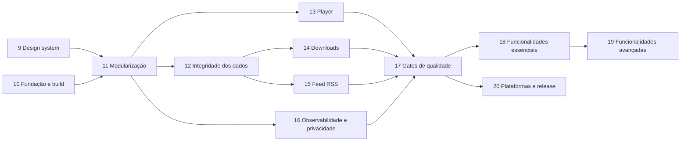

# Podcast KMP — Roadmap de Melhorias

> Continuação do [roadmap original](../roadmap-kmp-podcast.md) (fases 1–7 concluídas; a fase 8, de testes, foi
> absorvida pela fase 17 daqui). Baseado na análise do código em `main` (commit `9e4f898`), com
> `:shared:desktopTest` (66 testes) e `:shared:detekt` verdes em 02/10/2026. Contexto geral em [CONTEXTO.md](CONTEXTO.md).
>
> **Objetivo:** fazer um refactor completo e levar o projeto ao padrão de um app mantido por uma equipe grande:
> identidade visual própria, módulos com fronteiras verificadas, dados que não se perdem, player confiável,
> gates de qualidade no CI e uma pipeline de release para as quatro plataformas.
>
> Legenda: **Esforço** P (≤ ½ dia) · M (1–2 dias) · G (3+ dias).
> **Status**: ✅ confirmado lendo o código · 🔎 provável, reproduzir antes de corrigir · ✔ feito.

---

## Resumo por prioridade

| # | Problema | Impacto | Fase |
|---|---|---|---|
| 1 | Qualquer mudança de schema **apaga a biblioteca** (`fallbackToDestructiveMigration(true)` em produção) | Perda de dados | 12 |
| 2 | O progresso **não é salvo durante a reprodução**: `debounce(2000)` sobre um estado que muda a cada 500 ms nunca emite | Perda de dados | 13 |
| 3 | Download que falha no meio deixa um arquivo parcial que o player passa a tocar como se estivesse completo | Funcional | 14 |
| 4 | O download carrega o episódio inteiro na memória (`httpClient.get` em vez de streaming) e usa o `guid` (muitas vezes uma URL) como nome de arquivo | Funcional / memória | 14 |
| 5 | O `PlayerViewModel.onCleared()` libera o player singleton, que no Android fica inutilizável até o processo morrer | Funcional (Android) | 13 |
| 6 | O player do Android não pede foco de áudio nem pausa quando o fone é desconectado | Funcional (Android) | 13 |
| 7 | O id do episódio é o `guid` puro: episódios de feeds diferentes com o mesmo guid se sobrescrevem | Integridade | 12 |
| 8 | Erros de atualização nunca aparecem (o ViewModel faz `try/catch` em volta de um `Result`) e o filtro do detalhe volta para "Todos" a cada progresso salvo | Funcional | 12 |
| 9 | URL de feed privado (com token) vai para Analytics, traces e Crashlytics | Privacidade | 16 |
| 10 | Um módulo só, domínio dependendo de dados e de Compose, singletons globais sem injeção | Arquitetura | 11 |
| 11 | Visual monocromático genérico, 20 papéis de cor do M3 caindo no roxo padrão, 60 tokens de dimensão repetidos | Produto | 9 |
| 12 | Não dá para encontrar podcasts: só colando a URL do RSS (a busca procura só no que já foi salvo); faltam recursos que todo app de podcast tem, como categorias, fila editável e "Novos episódios" | Produto | 18 / 19 |
| 13 | A Web não consegue ler a maioria dos feeds (CORS) | Plataforma | 20 |
| 14 | CI não roda Detekt nem cobra cobertura; o `GoogleService-Info.plist` está versionado | Qualidade / segurança | 10 / 17 |

## Sequência



- **A fase 9 vem primeiro** a pedido: é ela que define a cara do app e cria o primeiro módulo separado
  (`:core:designsystem`), que serve de molde para a fase 11. A fase 10 pode rodar em paralelo, porque mexe só em build e CI.
- **A 11 vem antes das correções de dados e player** porque elas mudam justamente os arquivos que a modularização
  move. Corrigir antes significaria mover duas vezes e resolver conflitos. A exceção são os itens 12.1 (migrações) e
  13.1 (salvamento do progresso): se o app voltar a ser usado antes da fase 11 terminar, esses dois podem ser
  antecipados, porque cada um mexe em poucos arquivos.
- 12 e 13 podem rodar em paralelo, e 14, 15 e 16 também, desde que não toquem os mesmos arquivos.
- As fases 18 e 19 (funcionalidades novas) só começam com os gates da 17 ligados, para que o código novo já nasça
  cobrado. A 20 (release) pode andar em paralelo com elas.

**Regra de toda fase:** uma branch por fase a partir da `main` (`feature/phase-09-design-system`), um commit por
subitem com o teste correspondente e a nota "Implementado" na seção do roadmap, e uma merge request no fim. Cada
subitem só fica pronto quando o teste novo falha no código antigo e passa no novo. `detekt` limpo e testes verdes
antes de cada commit.

---

## Fase 9 — Design system

**Objetivo:** dar ao app uma identidade própria e um design system de verdade: tokens completos, componentes
reutilizáveis, um módulo próprio, uma referência visual e snapshot tests. Nenhuma tela nova; as telas existentes
passam a usar só o design system.

### 9.1 Direção visual e referência HTML ✔ — M
- **Problema:** a paleta é preto, branco e cinza nos dois temas (`Color.kt`), a fonte é a do sistema e não existe
  referência visual. O app não tem cara de produto.
- **Ação:** antes de qualquer código, montar `docs/podcast-design-system.html` (como o do PTT-LAN) com paleta clara e
  escura, escala tipográfica, espaçamentos, formas, estados (tocando, baixando, baixado, ouvido, erro) e os
  componentes da 9.6 renderizados. Registrar a decisão na **ADR 0001 — Identidade visual**.
- **Pontos a decidir:**
  1. **Cor de marca:** uma cor de destaque só, usada no play, no progresso e no "tocando agora". Neutros com leve
     temperatura, em vez de cinza puro.
  2. **Tipografia:** uma família embarcada em `composeResources/font` com pesos 400/500/600/700 e algarismos
     tabulares para os tempos do player. A fonte do sistema muda entre as plataformas.
  3. **Tema dinâmico pela capa:** o player e o detalhe do podcast tingidos pela cor dominante da capa (9.10).
- **Critério:** contraste AA (4,5:1 para texto, 3:1 para ícones e bordas) em todos os pares de cor, medido no próprio HTML.
- **Implementado:** comparadas três direções (Sinal/âmbar + Onest, Estúdio/cobalto + Plus Jakarta Sans,
  Ondas/petróleo + Figtree); escolhida a **Sinal**. Como o âmbar puro tem só 1,9:1 contra o fundo claro, ele foi
  dividido em três papéis: `primary` (`#BC7300` no claro), `accentText` (`#9A5B00` no claro) e `brand`
  (`#F2A93B`, sempre com texto escuro). A [ADR 0001](adr/0001-identidade-visual.md) traz a tabela completa de
  tokens (todos os papéis do M3 + 5 do app) e os 26 pares de uso, todos AA nos dois temas.
  `docs/podcast-design-system.html` mostra cores, contraste do tema atual, tipografia, medidas, movimento, os
  componentes da 9.6 com seus estados e as telas de biblioteca e player, com seletor de tema.

### 9.2 Módulo `:core:designsystem` ✔ — M
- **Problema:** o design system mora dentro do `:shared`, misturado com regras de negócio, e os componentes de UI
  ficam em `presentation/component`, fora dele.
- **Ação:** criar o módulo KMP `:core:designsystem` (Android, iOS, Desktop, Wasm) com tema, tokens, fontes, ícones,
  componentes e o próprio `Res` (`br.com.carvalho.podcast.core.designsystem.generated.resources`). O `:shared`
  passa a depender dele.
- **Atenção:** a task `syncComposeResourcesForAndroid` (necessária no AGP 9) precisa valer também para o módulo novo.
  Ela vai para o convention plugin da 10.3, em vez de ser copiada.
- **Implementado:** módulo `core/designsystem` (Android, Desktop, Wasm, iosArm64, iosSimulatorArm64) com o tema atual
  (`Color.kt`, `Type.kt`, `Shape.kt`, `Dimensions.kt`, `Theme.kt`) movido por `git mv` no mesmo pacote, então nenhum
  import mudou; o `:shared` depende dele com `implementation`. O módulo exporta Compose runtime, foundation, ui e
  material3 como `api`. Sem `Res` por enquanto: o módulo ainda não tem recursos. O `Res` próprio e a cópia dos
  recursos para o Android entram na 9.4, com as fontes, porque só dá para verificar o empacotamento no APK quando
  existe um recurso. Item sem teste novo (só movimentação): verificado com os 66 testes de `:shared:desktopTest`,
  `detekt` dos dois módulos, `:androidApp:assembleDebug`, `:desktopApp:compileKotlinJvm`,
  `:webApp:compileKotlinWasmJs` e `:core:designsystem:compileKotlinIosSimulatorArm64`. O framework iOS do `:shared`
  não foi compilado aqui porque o `pod install` local quebra (Ruby 4.0 do Homebrew); o CI cobre.

### 9.3 Cores: esquema completo e cores semânticas ✔ — P
- **Problema:** `lightColorScheme`/`darkColorScheme` recebem só 16 papéis. Os outros (`tertiary`, `outline`,
  `outlineVariant`, `surfaceContainer*`, `inverseSurface`, `scrim`…) caem no **roxo padrão do Material 3**, que
  aparece em chips, divisores, sliders e no `NavigationSuiteScaffold`.
- **Ação:** definir todos os papéis do M3 a partir da paleta da 9.1 e acrescentar um `PodcastColors` (via
  `CompositionLocal`) para o que o M3 não cobre: `playing`, `downloaded`, `played`, `progressTrack`, `progressFill`.
  Features usam `MaterialTheme.colorScheme` ou `PodcastTheme.colors`, nunca `Color(...)`.
- **Teste:** `ColorContrastTest` em `commonTest` calcula o contraste WCAG de cada par (`onX` sobre `X`) nos dois
  temas e falha abaixo de AA.
- **Implementado:** os 48 papéis do M3 definidos nos dois temas (`ColorSchemes.kt`), a partir de primitivas com nome
  em `Palette.kt` (`AMBER_50`, `NEUTRAL_97`…), o que também resolve o `MagicNumber` sem afrouxar o Detekt. As cores
  fora do M3 ficam em `PodcastColors` (`accentText`, `brand`, `onBrand`, `downloaded`, `played`), lidas por
  `PodcastTheme.colors` e providas pelo `PodcastTheme`. Dois testes em `core/designsystem/commonTest`:
  `ColorContrastTest` (os 26 pares da ADR nos dois temas, com o contraste WCAG calculado por `Color.luminance()` e
  conferido contra 21:1 de preto/branco) e `ColorSchemeCompletenessTest`, que compara cada papel com o padrão do
  M3 e falha se algum ficou de fora (com uma lista explícita de coincidências intencionais: branco, preto e os
  vermelhos de erro do M3 no tema claro). Rodado contra o esquema antigo, o de completude falha nos dois temas;
  com o novo, os 5 testes passam. Conferido no Razr 60 no tema escuro.

### 9.4 Tipografia ✔ — P
- **Problema:** `Type.kt` reescreve os 15 estilos do M3 com `FontFamily.Default` e os valores padrão, e os tempos do
  player ("12:05") mudam de largura a cada segundo.
- **Ação:** fonte embarcada e uma escala só com os estilos usados. `PodcastTheme.typography.timer` com
  `fontFeatureSettings = "tnum"`. Proibir `.sp` e `.copy(fontSize = …)` nas features.
- **Implementado:** Onest 400/500/600/700 (TTF estáticos do Google Fonts, com `tnum`) em
  `core/designsystem/src/commonMain/composeResources/font`, licença em `core/designsystem/OFL-Onest.txt`. O módulo
  ganhou o próprio `Res` (`…core.designsystem.generated.resources`) e `androidResources { enable = true }`: as fontes
  entram no APK em `assets/composeResources/…` **sem** a task manual de sincronização que o `:shared` usa (ver 10.3).
  `podcastTypography(family)` aplica a família a todos os 15 estilos do M3 (inclusive os que só os componentes do
  M3 usam por dentro, como snackbar e diálogo, para não voltarem à fonte do sistema) e os valores da ADR nos 7
  usados pelas telas; `PodcastTheme.typography` traz `timer` (13/18, 500, `tnum`) e `section` (11/16, 600, +0,06em; quem
  chama põe em caixa alta). Os tempos do player passaram a usar `timer`. `TypographyTest` (desktop, com Compose
  ui-test) exige uma família só em todos os estilos, diferente da padrão do sistema: falha com a família do
  sistema, como no código antigo, e passa com a Onest. Conferido no Razr 60: fontes no APK, sem erro de recurso e
  com a Onest nas telas. **Pendente:** iOS e Web só compilam aqui; o carregamento da fonte nessas plataformas fica
  para conferir no CI e quando a distribuição Web (10.10) voltar a funcionar.

### 9.5 Espaçamentos e tamanhos ✔ — P
- **Problema:** `AppDimensions` tem 60 tokens com valores repetidos (`paddingSmall` e `spacingSmall` valem 4 dp;
  `paddingNormal` e `spacingLarge`, 16 dp) e mistura espaçamento, tamanhos de componente, breakpoints, colunas da
  grade e opacidades.
- **Ação:**
  - `Spacing` com uma escala só (`xxs` 2 · `xs` 4 · `s` 8 · `m` 12 · `l` 16 · `xl` 24 · `xxl` 32 · `xxxl` 48).
  - `Sizes` só para tamanhos que vários componentes dividem (`touchTarget`, `artworkS/M/L`, `miniPlayerHeight`).
    Um tamanho que pertence a um componente vira um `val` com nome dentro dele.
  - Breakpoints saem do design system: o `WindowSizeClass`, que o `RootContent` já usa, cuida disso.
  - `GRID_COLUMNS_*` vira `GridCells.Adaptive(minSize = Sizes.artworkM)`, que se ajusta sozinho e dispensa os breakpoints.
  - Opacidades vão para `Alpha` (`disabled`, `muted`, `scrim`).
- **Implementado:** `AppDimensions` saiu. `Spacing` (2 · 4 · 8 · 12 · 16 · 24 · 32 · 48), `Sizes` (`touchTarget`,
  `artworkS/M/L`, `miniPlayerHeight`, `playButtonLarge`, `listBottomInset` = mini player + `Spacing.l`, ícones
  `iconS/M/L/Xl` e `progressStroke`) e `Alpha` (`disabled`, `muted`, `scrim` e `faint` 0,12, para trilhas sobre
  contêiner colorido) em `Dimensions.kt`; `Shapes` com os raios da ADR (6 · 10 · 14 · 20 · 28). Os 9 arquivos de tela
  e componente foram migrados: `RoundedCornerShape(AppDimensions.radiusX)` virou `MaterialTheme.shapes.x`; tamanhos de
  um só composable viraram `val` local (capa do detalhe 100 dp, traço 4 dp do player, altura máxima da fila, elevação
  e barras de progresso do mini player e da linha); `LINE_HEIGHT_NORMAL` saiu (vale a altura de linha do estilo). A
  grade da biblioteca virou `GridCells.Adaptive(Sizes.artworkM)`, e os breakpoints e `GRID_COLUMNS_*` sumiram. Mudanças
  visuais pequenas e intencionais: ícones de 16/18/20 dp unificados em 18, 28 dp em 32, botão de 40 dp da linha de
  episódio passou a 48 (alvo de toque), espaçadores de 40 dp do player passaram a 32, opacidades 0,5/0,7 viraram
  `muted` (0,6) e 0,8 virou opaco. Refatoração sem teste novo: verificado com os 66 + 7 testes, Detekt, os builds
  e no Razr 60 (biblioteca e player).

### 9.6 Componentes ✔ — G
Hoje a mesma linha de episódio é montada de formas diferentes em detalhe, busca e downloads, e play e download têm
um visual por tela. Componentes do design system, todos sem estado e com previews nos dois temas:

| Componente | Substitui / cobre |
|---|---|
| `PodcastArtwork` | `AsyncImage` + placeholder + forma, repetidos em 6 telas; com descrição para acessibilidade |
| `EpisodeRow` | `EpisodeListItem` (288 linhas) e as variações de busca e downloads; título, podcast, data, duração, progresso e ações |
| `PlayPauseButton` | Estados parado / tocando / carregando, mais o anel de progresso de um episódio já iniciado |
| `DownloadButton` | Os 5 `DownloadStatus` (inativo, na fila, baixando com %, baixado, falhou com nova tentativa) |
| `EpisodeProgressBar` | Barras de progresso do mini player e da lista |
| `PlayerSlider` | Slider com tempo decorrido e restante e `stateDescription` ("12:30 de 45:00") |
| `FilterChipRow` | Filtros do detalhe do podcast |
| `EmptyState` / `ErrorState` / `LoadingState` | Estados de tela padronizados (hoje cada tela improvisa ou não tem) |
| `ConfirmDialog` | Os diálogos de excluir podcast e excluir download |
| `PodcastTopBar` | As top bars transparentes repetidas em player e detalhes |
| `MiniPlayer`, `PodcastCard`, `HtmlText` | Saem de `presentation/component` para o design system, já com os tokens novos |

- **Implementado:** pacote `core.designsystem.component` com `PodcastArtwork` (placeholder com o glifo do app),
  `PlayPauseButton` (estilos `Filled` e `Tonal`, carregando e anel de progresso com "Continuar, 62% ouvido"),
  `DownloadButton` (estado próprio `DownloadState`, uma ação por estado: baixar, cancelar, remover, tentar de novo),
  `EpisodeProgressBar`, `PlayerSlider` (segue o dedo e só busca ao soltar; `stateDescription` "12:05 de 47:30"),
  `FilterChipRow`, `EmptyState`/`ErrorState`/`LoadingState`, `ConfirmDialog`, `PodcastTopBar`, `MiniPlayer`,
  `PodcastCard` (selo de não ouvidos) e `EpisodeRow` (marcadores Novo/Ouvido/Baixado). Nenhum depende de modelo
  de domínio; os textos de acessibilidade estão nos recursos do módulo (en/pt/es). `HtmlText` foi movido com
  `git mv` (ver 15.7). Previews claro/escuro em `Previews.kt`. No `:shared`, `PodcastCard` e `MiniPlayer` saíram
  (a biblioteca e o `RootContent` usam os do design system) e `EpisodeListItem` virou um adaptador de `Episode` +
  `DownloadStatus` para `EpisodeRow`. Como o botão de download agora cancela, `SearchViewModel` e
  `PodcastDetailViewModel` ganharam `cancelDownload` (com teste). Corrigido no caminho: `remaining_min` usava `%d`,
  que o Compose Resources não substitui (o código antigo trocava à mão); virou `%1$d` nos três idiomas. O Detekt
  passou a entender Compose (`FunctionNaming` e `LongParameterList` ignoram `@Composable`, `TooManyFunctions`
  ignora `@Preview`, `MagicNumber` isenta `Previews.kt`), parte do 17.1. Testes: `ComponentsTest` (desktop, 7 casos:
  ação de cada estado do download, rótulos do play/pause e do botão começado, chips, marcadores da linha, mini
  player e card, estes dois vindos do `:shared`) e `HtmlParserTest`. Conferido no Razr 60 (biblioteca, detalhe e
  mini player). O mini player usa `surfaceContainer` (não `surfaceContainerLowest`, que no escuro fica mais escuro
  que o fundo), e a referência HTML foi ajustada.

### 9.7 Movimento e formas ✅ — P
- **Ação:** um objeto `Motion` com durações e curvas usado na transição do mini player para o player, no
  aparecer/sumir do mini player e no crossfade das capas, que hoje usam os valores padrão de cada API. `Shapes` com
  os raios definidos na 9.1.

### 9.8 Textos fora do código ✅ — M
- **Problema:** a fase 6 foi marcada como feita, mas há texto em pt-BR nos ViewModels, em `LongExtensions.toDate()`,
  no `RssXmlParser`, no `PodcastCard` e na bandeja do Desktop; `app_name` e `rss_url_placeholder` faltam no `values-pt`.
- **Ação:**
  - ViewModels emitem `StringResource` + argumentos (ou um tipo selado), e a tela resolve o texto.
  - `toDate()` vira um cálculo puro (`RelativeTime`, testado) mais textos com plurais nos recursos.
  - Data absoluta formatada pelo locale.
  - Defaults do parser viram `null`; a UI decide o rótulo.
  - Teste que compara as chaves de `values`, `values-pt` e `values-es` e falha se faltar alguma.

### 9.9 Migração das telas ✅ — G
- **Ação:** as 6 telas e o `RootContent` passam a usar só tokens e componentes do design system. Cada tela vira
  `XxxScreen(viewModel)` + `XxxContent(state, onIntent)` sem estado, com previews de vazio, carregando, erro e
  conteúdo. O `PlayerScreen` (588 linhas) é quebrado em arquivos menores no caminho.
- **Regra no build:** o `MagicNumber` do Detekt passa a pegar `16.dp` e argumentos nomeados
  (`ignoreNamedArgument: false`, `ignoreExtensionFunctions: false`), com previews isentos. Um `ForbiddenImport`
  barra `androidx.compose.ui.graphics.Color` fora do design system.

### 9.10 Cor dinâmica pela capa (opcional) 🔎 — M
- **Ação:** extrair a cor dominante da capa (amostragem dos pixels do bitmap que o Coil já carrega, sem dependência
  nova) e aplicar no fundo do player e no topo do detalhe, com fallback para a cor de marca quando o contraste não
  atingir AA. A função de extração é pura e testada.

### 9.11 Snapshot tests ✅ — M
- **Ação:** Roborazzi em `androidHostTest` do `:core:designsystem`, com cada componente em claro e escuro e com
  fonte em 200%. O `verifyRoborazzi…` roda no CI e os diffs sobem como artefato.
- **Lição do PTT-LAN:** gravar as imagens no **Linux**, por um workflow manual (`record-snapshots.yml`). O
  Robolectric renderiza diferente no macOS, então uma referência gravada no Mac nunca bate no runner.

### 9.12 Acessibilidade ✅ — M
- **Ação:** alvos de toque de pelo menos 48 dp em todos os controles; `contentDescription` em todas as imagens e
  ícones que não sejam decorativos (hoje há `contentDescription = null` no play do detalhe do episódio);
  `semantics` no slider do player e no botão de download (estado + progresso); ordem de foco do teclado no Desktop e
  na Web; snapshot com fonte em 200% sem cortar texto.

### 9.13 Ícone do app no novo design ✅ — M
- **Problema:** cada plataforma tem um ícone diferente e nenhum segue a identidade da 9.1. O Android usa um ícone
  adaptativo vetorial do template, sem camada monocromática, então não acompanha os ícones temáticos do Android 13+.
  O iOS tem um `app-icon-1024.png` avulso, sem as variantes escura e tingida do iOS 18. O Desktop usa um `icon.png`
  também na bandeja. A Web não declara favicon nem manifest. O player usa um `app_icon.png` de `composeResources`
  como placeholder de capa.
- **Ação:**
  1. Desenhar o símbolo na referência HTML (`docs/podcast-design-system.html`): microfone (o glifo do logo da página)
     sobre o quadrado âmbar `brand`, com versões para fundo claro e escuro e uma versão monocromática. Aprovar antes
     de gerar os arquivos e registrar na ADR 0001.
  2. **Android:** ícone adaptativo vetorial (`foreground` + `background` + `monochrome`) em `mipmap-anydpi-v26`, com
     o glifo dentro da zona segura de 66 dp; apagar os PNGs `mipmap-*dpi` que o vetor dispensa (o `minSdk` é 26).
     Splash da API `SplashScreen` com o mesmo glifo e o fundo `background` do tema.
  3. **iOS:** `AppIcon` com as três aparências (padrão, escura e tingida) num único tamanho de 1024 px.
  4. **Desktop:** `.icns` (macOS), `.ico` (Windows) e `.png` (Linux) no `nativeDistributions`; ícone da bandeja em
     modelo monocromático no macOS.
  5. **Web:** favicon SVG, `apple-touch-icon` e `manifest.webmanifest` com `theme_color` âmbar.
  6. O placeholder de capa do player passa a ser o `PodcastArtwork` da 9.6, e o `app_icon.png` sai.
- **Verificação:** ícone conferido no launcher do Razr (com e sem ícones temáticos, e na tela externa), no
  simulador iOS nos três modos, no Dock/Barra de tarefas do Desktop e na aba do navegador.

**Critério de conclusão:** referência HTML aprovada; `:core:designsystem` publicado para as 4 plataformas; ícone novo em todas elas; nenhuma
cor, `sp` ou `dp` solto nem texto de tela nas features (garantido pelo Detekt); snapshots e `ColorContrastTest` no CI.

---

## Fase 10 — Fundação: repositório, build e CI

**Objetivo:** deixar o repositório limpo, o build padronizado e o CI rápido e confiável antes de dividir o código.

| Item | Status | Evidência | Ação | Esforço |
|---|---|---|---|---|
| 10.1 Arquivos de máquina e lixo | ✅ | `gradle_debug.log` versionado; `composeResources/drawable/compose-multiplatform.xml` (do template) sem uso | `git rm` | P |
| 10.2 Segredo versionado | ✅ | `iosApp/GoogleService-Info.plist` está no git, embora o `google-services.json` do Android tenha saído (`6d1301b`) e o `.gitignore` só cubra `iosApp/iosApp/` | Tirar do git, ajustar o `.gitignore` e restringir a API key no console do Google Cloud por bundle id (o repositório é público) | P |
| 10.3 Convention plugins | ✅ | `shared/build.gradle.kts` com 278 linhas: lista de `ksp<Target>` à mão, `-Xexpect-actual-classes` duas vezes, task de sync de recursos para o AGP 9 (desnecessária: na 9.4, `androidResources { enable = true }` empacotou os recursos do `:core:designsystem` sem ela; trocar no `:shared` e apagar a task e o `sourceSets.assets` do `androidApp`), JavaFX em string com classificador | `build-logic/` com `podcast.kmp.library`, `podcast.kmp.compose`, `podcast.android.application`, `podcast.room` e `podcast.quality` (Detekt + Kover). Pré-requisito da fase 11 | M |
| 10.4 Lockfiles | ✅ | O `.gitignore` ignora `kotlin-js-store/`, `yarn.lock` e `Podfile.lock`, mas os dois lockfiles estão versionados | Manter os lockfiles (builds reproduzíveis, como a JetBrains recomenda para o `kotlin-js-store`) e tirar essas linhas do `.gitignore` | P |
| 10.5 CI | ✅ | Sem Detekt; sem `concurrency`; testes com `--info` (logs enormes); cache manual em vez do `setup-gradle`; o build do Desktop roda só no Linux | Job `static-analysis` (Detekt + `lint` do Android); `concurrency` com `cancel-in-progress`; `gradle/actions/setup-gradle`; cache do `~/.konan`; matriz macOS/Windows/Linux para empacotar o Desktop | M |
| 10.6 Atualização de dependências | ✅ | Versões mantidas à mão | Renovate (ou Dependabot) lendo o `libs.versions.toml`, com PRs agrupados por ecossistema | P |
| 10.7 Dependências instáveis | ✅ | Room 3 e sqlite-web em alpha; `force("org.jetbrains.skiko:skiko:0.9.43")` | ADR 0002 com o motivo de cada exceção e a condição de saída (Room 3 estável; Compose alinhado com o Coil) | P |
| 10.8 Hook e template de PR | ✅ | A regra "Detekt antes do commit" só existe no `GEMINI.md` | `config/hooks/pre-commit` (Detekt + `desktopTest`) instalado por uma task Gradle; `.github/pull_request_template.md` com checklist (testes, snapshots, roadmap atualizado) | P |
| 10.9 Documentação | ✅ | `roadmap-kmp-podcast.md` na raiz; `docs/arquitetura.md` e `docs/regras-negocio.md` ignorados pelo git e com afirmações falsas (ver CONTEXTO §8); README pede JDK 17 | Mover o roadmap original para `docs/`; apagar os dois docs locais (o que vale entra no CONTEXTO e nas ADRs); README com JDK 21, segredos, CocoaPods e links; `docs/adr/` com um template | P |
| 10.10 Distribuição Web quebrada | ✅ | `:webApp:wasmJsBrowserDistribution` falha na `main`: com `RepositoriesMode.PREFER_SETTINGS`, o repositório do binaryen (GitHub Releases) que o plugin Kotlin adiciona é ignorado e `com.github.webassembly:binaryen:125` não é encontrado. O job `build-web` do CI deve estar falhando | Declarar no `settings.gradle.kts` um repositório `ivy` para `https://github.com/WebAssembly/binaryen/releases/download`, como já é feito para Node e Yarn | P |

**Critério de conclusão:** CI com análise estática, cache e cancelamento de execuções antigas; nenhum segredo nem
lixo no git; módulos configurados só por convention plugins.

---

## Fase 11 — Modularização e arquitetura

**Objetivo:** trocar o módulo único por módulos com fronteiras verificadas pelo build, deixar o domínio puro e
injetar tudo que hoje é global.

### 11.1 Grafo de módulos alvo ✅ — P
Registrado na **ADR 0003 — Grafo de módulos**:

```
build-logic/                convention plugins (10.3)
core/
  common                    dispatchers, AppError, relógio, constantes compartilhadas
  designsystem              fase 9
  database                  Room: entidades, DAOs, migrações, schemas
  network                   HttpClient comum + engines por plataforma
  player                    implementações do AudioPlayer, MediaService, sessões nativas
  observability             Logger, Analytics, Crashlytics, Performance, RemoteConfig (interfaces + Firebase)
  testing                   fakes compartilhados e utilitários de teste
domain                      modelos, interfaces de repositório, use cases (Kotlin puro)
data                        repositórios, RSS, downloader, mappers
feature/
  library  podcast  episode  search  downloads  player
shared                      RootComponent, montagem do Koin, framework iOS (export)
androidApp  desktopApp  webApp  iosApp
```

Regras: uma `feature` depende só de `domain`, `core:designsystem` e `core:common`, nunca de outra feature nem de
`data`, `database` ou `network`. `data` depende de `domain`, `core:database` e `core:network`. `domain` não depende
de nenhum outro módulo do projeto. Só o `shared` e os apps conhecem todos.

### 11.2 Domínio puro ✅ — M
- **Problema:** `AddPodcastFromUrlUseCase` e `RefreshPodcastUseCase` importam `data.mapper` e `data.remote.RssFeedDataSource`;
  `Episode` e `Podcast` importam `androidx.compose.runtime.Immutable`.
- **Ação:** o domínio fala com uma interface `FeedRepository` (`fetch(url): Result<Feed>`), e o mapeamento RSS fica
  em `data`. A estabilidade dos modelos para o Compose passa a vir de um `compose-stability.conf` nos módulos de UI,
  e não de anotação no domínio.

### 11.3 Extrair os módulos `core` ✅ — G
- **Ação:** mover `common`, `database`, `network`, `player` e `observability` nessa ordem, com o build verde a cada
  passo. O `core:testing` recebe os fakes que hoje estão em `shared/commonTest` (`FakePodcastRepository`,
  `FakeAudioPlayer`, `FakeEpisodeDownloader`…), porque eles vão ser usados por vários módulos.

### 11.4 Extrair `domain`, `data` e as features ✅ — G
- **Ação:** cada feature leva sua tela, ViewModel, recursos de texto e módulo Koin. O `shared` fica com a navegação e
  a montagem. Os testes vão junto com o código que testam.

### 11.5 Regra de dependência automática ✅ — P
- **Ação:** task `checkModuleDependencies` no `build-logic`, da qual o `check` depende, que falha se uma feature
  depender de outra feature ou de `data`/`database`/`network`. Verificar plantando uma dependência proibida.

### 11.6 Injeção no lugar de singletons globais ✅ — M
- **Problema:** `Analytics`, `Crashlytics`, `Performance`, `RemoteConfig`, `FileUtils` e `AppContext` são
  `expect object` chamados direto dos ViewModels e repositórios. Os testes precisam ser blindados contra o Firebase
  não inicializado (`f63370d`, `bdce2d4`, `0d9523c`), e `AppContext.context` lança exceção se for lido cedo demais.
- **Ação:** interfaces em `core:observability` e `core:common` com a implementação Firebase/plataforma registrada
  no Koin e uma implementação no-op ou fake no `core:testing`. O `AppContext` some: o `Context` do Android vem do
  `androidContext()` do Koin.

### 11.7 Grafo do Koin verificado ✅ — P
- **Ação:** um teste JVM com `koin-test` (`verify()` nos módulos) que falha quando falta um binding, em vez de o
  erro aparecer só ao abrir a tela.

### 11.8 Padrão de estado e eventos ✅ — M
- **Problema:** cada ViewModel inventa o seu formato: erros como `String`, `snackbarMessage`, diálogos como campos
  anuláveis espalhados no estado; `SearchViewModel` expõe o `audioPlayer` como `val` público.
- **Ação:** `State` imutável + `onIntent(intent)` + `effects: Flow<Effect>` para eventos únicos (snackbar,
  navegação). Os estados das telas usam os `EmptyState`/`ErrorState` da 9.6.

### 11.9 Modelo de erro ✅ — M
- **Problema:** `PodcastError.FetchFailed` e `ParseFailed` nunca são lançados; `RefreshPodcastUseCase` lança
  `Exception("Podcast not found")`; a UI mostra `e.message` cru ("Ocorreu um erro inesperado: …").
- **Ação:** `AppError` selado em `core:common` (sem rede, HTTP, feed inválido, já existe, armazenamento cheio,
  desconhecido). Data converte exceções para ele e a UI converte para `StringResource`.

### 11.10 Navegação ✅ — M
- **Problema:** `RootContent` (257 linhas) deduz a aba selecionada por heurística (`isTabSelected`), `Child.Library`
  carrega um `Unit`, e as regras de pilha ficam espalhadas entre o componente e o composable.
- **Ação:** uma pilha por aba (`childStack` por aba ou `ChildPages` + pilhas), com a aba selecionada como estado
  explícito no componente e testada no `RootComponentTest`. O `RootContent` só desenha.

**Critério de conclusão:** `:shared` sem código de negócio; `checkModuleDependencies` e o teste do Koin no `check`;
nenhum `expect object` de serviço chamado direto por ViewModel ou repositório.

---

## Fase 12 — Integridade dos dados

**Objetivo:** nenhuma ação do usuário nem atualização de schema perde ou corrompe a biblioteca.

| Item | Status | Evidência | Ação | Esforço |
|---|---|---|---|---|
| 12.1 Migração destrutiva em produção | ✅ | `fallbackToDestructiveMigration(true)` em `AppDatabase.android/ios/desktop/wasmJs.kt`; esquemas 1–3 exportados e nenhuma migração | Remover o fallback; `autoMigrations` ou `Migration` manual para cada versão; teste de migração com os schemas exportados (`MigrationTestHelper` no JVM). **Pode ser antecipado**: é o primeiro item a fazer se o app voltar a ser usado | M |
| 12.2 Id de episódio global | ✅ | `RssMapper.toEpisode`: `id = guid`; sem guid, `title.hashCode()` (dois "Trailer" no mesmo feed colidem) | Id = hash estável de `podcastId + guid` (fallback: URL do enclosure); migração que regrava os ids e as referências em `playback_state` | M |
| 12.3 Atualização ignora episódios existentes | ✅ | `insertAll` com `OnConflictStrategy.IGNORE` | Upsert só dos metadados (título, descrição, URL do áudio, capa, duração), preservando `isPlayed`, `playbackPosition` e `isDownloaded` | P |
| 12.4 Gravação sem transação | ✅ | `savePodcast` + `saveEpisodes` e `deleteByPodcast` + `deleteById` em chamadas separadas | `@Transaction` no repositório; o `deleteByPodcast` sai, porque a FK já tem `CASCADE` | P |
| 12.5 Remover podcast deixa arquivos | ✅ | `DeletePodcastUseCase` só apaga do banco | Apagar os downloads do podcast antes de apagar as linhas, com teste usando `FakeFileSystem` | P |
| 12.6 Erros engolidos | ✅ | `RefreshPodcastUseCase` devolve `Result`, mas `LibraryViewModel` e `PodcastDetailViewModel` fazem `try/catch` (que nunca dispara); `refreshAll()` devolve sucesso mesmo se todos os feeds falharem | Tratar o `Result`; `refreshAll` devolve quantos falharam e a UI mostra | P |
| 12.7 Estado do detalhe sobrescrito | ✅ | `PodcastDetailViewModel.init` faz `_uiState.update { newState }` a cada emissão do banco, o que zera `filter`, `error` e os diálogos. Durante a reprodução, o progresso é salvo e o banco emite de novo, então **o filtro volta para "Todos" sozinho** | Combinar só os campos vindos do banco; filtro e diálogos em estado separado | P |
| 12.8 Paginação recriada e lista carregada duas vezes | ✅ | `pagedEpisodes` faz `flatMapLatest` sobre o `_uiState` inteiro, então cada mudança (até `isLoading`) cria um `Pager` novo; e `getEpisodes(podcastId)` carrega todos os episódios sem paginar em paralelo | `flatMapLatest` só sobre o filtro, com o filtro aplicado na query; a fila do player é montada por consulta, não pela lista em memória | M |
| 12.9 Fila salva como cópia | ✅ | `playback_state.queueJson` guarda os `Episode` inteiros, que ficam desatualizados (ouvido, baixado, URL) | Tabela `queue_items(position, episodeId)`; base da fila editável da 18.6 | M |

**Critério de conclusão:** teste de migração de cada versão; atualizar, remover e voltar a assinar um podcast
preserva progresso e downloads; nenhum erro de atualização sem aviso.

---

## Fase 13 — Player e reprodução

**Objetivo:** reprodução confiável e com o mesmo comportamento em todas as plataformas, com a lógica num lugar só.

### 13.1 Progresso não é salvo durante a reprodução ✅ — P
- **Problema:** `PlayerViewModel` usa `playerState.filter { it.isPlaying }.debounce(2000)`, e os quatro players
  atualizam a posição a cada 500 ms. O `debounce` só emite depois de 2 s sem mudanças, o que nunca acontece enquanto
  o áudio toca. O progresso só é salvo quando o usuário pausa; se o app morrer ou o sistema matar o processo, perde-se tudo.
- **Ação:** `sample(intervalo)` no lugar de `debounce`, mais um salvamento ao pausar, trocar de episódio e ir para background.
- **Teste:** com `FakeAudioPlayer` emitindo a cada 500 ms em tempo virtual, exigir pelo menos um salvamento a cada intervalo.
  **Pode ser antecipado**, junto com o 12.1.

### 13.2 Player singleton liberado pelo ViewModel ✅ / 🔎 — M
- **Problema:** `PlayerViewModel.onCleared()` chama `audioPlayer.release()` no player singleton do Koin. No Android,
  `release()` cancela o `scope` e libera o `MediaController` de vez. Basta fechar a activity pelo voltar com o
  processo vivo (o serviço continua tocando) para, ao reabrir, o novo ViewModel receber um player morto. O
  `ON_DESTROY` do `ProcessLifecycleOwner` em `PodcastApplication` nunca é disparado (a documentação do Android
  garante isso), então aquele `release()` é código morto.
- **Ação:** o ciclo de vida do player pertence à aplicação (ou ao serviço), não à tela; o ViewModel não libera nada.
  Reproduzir no aparelho antes e depois.

### 13.3 Foco de áudio e fone desconectado (Android) ✅ — P
- **Problema:** `PodcastMediaService` cria o ExoPlayer com `setAudioAttributes(…, handleAudioFocus = false)` e sem
  `setHandleAudioBecomingNoisy(true)`. O podcast toca por cima de ligações e de outros apps, e continua no
  alto-falante quando o fone é desconectado.
- **Ação:** `handleAudioFocus = true` e `setHandleAudioBecomingNoisy(true)`. Validar com uma ligação e tirando o fone.

### 13.4 Saltos diferentes na notificação e no app ✅ — P
- **Problema:** o serviço fixa 30 s/15 s (`setSeekForwardIncrementMs(30000)`, `setSeekBackIncrementMs(15000)`) e o
  app usa 30 s/10 s do `AppConfig`. Os ícones do player (`Forward30`, `Replay10`) também são fixos.
- **Ação:** um valor só, lido da configuração (e depois das Configurações, na 18.5), com ícones que acompanham o valor.

### 13.5 Lógica de reprodução repetida em quatro plataformas ✅ — G
- **Problema:** fila, próximo/anterior, laço de progresso, estado do sleep timer e montagem do `PlayerState` estão
  reimplementados em `AudioPlayer.android/ios/desktop/wasmJs.kt` (206 a 331 linhas cada), sem testes.
- **Ação:** um `PlaybackController` em `commonMain` com toda a regra (fila, próximo, fim do episódio, sleep timer,
  progresso, salvamento) sobre uma interface mínima por plataforma (`load`, `play`, `pause`, `seekTo`, `setSpeed`,
  `position`, `events`). Os `actual` passam a só traduzir a API nativa. Testes em `commonTest` com um engine fake.

### 13.6 Sleep timer preso à tela ✅ — P
- **Problema:** o timer é um laço no `viewModelScope`; se a activity for destruída com o áudio tocando em background,
  o timer morre e o áudio não para.
- **Ação:** o timer vai para o `PlaybackController` (13.5), com a opção "fim do episódio".

### 13.7 Regra de "tocar" duplicada nos ViewModels ✅ — P
- **Problema:** alternar entre play e pause, montar a fila e resolver o arquivo local está copiado em
  `PodcastDetailViewModel`, `SearchViewModel`, `EpisodeDetailViewModel` e `PlayerViewModel`. A busca nem resolve o
  arquivo local: um episódio baixado é tocado por streaming a partir dela.
- **Ação:** um `PlayEpisodeUseCase` usado por todos.

### 13.8 Episódio concluído 🔎 — P
- **Suspeita:** no fim (`STATE_ENDED`), o Android chama `playNext()` direto, e a marcação de ouvido depende de algum
  salvamento ter acontecido acima de 95%, o que, com o 13.1, quase nunca acontece.
- **Ação:** o `PlaybackController` marca como ouvido no evento de fim, antes de avançar.

**Critério de conclusão:** o progresso sobrevive a matar o processo durante a reprodução; o player funciona depois
de fechar e reabrir o app; a regra de reprodução tem testes em `commonTest`.

---

## Fase 14 — Downloads

**Objetivo:** downloads que não corrompem, não estouram a memória e sobrevivem ao app ir para background.

| Item | Status | Evidência | Ação | Esforço |
|---|---|---|---|---|
| 14.1 Corpo inteiro na memória | ✅ | `httpClient.get(url)` lê e guarda a resposta inteira antes de devolver; o laço de `readAvailable` copia de um buffer que já está todo na RAM (um episódio tem 50–150 MB). Somado a isso, `HttpCache` com armazenamento em memória sem limite no Android e no iOS | `prepareGet(url).execute { it.bodyAsChannel().copyTo(sink) }`; o client de mídia sem `HttpCache` | P |
| 14.2 Arquivo parcial vira "baixado" | ✅ | Grava direto no caminho final; numa falha o arquivo fica, e o `getLocalPath` só testa se ele existe | Gravar em `.part` e fazer `atomicMove` no fim; conferir `Content-Length`; apagar o `.part` na falha | P |
| 14.3 Nome de arquivo inválido | ✅ | `"${episode.id}.mp3"`; o guid costuma ser uma URL (`https://…/123?x=y`), o que gera um caminho com `/` e `:`; a extensão é sempre `.mp3`, mesmo para `audio/mp4` | Nome = hash do id + extensão pelo tipo do enclosure; caminho guardado no banco (coluna `localPath`), sem ser deduzido | P |
| 14.4 Concorrência e cancelamento | ✅ | `downloadJobs` é um `mutableMapOf` acessado de várias coroutines sem sincronização; `CancellationException` é capturada e não relançada; `cancel()` apaga o arquivo enquanto o job ainda pode estar gravando | Estado confinado (`limitedParallelism(1)` ou `Mutex`); relançar o cancelamento; `cancelAndJoin` antes de apagar | P |
| 14.5 API que promete o que não faz | ✅ | `pause()` cancela e apaga; `resume()` é vazio | Tirar `pause`/`resume` da interface (download com `Range` pode voltar como item próprio, se houver necessidade) | P |
| 14.6 Downloads morrem com o app | ✅ | O escopo é do processo | Android: `WorkManager` com restrição de rede (só Wi-Fi como opção); iOS: `URLSession` em background; Desktop: segue no processo. Interface comum, `actual` por plataforma | G |
| 14.7 Downloads na Web | ✅ | `FakeFileSystem` em memória: o download some ao recarregar a página e ocupa RAM | Esconder downloads na Web (capacidade da plataforma) até existir armazenamento persistente (OPFS) | P |
| 14.8 Gestão de espaço | ✅ | Nada controla o espaço ocupado | Total ocupado nas Configurações; apagar ao terminar de ouvir (opcional); erro claro de disco cheio (`AppError.StorageFull`) | M |
| 14.9 Erro como texto | ✅ | `DownloadStatus.Failed(error: String)` com mensagem crua | `Failed(reason: AppError)` | P |

**Critério de conclusão:** download de um arquivo grande sem pico de memória; falha no meio não deixa episódio
"baixado"; download continua com o app em background no Android e no iOS.

---

## Fase 15 — Feed RSS e conteúdo

**Objetivo:** ler corretamente os feeds reais, não só os de teste.

| Item | Status | Evidência | Ação | Esforço |
|---|---|---|---|---|
| 15.1 Parser feito à mão | ✅ | `RssXmlParser` usa `indexOf` sobre a string: não decodifica entidades (`&amp;` numa URL de enclosure quebra o áudio), não acha `<item>` com atributos, lê `language`/`link` do documento inteiro, fixa `enclosureType = "audio/mpeg"`, `explicit = false`, `season`/`episode` nulos e categorias vazias | ADR 0004: trocar por um leitor XML de verdade (`xmlutil`, que é KMP) ou corrigir o atual, decidido pelos fixtures da 15.2. Ler também `itunes:summary`, `content:encoded`, `itunes:episode`/`season`, `itunes:explicit`, categorias, tamanho e tipo do enclosure | M |
| 15.2 Fixtures de feeds reais | ✅ | `RssXmlParserTest` com 51 linhas e XML mínimo | 8–10 feeds reais salvos em `commonTest/resources` (com CDATA, entidades, itens sem guid, durações em segundos e em `hh:mm:ss`, fusos variados, categorias aninhadas) | P |
| 15.3 Data sem fuso | ✅ | `parsePubDate` ignora o fuso (`+0000`, `-0300`, `GMT`, `PDT`) e trata tudo como UTC | `DateTimeComponents.Formats.RFC_1123` do kotlinx-datetime, que já é dependência | P |
| 15.4 Item sem áudio | ✅ | Sem `<enclosure>`, o episódio é salvo com `audioUrl = ""` | Pular o item | P |
| 15.5 Feed que mudou de endereço | 🔎 | O id do podcast é a URL do feed; `itunes:new-feed-url` e redirecionamento permanente são ignorados | Id interno estável (não a URL); seguir `new-feed-url`/301 atualizando `feedUrl` | M |
| 15.6 Atualização cara | ✅ | `refreshAll` baixa todos os feeds em série e inteiros toda vez | `ETag`/`If-Modified-Since` (304 não reprocessa) e concorrência limitada (ex.: 4 por vez) | M |
| 15.7 HTML da descrição | ✅ | `HtmlText` (agora no design system) usa um parser próprio por regex (só `b`, `i`, `br`, `p`), sem links clicáveis | O `AnnotatedString.fromHtml()` **não existe** no Compose Multiplatform 1.11 fora do Android (conferido no jar do Desktop na 9.6). Opções: `expect/actual` com o `fromHtml` no Android e um parser comum nos demais, ou estender o parser atual para `a href` com `LinkAnnotation.Url`, com testes de feeds reais (15.2) | P |
| 15.8 Validação da URL | ✅ | O `LibraryViewModel` só põe `https://` na frente; `validateFeedUrl` existe e ninguém chama | Validar a URL antes do fetch, com erro específico; apagar `validateFeedUrl` | P |
| 15.9 User-Agent | 🔎 | O Ktor manda o User-Agent padrão; alguns hosts de podcast bloqueiam ou limitam clientes sem identificação | `User-Agent: PodcastKMP/<versão> (<plataforma>)` no client comum (16.5) | P |

**Critério de conclusão:** todos os fixtures reais são lidos com título, áudio, data e duração corretos; atualizar
um feed que não mudou não reprocessa nada.

---

## Fase 16 — Observabilidade, configuração e privacidade

**Objetivo:** logs e métricas úteis, sem vazar dados do usuário e sem configuração remota para o que não muda.

| Item | Status | Evidência | Ação | Esforço |
|---|---|---|---|---|
| 16.1 URL de feed privado vazando | ✅ | `LibraryViewModel` manda a URL do feed para o Analytics (`add_podcast_attempt`), para atributos de trace e para os logs, que também vão para o Crashlytics. Feeds pagos (Patreon, Supercast, Apple) trazem o token de acesso na URL | Nunca registrar URL: no máximo o host. Títulos de episódio também saem dos eventos (ficam só os ids) | P |
| 16.2 Logs demais no Crashlytics | ✅ | `AppLogger.d` grava toda linha de debug como breadcrumb do Crashlytics, inclusive cada linha de log HTTP | Só `i`/`e` vão para o Crashlytics; nível mínimo do Kermit por tipo de build; HTTP em `LogLevel.HEADERS` só no debug | P |
| 16.3 Catálogo de eventos | ✅ | Nomes de evento em string espalhados pelos ViewModels | `sealed interface AnalyticsEvent` com os parâmetros tipados, e um teste de que todos os nomes seguem o limite do Firebase (40 caracteres, `snake_case`) | M |
| 16.4 Consentimento | ✅ | Analytics e Crashlytics ligados sem opção | Opção de desligar nas Configurações (18.5, LGPD), respeitada antes do primeiro evento; `PrivacyInfo.xcprivacy` no iOS e formulário de segurança de dados da Play Store coerentes com isso | M |
| 16.5 HttpClient duplicado | ✅ | Quatro `actual` repetem timeouts, retry e logging; `HttpCache` e `ContentEncoding` só no Android e no iOS; o Desktop e o iOS não usam o `KtorLogger` | Uma função comum de configuração; cada plataforma só escolhe o engine. Dois clients: feeds (com cache em disco) e mídia (sem cache) | P |
| 16.6 Configuração remota demais | ✅ | `AppConfig` lê do Remote Config `millis_per_second`, `download_buffer_size`, `sleep_timer_tick_ms` e `playback_save_debounce_ms`: constantes técnicas que nunca deveriam mudar remotamente | Essas viram constantes; ficam no Remote Config só as decisões de produto (saltos, velocidades), com os defaults também registrados no SDK (`setDefaults`) | P |
| 16.7 Feeds e áudio em `http://` | 🔎 | O Android bloqueia texto claro por padrão e o iOS aplica o ATS, sem exceções configuradas; ainda há feeds e CDNs só em `http` | Testar um feed `http`; decidir na ADR 0005 entre permitir texto claro só para mídia ou tentar `https` primeiro e mostrar erro explicando | P |
| 16.8 Métricas de saúde | ✅ | Traces só em algumas ações | Traces de início do app (até a biblioteca aparecer), tempo até o áudio começar, atualização de feed e download, cada um com um orçamento documentado | M |

**Critério de conclusão:** nenhum dado pessoal ou token nos eventos e logs (verificado por teste no catálogo);
o usuário pode desligar a telemetria.

---

## Fase 17 — Gates de qualidade e testes

**Objetivo:** o CI barra regressão de comportamento, de cobertura, de estilo e de arquitetura.

| Item | Status | Ação | Esforço |
|---|---|---|---|
| 17.1 Detekt no CI e baseline zerada | ✅ | O baseline tem 189 achados (71 `MagicNumber`, 24 `WildcardImport`, 23 `FunctionNaming`…). Ajustar a configuração ao Compose (`FunctionNaming` ignorando `@Composable`, `UnusedPrivateFunction` ignorando `@Preview`), corrigir o resto e um baseline por módulo para o que sobrar, com o código novo sem baseline. Incluir o conjunto `formatting` (ktlint) | M |
| 17.2 Cobertura com piso | ✅ | Kover hoje só imprime o total. `koverVerify` por módulo com o piso atual (barra regressão) e meta: domain e data ≥ 90%, features ≥ 70%, UI Compose fora da medição | P |
| 17.3 Testes que faltam | ✅ | `PlaybackController` (13.5), migrações (12.1), downloader com falha no meio e cancelamento (14.2/14.4), fixtures reais (15.2), grafo do Koin (11.7), ViewModels com Turbine cobrindo erro e estados vazios | G |
| 17.4 Testes de tela | ✅ | Os snapshots da 9.11 estendidos para as telas (vazio, carregando, erro, conteúdo) e testes de interação com Compose ui-test no Desktop para os fluxos: adicionar podcast, tocar, baixar e remover | M |
| 17.5 Testes de ponta a ponta | 🔎 | Um fluxo Maestro (adicionar feed → tocar → pausar → reabrir e conferir a posição) no emulador Android do CI; iOS quando o runner permitir | M |
| 17.6 Desempenho medido | ✅ | Teste de parsing de um feed com 1.000 episódios com tempo máximo; Macrobenchmark de início do app no Android, que alimenta o baseline profile da 20.1 | M |

**Critério de conclusão:** o CI falha com cobertura abaixo do piso, achado novo do Detekt, dependência proibida
entre módulos, snapshot diferente ou chave de tradução faltando.

---

## Fase 18 — Funcionalidades essenciais

**Objetivo:** o que qualquer app de podcast tem e que o usuário estranha não encontrar. Cada item é uma feature
completa: componentes do design system, textos nos três idiomas, testes de ViewModel e de tela, eventos no
catálogo da 16.3.

**Ordem dentro da fase:** 18.1 e 18.2 primeiro (sem elas não dá para montar uma biblioteca sem colar URLs), depois
18.5 (as Configurações guardam as preferências que os outros itens criam), depois o resto em qualquer ordem.

### Descoberta

| Item | O que entrega | Depende de | Esforço |
|---|---|---|---|
| 18.1 Busca de podcasts | Busca no diretório da Apple (iTunes Search API, sem chave) por nome, autor ou assunto; resultado com capa, autor e categoria; assinar com um toque. A aba "Buscar" fica com duas seções: podcasts novos e episódios já salvos. "Adicionar por URL" continua, num menu | 11 | G |
| 18.2 Categorias | **Navegar e filtrar por categoria** nos dois lados: na descoberta, a lista de categorias do iTunes (Comédia, Notícias, Tecnologia, True Crime…) com os populares de cada uma; na biblioteca, chips de categoria que filtram os podcasts assinados. As categorias vêm do `<itunes:category>` do feed (hoje o parser descarta: `categories = emptyList()`) e são guardadas numa tabela `podcast_categories` | 15.1, 12.1 | M |
| 18.3 Populares e onboarding | Ranking por país (RSS de top podcasts da Apple) na tela inicial da descoberta; na primeira abertura, com a biblioteca vazia, o usuário escolhe categorias de interesse e recebe sugestões para assinar, em vez de uma tela vazia | 18.1, 18.2 | M |
| 18.4 Abrir links de podcast | Abrir no app um link de feed RSS, `podcast://`, `pcast://` ou link do Apple Podcasts (resolvido pela API de lookup); compartilhar um podcast ou episódio (link do episódio no site do podcast ou do enclosure), com o minuto atual quando vier do player | 18.1 | M |

### Biblioteca e organização

| Item | O que entrega | Depende de | Esforço |
|---|---|---|---|
| 18.5 Configurações | Tela nova com tema (sistema/claro/escuro), saltos, velocidade padrão, download automático, só Wi-Fi, limite de armazenamento, conteúdo explícito e telemetria (16.4). Persistência com `multiplatform-settings` ou DataStore KMP, decidida em ADR | 11 | M |
| 18.6 Fila editável | Arrastar para reordenar, remover, "tocar a seguir" e "adicionar ao fim" a partir de qualquer episódio; a fila deixa de ser montada sozinha a partir da lista do podcast | 12.9, 13.5 | M |
| 18.7 Novos episódios | Aba ou seção cronológica com os episódios novos de todos os podcasts desde a última visita, com ações rápidas (tocar, enfileirar, baixar, dispensar) | 12.3 | M |
| 18.8 Continuar ouvindo | Seção "Em andamento" no topo da biblioteca com os episódios começados e o tempo que falta | 13.1 | P |
| 18.9 Ordenação e visualização da biblioteca | Ordenar por nome, episódio mais recente, mais não ouvidos ou data em que foi assinado; alternar entre grade e lista; contador de não ouvidos no card (a query `getUnplayedCount` já existe e não é usada) | 9.6 | P |
| 18.10 Episódios do podcast | Ordenar do mais novo ao mais antigo e o contrário; agrupar por temporada (`itunes:season`); destacar trailer e bônus (`itunes:episodeType`); "marcar como não ouvido" (hoje só existe o contrário); filtros combináveis com os atuais | 15.1 | M |
| 18.11 Ações rápidas na lista | Deslizar para baixar, enfileirar ou marcar como ouvido; seleção múltipla para fazer isso em vários episódios de uma vez | 9.6 | M |
| 18.12 Salvos e histórico | Marcar episódios como favoritos ("Salvos") e uma tela de histórico do que foi ouvido, com data | 12.1 | M |
| 18.13 OPML | Importar e exportar as assinaturas em OPML (é como as pessoas trocam de app) | 18.1 | M |

### Escuta

| Item | O que entrega | Depende de | Esforço |
|---|---|---|---|
| 18.14 Configurações por podcast | Velocidade, pular os primeiros N segundos (vinheta) e os últimos N (encerramento), download automático e notificação de episódio novo, cada um por podcast | 18.5, 13.5 | M |
| 18.15 Sleep timer completo | Opção "fim do episódio", estender com um toque (ou sacudindo o celular), diminuir o volume aos poucos no último minuto | 13.6 | P |
| 18.16 Pular silêncio e realçar voz | `setSkipSilenceEnabled` e `LoudnessEnhancer` no Media3; nas outras plataformas, só onde a API nativa permitir (mostrado como disponível por plataforma) | 13.5 | M |
| 18.17 Saída de áudio | AirPlay no iOS (`AVRoutePickerView`) e Chromecast no Android (Media3 Cast) | 13.5 | G |

### Downloads e atualização

| Item | O que entrega | Depende de | Esforço |
|---|---|---|---|
| 18.18 Atualização em background | Android: `WorkManager` periódico; iOS: `BGAppRefreshTask`; notificação de episódio novo (ligável por podcast na 18.14) | 15.6, 14.6 | G |
| 18.19 Download automático | Baixar os N episódios mais recentes de cada podcast escolhido, só no Wi-Fi se configurado; apagar depois de ouvido ou depois de X dias; respeitar o limite de armazenamento (14.8) | 18.18 | M |

---

## Fase 19 — Funcionalidades avançadas

**Objetivo:** recursos que diferenciam o app. Entram depois da 18, e cada um precisa de uma ADR curta quando
envolver serviço externo ou dependência nova.

| Item | O que entrega | Depende de | Esforço |
|---|---|---|---|
| 19.1 Capítulos | Capítulos do Podcasting 2.0 (`podcast:chapters`, JSON) e de ID3 (`CHAP`) no player: lista, pular para o capítulo, título do capítulo na notificação | 15.1, 13.5 | G |
| 19.2 Transcrições | `podcast:transcript` (SRT/VTT): texto acompanhando o áudio, tocar a partir de uma frase, busca dentro da transcrição | 15.1 | G |
| 19.3 Marcadores com nota | Marcar um minuto com uma nota e voltar a ele depois; lista de marcadores por episódio | 12.1 | M |
| 19.4 Filas inteligentes | Filtros salvos como playlists ("não ouvidos com menos de 30 min de Tecnologia", "baixados de Notícias") | 18.2, 18.6 | M |
| 19.5 Estatísticas de escuta | Tempo ouvido por semana e por podcast, tempo economizado com velocidade e pular silêncio | 13.5 | M |
| 19.6 Recomendações | "Ouvintes também assinam" e "parecidos com este" a partir das categorias e do autor (sem backend: lookup do iTunes por gênero) | 18.2 | M |
| 19.7 Widgets e atalhos | Widget de "tocando agora" e "continuar ouvindo" (Glance no Android, WidgetKit no iOS); atalhos do launcher | 18.8 | G |
| 19.8 CarPlay | Navegação por biblioteca e fila no CarPlay, equivalente ao Android Auto que já existe | 13.5 | G |
| 19.9 Relógio | Controles e downloads no Wear OS e no Apple Watch | 13.5, 14.6 | G |
| 19.10 Podcasts em vídeo | Reproduzir enclosures de vídeo (hoje só áudio), com picture-in-picture | 13.5 | G |
| 19.11 Backup completo | Exportar e importar biblioteca + progresso + fila + configurações num arquivo (o OPML da 18.13 só leva as assinaturas) | 12 | M |
| 19.12 Sincronização entre aparelhos | Fora de escopo até uma ADR escolher o caminho (gpodder.net, backend próprio ou iCloud/Drive) | 19.11 | — |

---

## Fase 20 — Plataformas, release e distribuição

**Objetivo:** gerar e publicar versões de forma repetível nas quatro plataformas.

| Item | Status | Evidência | Ação | Esforço |
|---|---|---|---|---|
| 20.1 Release do Android | ✅ | `isMinifyEnabled = false`, sem assinatura configurada, `versionCode = 1` fixo | R8 com regras para Ktor, serialização e Room; assinatura por variáveis de ambiente no CI; `versionCode` derivado da tag; App Bundle; baseline profile (17.6); regras de backup excluindo os downloads | M |
| 20.2 Fonte única de versão | ✅ | Versões em `androidApp` ("1.0"), `desktopApp` ("1.0.0"), `cocoapods` ("1.0") e Xcode | `app.version` no `gradle.properties`, lido pelos convention plugins e injetado no `Info.plist` pelo xcconfig | P |
| 20.3 iOS | 🔎 | Firebase via CocoaPods (o repositório de specs do CocoaPods tem fim anunciado; confirmar a data) | Migrar o Firebase para Swift Package Manager e o framework do KMP para `embedAndSignAppleFrameworkForXcode` ou SPM; build de release e envio ao TestFlight pelo CI (fastlane ou `xcodebuild` + `altool`) | G |
| 20.4 Web e CORS | ✅ | Feed é lido direto pelo navegador e a maioria dos hosts não envia `Access-Control-Allow-Origin` | ADR 0006: proxy mínimo (ex.: Cloudflare Worker que só repassa feeds) ou assumir a Web como demonstração, com aviso. Sem downloads nem Firebase na Web (14.7) | M |
| 20.5 Desktop | ✅ | Empacota só para o SO do runner; textos da bandeja em inglês no código; sem assinatura | Matriz de SO no CI (10.5); textos nos recursos (9.8); assinatura e notarização no macOS | M |
| 20.6 Pipeline de release | ✅ | Não existe | Tag `vX.Y.Z` → CI gera APK/AAB, `.app`/IPA, DMG/MSI/DEB e o bundle Web, cria o GitHub Release com changelog gerado dos Conventional Commits | M |
| 20.7 Android Auto | 🔎 | Árvore de navegação existe, sem testes | Validar no Desktop Head Unit; testes da árvore do `MediaLibraryService` | P |

---

## A confirmar (não entra em fase até reproduzir)

| Suspeita | Onde | Como verificar |
|---|---|---|
| Disk cache do Coil na Web | `ImageLoaderFactory.kt` usa `FileSystem.SYSTEM_TEMPORARY_DIRECTORY`, que não existe no Wasm | Abrir a Web com o console aberto e procurar erro do Coil ao carregar capas |
| Observador de tempo do `AVPlayer` | `AudioPlayer.ios.kt` faz polling a cada 500 ms numa coroutine; conferir se `release()` cancela tudo e remove os observadores do `NSNotificationCenter` | Instruments (Leaks) trocando de episódio várias vezes |
| `PodcastDetailViewModel` com `key = podcastId` | Cada podcast aberto cria um ViewModel guardado no `ViewModelStore` da activity, que nunca é limpo enquanto a activity vive | Abrir 30 podcasts e olhar o heap |
| Mini player "carregando" com o episódio pausado | Visto no Razr 60 na 9.5: depois de restaurar a sessão, o mini player mostra o indicador de carregamento enquanto o player em tela cheia mostra o botão de play (pausado). Provável `isBuffering` que fica `true` após o `prepare` sem tocar (`AudioPlayer.android.kt`) | Abrir o app com um episódio restaurado e pausado, olhar o mini player; conferir `playbackState` no log `AudioPlayer` |
| JavaFX no Desktop empacotado | Classificador escolhido pela máquina do build | Rodar o DMG gerado num Mac Intel e o MSI num Windows |
