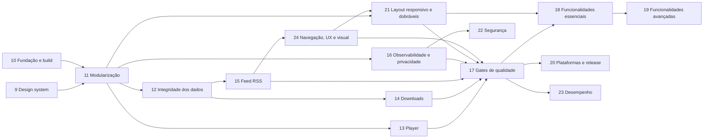

# Podcast KMP — Roadmap de Melhorias

> Continuação do [roadmap original](roadmap-kmp-podcast.md) (fases 1–7 concluídas; a fase 8, de testes, foi
> absorvida pela fase 17 daqui). Baseado na análise do código em `main` (commit `9e4f898`), com
> `:shared:desktopTest` (66 testes) e `:shared:detekt` verdes em 02/10/2026. Contexto geral em [CONTEXTO.md](CONTEXTO.md).
>
> **Objetivo:** fazer um refactor completo e levar o projeto ao padrão de um app mantido por uma equipe grande:
> identidade visual própria, módulos com fronteiras verificadas, dados que não se perdem, player confiável,
> gates de qualidade no CI e uma pipeline de release para as quatro plataformas.
>
> Legenda: **Esforço** P (≤ ½ dia) · M (1–2 dias) · G (3+ dias).
> **Status**: ✅ confirmado lendo o código · 🔎 provável, reproduzir antes de corrigir · ✔ feito.

---

## Resumo por prioridade

| # | Problema | Impacto | Fase |
|---|---|---|---|
| 1 | Qualquer mudança de schema **apaga a biblioteca** (`fallbackToDestructiveMigration(true)` em produção) | Perda de dados | 12 |
| 2 | O progresso **não é salvo durante a reprodução**: `debounce(2000)` sobre um estado que muda a cada 500 ms nunca emite | Perda de dados | 13 |
| 3 | Download que falha no meio deixa um arquivo parcial que o player passa a tocar como se estivesse completo | Funcional | 14 |
| 4 | O download carrega o episódio inteiro na memória (`httpClient.get` em vez de streaming) e usa o `guid` (muitas vezes uma URL) como nome de arquivo | Funcional / memória | 14 |
| 5 | O `PlayerViewModel.onCleared()` libera o player singleton, que no Android fica inutilizável até o processo morrer | Funcional (Android) | 13 |
| 6 | O player do Android não pede foco de áudio nem pausa quando o fone é desconectado | Funcional (Android) | 13 |
| 7 | O id do episódio é o `guid` puro: episódios de feeds diferentes com o mesmo guid se sobrescrevem | Integridade | 12 |
| 8 | Erros de atualização nunca aparecem (o ViewModel faz `try/catch` em volta de um `Result`) e o filtro do detalhe volta para "Todos" a cada progresso salvo | Funcional | 12 |
| 9 | URL de feed privado (com token) vai para Analytics, traces e Crashlytics | Privacidade | 16 |
| 10 | Um módulo só, domínio dependendo de dados e de Compose, singletons globais sem injeção | Arquitetura | 11 |
| 11 | Visual monocromático genérico, 20 papéis de cor do M3 caindo no roxo padrão, 60 tokens de dimensão repetidos | Produto | 9 |
| 12 | Não dá para encontrar podcasts: só colando a URL do RSS (a busca procura só no que já foi salvo); faltam recursos que todo app de podcast tem, como categorias, fila editável e "Novos episódios" | Produto | 18 / 19 |
| 13 | A Web não consegue ler a maioria dos feeds (CORS) | Plataforma | 20 |
| 14 | CI não roda Detekt nem cobra cobertura; o `GoogleService-Info.plist` está versionado | Qualidade / segurança | 10 / 17 |
| 15 | Qualquer app instalado pode navegar na biblioteca e controlar o player (serviço de mídia exportado sem filtro) | Segurança | 22 |
| 16 | A navegação inteira recompõe a cada 500 ms enquanto toca | Desempenho | 23 |
| 17 | Layout de celular esticado em tablet, Desktop e dobráveis; nada reage à dobra | Produto | 21 |
| 18 | O mesmo feed entra duas vezes se a URL vier escrita de outro jeito (`http`/`https`, `/` no fim, caractere sobrando) | Integridade | 15 |
| 19 | Barra de navegação com abas que repetem outros caminhos (Downloads, Player), nome "Buscar" para uma lista de episódios e layout sem modernização desde a 9 | Produto | 24 |

## Sequência



- **A fase 9 vem primeiro** a pedido: é ela que define a cara do app e cria o primeiro módulo separado
  (`:core:designsystem`), que serve de molde para a fase 11. A fase 10 pode rodar em paralelo, porque mexe só em build e CI.
- **A 11 vem antes das correções de dados e player** porque elas mudam justamente os arquivos que a modularização
  move. Corrigir antes significaria mover duas vezes e resolver conflitos. A exceção são os itens 12.1 (migrações) e
  13.1 (salvamento do progresso): se o app voltar a ser usado antes da fase 11 terminar, esses dois podem ser
  antecipados, porque cada um mexe em poucos arquivos.
- 12 e 13 podem rodar em paralelo, e 14, 15 e 16 também, desde que não toquem os mesmos arquivos.
- As fases 18 e 19 (funcionalidades novas) só começam com os gates da 17 ligados, para que o código novo já nasça
  cobrado. A 20 (release) pode andar em paralelo com elas.
- A 21 (layout responsivo) depende da modularização (11) e dos componentes da 9; a 22 (segurança) vem depois da 16,
  que já trata de privacidade; a 23 (desempenho) precisa das medições da 17.6 e pode rodar junto com as 18–20.

**Ordem a partir da fase 15** (revista em 03/10/2026, com a fase 14 concluída):

1. **15 — Feed RSS**, com a **16.1** (URL de feed privado vazando) antecipada: é um vazamento que acontece hoje e
   também é sobre feeds. A 15 vem antes da 24 porque corrige o que as telas mostram (datas, itens sem áudio, HTML,
   links, feeds duplicados); revisar a UX com conteúdo errado desperdiça a revisão.
2. **24 — Navegação, UX e visual.** Antes da 18 para que as telas novas (busca de podcasts, Configurações, fila,
   novos episódios) já nasçam no layout e na navegação decididos, em vez de serem refeitas. A ADR de navegação já
   diz onde entram 18.1, 18.5, 18.6 e 18.7.
3. **21 — Layout responsivo**, logo depois da 24: adapta a cada tamanho o layout novo, não o que vai ser trocado.
4. **16 — Observabilidade e privacidade** (o resto; a 15.9 sai junto com a 16.5, de que depende). Antes da 17,
   que usa as métricas da 16.8.
5. **17 — Gates de qualidade**, depois da 24 e da 21: os testes de tela e snapshots da 17.4 já cobrem o visual
   final. Continua antes da 18, para o código novo nascer cobrado.
6. **18 — Funcionalidades essenciais**, depois **19**.
7. **20 (release), 22 (segurança) e 23 (desempenho)** depois da 17, em paralelo com a 18 e a 19, como antes.
8. **25 — UI nativa no iOS**, por último (decisão de 07/10/2026): reescreve a interface do iOS em SwiftUI sobre os
   ViewModels e o domínio que as outras fases deixaram prontos, então chega quando eles param de mudar.

**Regra de toda fase:** uma branch por fase a partir da `main` (`feature/phase-09-design-system`), um commit por
subitem com o teste correspondente e a nota "Implementado" na seção do roadmap, e uma merge request no fim. Cada
subitem só fica pronto quando o teste novo falha no código antigo e passa no novo. `detekt` limpo e testes verdes
antes de cada commit.

---

## Fase 9 — Design system

**Objetivo:** dar ao app uma identidade própria e um design system de verdade: tokens completos, componentes
reutilizáveis, um módulo próprio, uma referência visual e snapshot tests. Nenhuma tela nova; as telas existentes
passam a usar só o design system.

### 9.1 Direção visual e referência HTML ✔ — M
- **Problema:** a paleta é preto, branco e cinza nos dois temas (`Color.kt`), a fonte é a do sistema e não existe
  referência visual. O app não tem cara de produto.
- **Ação:** antes de qualquer código, montar `docs/podcast-design-system.html` (como o do PTT-LAN) com paleta clara e
  escura, escala tipográfica, espaçamentos, formas, estados (tocando, baixando, baixado, ouvido, erro) e os
  componentes da 9.6 renderizados. Registrar a decisão na **ADR 0001 — Identidade visual**.
- **Pontos a decidir:**
  1. **Cor de marca:** uma cor de destaque só, usada no play, no progresso e no "tocando agora". Neutros com leve
     temperatura, em vez de cinza puro.
  2. **Tipografia:** uma família embarcada em `composeResources/font` com pesos 400/500/600/700 e algarismos
     tabulares para os tempos do player. A fonte do sistema muda entre as plataformas.
  3. **Tema dinâmico pela capa:** o player e o detalhe do podcast tingidos pela cor dominante da capa (9.10).
- **Critério:** contraste AA (4,5:1 para texto, 3:1 para ícones e bordas) em todos os pares de cor, medido no próprio HTML.
- **Implementado:** comparadas três direções (Sinal/âmbar + Onest, Estúdio/cobalto + Plus Jakarta Sans,
  Ondas/petróleo + Figtree); escolhida a **Sinal**. Como o âmbar puro tem só 1,9:1 contra o fundo claro, ele foi
  dividido em três papéis: `primary` (`#BC7300` no claro), `accentText` (`#9A5B00` no claro) e `brand`
  (`#F2A93B`, sempre com texto escuro). A [ADR 0001](adr/0001-identidade-visual.md) traz a tabela completa de
  tokens (todos os papéis do M3 + 5 do app) e os 26 pares de uso, todos AA nos dois temas.
  `docs/podcast-design-system.html` mostra cores, contraste do tema atual, tipografia, medidas, movimento, os
  componentes da 9.6 com seus estados e as telas de biblioteca e player, com seletor de tema.

### 9.2 Módulo `:core:designsystem` ✔ — M
- **Problema:** o design system mora dentro do `:shared`, misturado com regras de negócio, e os componentes de UI
  ficam em `presentation/component`, fora dele.
- **Ação:** criar o módulo KMP `:core:designsystem` (Android, iOS, Desktop, Wasm) com tema, tokens, fontes, ícones,
  componentes e o próprio `Res` (`br.com.carvalho.podcast.core.designsystem.generated.resources`). O `:shared`
  passa a depender dele.
- **Atenção:** a task `syncComposeResourcesForAndroid` (necessária no AGP 9) precisa valer também para o módulo novo.
  Ela vai para o convention plugin da 10.3, em vez de ser copiada.
- **Implementado:** módulo `core/designsystem` (Android, Desktop, Wasm, iosArm64, iosSimulatorArm64) com o tema atual
  (`Color.kt`, `Type.kt`, `Shape.kt`, `Dimensions.kt`, `Theme.kt`) movido por `git mv` no mesmo pacote, então nenhum
  import mudou; o `:shared` depende dele com `implementation`. O módulo exporta Compose runtime, foundation, ui e
  material3 como `api`. Sem `Res` por enquanto: o módulo ainda não tem recursos. O `Res` próprio e a cópia dos
  recursos para o Android entram na 9.4, com as fontes, porque só dá para verificar o empacotamento no APK quando
  existe um recurso. Item sem teste novo (só movimentação): verificado com os 66 testes de `:shared:desktopTest`,
  `detekt` dos dois módulos, `:androidApp:assembleDebug`, `:desktopApp:compileKotlinJvm`,
  `:webApp:compileKotlinWasmJs` e `:core:designsystem:compileKotlinIosSimulatorArm64`. O framework iOS do `:shared`
  não foi compilado aqui porque o `pod install` local quebra (Ruby 4.0 do Homebrew); o CI cobre.

### 9.3 Cores: esquema completo e cores semânticas ✔ — P
- **Problema:** `lightColorScheme`/`darkColorScheme` recebem só 16 papéis. Os outros (`tertiary`, `outline`,
  `outlineVariant`, `surfaceContainer*`, `inverseSurface`, `scrim`…) caem no **roxo padrão do Material 3**, que
  aparece em chips, divisores, sliders e no `NavigationSuiteScaffold`.
- **Ação:** definir todos os papéis do M3 a partir da paleta da 9.1 e acrescentar um `PodcastColors` (via
  `CompositionLocal`) para o que o M3 não cobre: `playing`, `downloaded`, `played`, `progressTrack`, `progressFill`.
  Features usam `MaterialTheme.colorScheme` ou `PodcastTheme.colors`, nunca `Color(...)`.
- **Teste:** `ColorContrastTest` em `commonTest` calcula o contraste WCAG de cada par (`onX` sobre `X`) nos dois
  temas e falha abaixo de AA.
- **Implementado:** os 48 papéis do M3 definidos nos dois temas (`ColorSchemes.kt`), a partir de primitivas com nome
  em `Palette.kt` (`AMBER_50`, `NEUTRAL_97`…), o que também resolve o `MagicNumber` sem afrouxar o Detekt. As cores
  fora do M3 ficam em `PodcastColors` (`accentText`, `brand`, `onBrand`, `downloaded`, `played`), lidas por
  `PodcastTheme.colors` e providas pelo `PodcastTheme`. Dois testes em `core/designsystem/commonTest`:
  `ColorContrastTest` (os 26 pares da ADR nos dois temas, com o contraste WCAG calculado por `Color.luminance()` e
  conferido contra 21:1 de preto/branco) e `ColorSchemeCompletenessTest`, que compara cada papel com o padrão do
  M3 e falha se algum ficou de fora (com uma lista explícita de coincidências intencionais: branco, preto e os
  vermelhos de erro do M3 no tema claro). Rodado contra o esquema antigo, o de completude falha nos dois temas;
  com o novo, os 5 testes passam. Conferido no Razr 60 no tema escuro.

### 9.4 Tipografia ✔ — P
- **Problema:** `Type.kt` reescreve os 15 estilos do M3 com `FontFamily.Default` e os valores padrão, e os tempos do
  player ("12:05") mudam de largura a cada segundo.
- **Ação:** fonte embarcada e uma escala só com os estilos usados. `PodcastTheme.typography.timer` com
  `fontFeatureSettings = "tnum"`. Proibir `.sp` e `.copy(fontSize = …)` nas features.
- **Implementado:** Onest 400/500/600/700 (TTF estáticos do Google Fonts, com `tnum`) em
  `core/designsystem/src/commonMain/composeResources/font`, licença em `core/designsystem/OFL-Onest.txt`. O módulo
  ganhou o próprio `Res` (`…core.designsystem.generated.resources`) e `androidResources { enable = true }`: as fontes
  entram no APK em `assets/composeResources/…` **sem** a task manual de sincronização que o `:shared` usa (ver 10.3).
  `podcastTypography(family)` aplica a família a todos os 15 estilos do M3 (inclusive os que só os componentes do
  M3 usam por dentro, como snackbar e diálogo, para não voltarem à fonte do sistema) e os valores da ADR nos 7
  usados pelas telas; `PodcastTheme.typography` traz `timer` (13/18, 500, `tnum`) e `section` (11/16, 600, +0,06em; quem
  chama põe em caixa alta). Os tempos do player passaram a usar `timer`. `TypographyTest` (desktop, com Compose
  ui-test) exige uma família só em todos os estilos, diferente da padrão do sistema: falha com a família do
  sistema, como no código antigo, e passa com a Onest. Conferido no Razr 60: fontes no APK, sem erro de recurso e
  com a Onest nas telas. **Pendente:** iOS e Web só compilam aqui; o carregamento da fonte nessas plataformas fica
  para conferir no CI e quando a distribuição Web (10.10) voltar a funcionar.

### 9.5 Espaçamentos e tamanhos ✔ — P
- **Problema:** `AppDimensions` tem 60 tokens com valores repetidos (`paddingSmall` e `spacingSmall` valem 4 dp;
  `paddingNormal` e `spacingLarge`, 16 dp) e mistura espaçamento, tamanhos de componente, breakpoints, colunas da
  grade e opacidades.
- **Ação:**
  - `Spacing` com uma escala só (`xxs` 2 · `xs` 4 · `s` 8 · `m` 12 · `l` 16 · `xl` 24 · `xxl` 32 · `xxxl` 48).
  - `Sizes` só para tamanhos que vários componentes dividem (`touchTarget`, `artworkS/M/L`, `miniPlayerHeight`).
    Um tamanho que pertence a um componente vira um `val` com nome dentro dele.
  - Breakpoints saem do design system: o `WindowSizeClass`, que o `RootContent` já usa, cuida disso.
  - `GRID_COLUMNS_*` vira `GridCells.Adaptive(minSize = Sizes.artworkM)`, que se ajusta sozinho e dispensa os breakpoints.
  - Opacidades vão para `Alpha` (`disabled`, `muted`, `scrim`).
- **Implementado:** `AppDimensions` saiu. `Spacing` (2 · 4 · 8 · 12 · 16 · 24 · 32 · 48), `Sizes` (`touchTarget`,
  `artworkS/M/L`, `miniPlayerHeight`, `playButtonLarge`, `listBottomInset` = mini player + `Spacing.l`, ícones
  `iconS/M/L/Xl` e `progressStroke`) e `Alpha` (`disabled`, `muted`, `scrim` e `faint` 0,12, para trilhas sobre
  contêiner colorido) em `Dimensions.kt`; `Shapes` com os raios da ADR (6 · 10 · 14 · 20 · 28). Os 9 arquivos de tela
  e componente foram migrados: `RoundedCornerShape(AppDimensions.radiusX)` virou `MaterialTheme.shapes.x`; tamanhos de
  um só composable viraram `val` local (capa do detalhe 100 dp, traço 4 dp do player, altura máxima da fila, elevação
  e barras de progresso do mini player e da linha); `LINE_HEIGHT_NORMAL` saiu (vale a altura de linha do estilo). A
  grade da biblioteca virou `GridCells.Adaptive(Sizes.artworkM)`, e os breakpoints e `GRID_COLUMNS_*` sumiram. Mudanças
  visuais pequenas e intencionais: ícones de 16/18/20 dp unificados em 18, 28 dp em 32, botão de 40 dp da linha de
  episódio passou a 48 (alvo de toque), espaçadores de 40 dp do player passaram a 32, opacidades 0,5/0,7 viraram
  `muted` (0,6) e 0,8 virou opaco. Refatoração sem teste novo: verificado com os 66 + 7 testes, Detekt, os builds
  e no Razr 60 (biblioteca e player).

### 9.6 Componentes ✔ — G
Hoje a mesma linha de episódio é montada de formas diferentes em detalhe, busca e downloads, e play e download têm
um visual por tela. Componentes do design system, todos sem estado e com previews nos dois temas:

| Componente | Substitui / cobre |
|---|---|
| `PodcastArtwork` | `AsyncImage` + placeholder + forma, repetidos em 6 telas; com descrição para acessibilidade |
| `EpisodeRow` | `EpisodeListItem` (288 linhas) e as variações de busca e downloads; título, podcast, data, duração, progresso e ações |
| `PlayPauseButton` | Estados parado / tocando / carregando, mais o anel de progresso de um episódio já iniciado |
| `DownloadButton` | Os 5 `DownloadStatus` (inativo, na fila, baixando com %, baixado, falhou com nova tentativa) |
| `EpisodeProgressBar` | Barras de progresso do mini player e da lista |
| `PlayerSlider` | Slider com tempo decorrido e restante e `stateDescription` ("12:30 de 45:00") |
| `FilterChipRow` | Filtros do detalhe do podcast |
| `EmptyState` / `ErrorState` / `LoadingState` | Estados de tela padronizados (hoje cada tela improvisa ou não tem) |
| `ConfirmDialog` | Os diálogos de excluir podcast e excluir download |
| `PodcastTopBar` | As top bars transparentes repetidas em player e detalhes |
| `MiniPlayer`, `PodcastCard`, `HtmlText` | Saem de `presentation/component` para o design system, já com os tokens novos |

- **Implementado:** pacote `core.designsystem.component` com `PodcastArtwork` (placeholder com o glifo do app),
  `PlayPauseButton` (estilos `Filled` e `Tonal`, carregando e anel de progresso com "Continuar, 62% ouvido"),
  `DownloadButton` (estado próprio `DownloadState`, uma ação por estado: baixar, cancelar, remover, tentar de novo),
  `EpisodeProgressBar`, `PlayerSlider` (segue o dedo e só busca ao soltar; `stateDescription` "12:05 de 47:30"),
  `FilterChipRow`, `EmptyState`/`ErrorState`/`LoadingState`, `ConfirmDialog`, `PodcastTopBar`, `MiniPlayer`,
  `PodcastCard` (selo de não ouvidos) e `EpisodeRow` (marcadores Novo/Ouvido/Baixado). Nenhum depende de modelo
  de domínio; os textos de acessibilidade estão nos recursos do módulo (en/pt/es). `HtmlText` foi movido com
  `git mv` (ver 15.7). Previews claro/escuro em `Previews.kt`. No `:shared`, `PodcastCard` e `MiniPlayer` saíram
  (a biblioteca e o `RootContent` usam os do design system) e `EpisodeListItem` virou um adaptador de `Episode` +
  `DownloadStatus` para `EpisodeRow`. Como o botão de download agora cancela, `SearchViewModel` e
  `PodcastDetailViewModel` ganharam `cancelDownload` (com teste). Corrigido no caminho: `remaining_min` usava `%d`,
  que o Compose Resources não substitui (o código antigo trocava à mão); virou `%1$d` nos três idiomas. O Detekt
  passou a entender Compose (`FunctionNaming` e `LongParameterList` ignoram `@Composable`, `TooManyFunctions`
  ignora `@Preview`, `MagicNumber` isenta `Previews.kt`), parte do 17.1. Testes: `ComponentsTest` (desktop, 7 casos:
  ação de cada estado do download, rótulos do play/pause e do botão começado, chips, marcadores da linha, mini
  player e card, estes dois vindos do `:shared`) e `HtmlParserTest`. Conferido no Razr 60 (biblioteca, detalhe e
  mini player). O mini player usa `surfaceContainer` (não `surfaceContainerLowest`, que no escuro fica mais escuro
  que o fundo), e a referência HTML foi ajustada.

### 9.7 Movimento e formas ✔ — P
- **Ação:** um objeto `Motion` com durações e curvas usado na transição do mini player para o player, no
  aparecer/sumir do mini player e no crossfade das capas, que hoje usam os valores padrão de cada API. `Shapes` com
  os raios definidos na 9.1.

- **Implementado:** `Motion` no design system (`SHORT` 150, `MEDIUM` 250, `LONG` 400 ms; `Standard` e
  `Emphasized`). Aplicado no player em tela cheia abrindo e fechando (`LONG` + `Emphasized`), no mini player
  aparecendo e sumindo e no deslocamento do botão "+" (`MEDIUM` + `Standard`), no crossfade das capas do Coil
  (`MEDIUM`) e na troca de ícone do `PlayPauseButton` (`SHORT`). Os raios das formas já tinham entrado na 9.5.
  Sem teste novo (só valores de animação): verificado com os testes, o Detekt, os builds e no Razr 60, com uma
  captura no meio da abertura do player.

### 9.8 Textos fora do código ✔ — M
- **Problema:** a fase 6 foi marcada como feita, mas há texto em pt-BR nos ViewModels, em `LongExtensions.toDate()`,
  no `RssXmlParser`, no `PodcastCard` e na bandeja do Desktop; `app_name` e `rss_url_placeholder` faltam no `values-pt`.
- **Ação:**
  - ViewModels emitem `StringResource` + argumentos (ou um tipo selado), e a tela resolve o texto.
  - `toDate()` vira um cálculo puro (`RelativeTime`, testado) mais textos com plurais nos recursos.
  - Data absoluta formatada pelo locale.
  - Defaults do parser viram `null`; a UI decide o rótulo.
  - Teste que compara as chaves de `values`, `values-pt` e `values-es` e falha se faltar alguma.

- **Implementado:** os erros e o snackbar dos 5 ViewModels viraram `StringResource` (a tela resolve com
  `getString`); "já existe" ganhou mensagem própria (`error_podcast_exists`, com teste no `LibraryViewModelTest`) e a
  mensagem crua da exceção saiu da tela. `toDate()` deu lugar a `relativeTime()` (cálculo puro, `RelativeTimeTest`)
  + `RelativeTime.text()` com plurais; a data absoluta usa `date_short` com argumentos posicionais (dia/mês/ano em
  pt e es, mês/dia/ano em en); feed sem data não mostra texto. O parser não inventa mais texto: canal sem título vira
  o host do feed no mapper, autor ausente fica `null`, episódio sem título usa a descrição ou o nome do arquivo (com
  testes). Bandeja e título da janela do Desktop, e os rótulos do Android Auto e da notificação, vêm dos recursos.
  `app_name` e `rss_url_placeholder` entraram em pt e es. `StringResourcesTest` (nos dois módulos) compara as chaves
  dos três idiomas: falhou no `:shared` antes da correção e passa depois. Conferido no Razr 60 (datas na lista).
  **Exceção mantida:** `DownloadStatus.Failed` ainda carrega a mensagem crua da exceção, mas ela não chega à tela
  (o `DownloadState.Failed` do design system não tem texto); o tipo do erro fica para a 14.9.

### 9.9 Migração das telas ✔ — G
- **Ação:** as 6 telas e o `RootContent` passam a usar só tokens e componentes do design system. Cada tela vira
  `XxxScreen(viewModel)` + `XxxContent(state, onIntent)` sem estado, com previews de vazio, carregando, erro e
  conteúdo. O `PlayerScreen` (588 linhas) é quebrado em arquivos menores no caminho.
- **Regra no build:** o `MagicNumber` do Detekt passa a pegar `16.dp` e argumentos nomeados
  (`ignoreNamedArgument: false`, `ignoreExtensionFunctions: false`), com previews isentos. Um `ForbiddenImport`
  barra `androidx.compose.ui.graphics.Color` fora do design system.

- **Implementado:** as 6 telas viraram `XxxScreen(viewModel)` (coleta estado, snackbar, diálogos de player) +
  `XxxContent(state, actions)` sem estado, com as ações agrupadas em `XxxActions` (`LibraryActions`,
  `PodcastDetailActions`, `SearchActions`, `PlayerActions`). Todas usam só tokens e componentes do design system:
  `LoadingState`, `EmptyState` com ação (biblioteca vazia oferece "Adicionar podcast"; busca e downloads vazios
  explicam o que fazer), `ConfirmDialog` nas exclusões, `FilterChipRow` no lugar das abas do detalhe,
  `PodcastArtwork` em todas as capas (o `app_icon.png` como placeholder saiu das telas) e campo de busca em pílula.
  O `PlayerScreen` (588 linhas) virou `PlayerScreen` (65), `PlayerContent` (204) e `PlayerDialogs` (215), com o
  `PlayerSlider` e o `PlayPauseButton` do design system; o tempo da direita passou a ser o restante ("−35:25").
  Previews de todas as telas em `presentation/preview/Previews.kt` (vazio, carregando, conteúdo, claro e escuro).
  **Regras no build:** `MagicNumber` com `ignoreNamedArgument: false` e `ignoreExtensionFunctions: false` (pega
  `16.dp` e `maxLines = 3`), `ignoreLocalVariableDeclaration: true` (o `val` local com nome da regra) e
  `ignoreAnnotation: true`; isentos os arquivos de tokens e os `Previews.kt`. `ForbiddenImport` barra
  `androidx.compose.ui.graphics.Color` fora de `core/designsystem`. Verificado plantando um `import Color` e um
  `padding(16.dp)` numa tela: os dois quebram o Detekt. Os 9 números que sobraram fora das telas viraram constantes
  (`PAGE_SIZE`, `MAX_RETRIES`, `MILLIS_PER_SECOND` no player Web). **Corrigido no caminho:** três diálogos usavam
  `%s`, que o Compose Resources não substitui (o diálogo mostrava "%s" no lugar do nome): viraram `%1$s`, e o
  `StringResourcesTest` ganhou `placeholdersArePositional` (falha nos recursos antigos); 8 chaves de data e duração
  sem uso saíram; o placeholder da busca dizia "Search podcasts…" e ela busca episódios; o texto da fila usava
  `primary` como cor de texto (proibido pela ADR) e passou a `accentText`; "Sleep Timer" estava em inglês no pt; o
  campo de busca invadia a barra de status. Testes: `ScreenContentTest` (biblioteca vazia chama "adicionar",
  toque no card abre o podcast certo, "próximo" desabilitado no último episódio da fila). Conferido no Razr 60
  (biblioteca, busca, downloads vazio e player). **Fica para a 11.10:** o `RootContent` não foi reestruturado (só
  usa `MaterialTheme`); o botão de atualizar da busca saiu (ela atualiza ao abrir).

### 9.10 Cor dinâmica pela capa (opcional) ✔ — M
- **Ação:** extrair a cor dominante da capa (amostragem dos pixels do bitmap que o Coil já carrega, sem dependência
  nova) e aplicar no fundo do player e no topo do detalhe, com fallback para a cor de marca quando o contraste não
  atingir AA. A função de extração é pura e testada.

- **Implementado:** `dominantColor(pixels)` (média dos pixels com cor; cinzas, brancos e quase-pretos ficam de fora;
  `null` se menos de 5% tiver cor) e `artworkTint(dominante, fundo, texto)` (mistura 35%, depois 20%, e desiste se o
  texto cair abaixo de 4,5:1), ambas puras e com `ArtworkColorTest`. `rememberArtworkColor(url)` pede ao Coil a
  mesma capa em 32×32 (aproveita o cache), desenha o `painter` num `ImageBitmap` e lê os pixels, só com APIs comuns
  do Compose. `ArtworkBackdrop` aplica o degradê (cor da capa no topo → fundo, entrando com `Motion.LONG`) e é
  usado pelo player, sem `Color` na tela. **Achados no aparelho:** (1) no Android o Coil entrega bitmap de hardware,
  que não pode ser desenhado num canvas de software, e o app fechava ao abrir o player: a amostragem pede
  `allowHardware(false)` (`expect/actual`, porque a opção só existe no Android) e roda em `runCatching`, já que a
  cor é decorativa; (2) a primeira versão excluía pixels muito claros e descartava o ciano vivo da capa de teste, o
  limite superior saiu (o branco já cai pelo filtro de saturação), com caso novo no teste. Conferido no Razr 60:
  degradê azul-petróleo no player de um episódio com capa ciano. iOS, Desktop e Web só compilam aqui.

### 9.11 Snapshot tests ✔ (falta gravar no Linux) — M
- **Ação:** Roborazzi em `androidHostTest` do `:core:designsystem`, com cada componente em claro e escuro e com
  fonte em 200%. O `verifyRoborazzi…` roda no CI e os diffs sobem como artefato.
- **Lição do PTT-LAN:** gravar as imagens no **Linux**, por um workflow manual (`record-snapshots.yml`). O
  Robolectric renderiza diferente no macOS, então uma referência gravada no Mac nunca bate no runner.

- **Implementado:** Roborazzi 1.76 + Robolectric 4.17 no `androidHostTest` do `:core:designsystem`
  (`@Config(sdk = [35])`, `GraphicsMode.NATIVE`, 411dp xxhdpi). `DesignSystemSnapshotTest` grava 9 imagens: botões,
  linhas de episódio, peças do player e estados vazio/erro, cada um em claro e escuro, mais as linhas com fonte em
  200%. Referências em `core/designsystem/snapshots/`. Workflow manual `record-snapshots.yml` grava no Linux e
  commita as imagens na branch; o job de testes do CI passou a rodar também os testes do design system e roda
  `verifyRoborazziAndroidHostTest` quando há imagens, publicando os diffs se falhar. **Achado pelas imagens:** no
  tema escuro o título do `PodcastCard` e do `EmptyState`/`ErrorState` saía preto, porque herdava a cor do contêiner
  (no app o `Scaffold` escondia o problema); os componentes passaram a definir a cor, e o `PreviewSurface` usa
  `Surface`. **Pendente:** as imagens foram gravadas no Mac só para validar a configuração e não foram commitadas;
  as de referência dependem de rodar o workflow no GitHub depois do push da branch.

### 9.12 Acessibilidade ✔ — M
- **Ação:** alvos de toque de pelo menos 48 dp em todos os controles; `contentDescription` em todas as imagens e
  ícones que não sejam decorativos (hoje há `contentDescription = null` no play do detalhe do episódio);
  `semantics` no slider do player e no botão de download (estado + progresso); ordem de foco do teclado no Desktop e
  na Web; snapshot com fonte em 200% sem cortar texto.

- **Implementado:** já estavam cobertos pelos componentes da 9.6: alvos de 48 dp em todos os controles, descrição
  em todos os botões de ícone, `stateDescription` no slider e no botão de download, "ouvido" com ícone e texto além
  da cor, e o play do detalhe do episódio tem texto ao lado do ícone. Nesta etapa: títulos de tela, do episódio no
  player, do podcast e dos estados vazios marcados como cabeçalho (`heading()`), para navegar por cabeçalhos no
  TalkBack/VoiceOver; o mini player anuncia "Abrir player" (rótulo do clique); velocidade e timer anunciam
  "Ativado" quando ligados, em vez de só mudar de cor. A fonte em 200% está no snapshot da 9.11, e as animações
  do Compose respeitam a escala de animação do sistema no Android. Testes: alvo de toque mínimo (play e download),
  rótulo do mini player, título do estado vazio como cabeçalho (`ComponentsTest`), título da biblioteca como
  cabeçalho e timer ativo anunciado (`ScreenContentTest`). Os quatro últimos falham no código anterior e passam no
  novo. **Fica para a 21.6/21.7:** atalhos de teclado e ordem de foco entre painéis no iPad, Desktop e Web.

### 9.13 Ícone do app no novo design ✔ (falta conferir no launcher) — M
- **Problema:** cada plataforma tem um ícone diferente e nenhum segue a identidade da 9.1. O Android usa um ícone
  adaptativo vetorial do template, sem camada monocromática, então não acompanha os ícones temáticos do Android 13+.
  O iOS tem um `app-icon-1024.png` avulso, sem as variantes escura e tingida do iOS 18. O Desktop usa um `icon.png`
  também na bandeja. A Web não declara favicon nem manifest. O player usa um `app_icon.png` de `composeResources`
  como placeholder de capa.
- **Ação:**
  1. Desenhar o símbolo na referência HTML (`docs/podcast-design-system.html`): microfone (o glifo do logo da página)
     sobre o quadrado âmbar `brand`, com versões para fundo claro e escuro e uma versão monocromática. Aprovar antes
     de gerar os arquivos e registrar na ADR 0001.
  2. **Android:** ícone adaptativo vetorial (`foreground` + `background` + `monochrome`) em `mipmap-anydpi-v26`, com
     o glifo dentro da zona segura de 66 dp; apagar os PNGs `mipmap-*dpi` que o vetor dispensa (o `minSdk` é 26).
     Splash da API `SplashScreen` com o mesmo glifo e o fundo `background` do tema.
  3. **iOS:** `AppIcon` com as três aparências (padrão, escura e tingida) num único tamanho de 1024 px.
  4. **Desktop:** `.icns` (macOS), `.ico` (Windows) e `.png` (Linux) no `nativeDistributions`; ícone da bandeja em
     modelo monocromático no macOS.
  5. **Web:** favicon SVG, `apple-touch-icon` e `manifest.webmanifest` com `theme_color` âmbar.
  6. O placeholder de capa do player passa a ser o `PodcastArtwork` da 9.6, e o `app_icon.png` sai.
- **Verificação:** ícone conferido no launcher do Razr (com e sem ícones temáticos, e na tela externa), no
  simulador iOS nos três modos, no Dock/Barra de tarefas do Desktop e na aba do navegador.

- **Implementado:** escolhida a opção **B · No ar** entre três (comparadas nas máscaras do Android e do iOS, nos
  modos escuro, tingido e temático, e em 24–48 px); registrada na ADR 0001. O glifo foi reduzido a 75% do quadro
  de 108 porque, como desenhado no comparativo, as ondas externas sairiam da zona segura de 66 do ícone adaptativo
  e seriam cortadas pela máscara. Fontes SVG em `docs/brand/` e `generate-icons.sh` (Chrome headless para
  renderizar o SVG, porque o renderizador embutido do ImageMagick desenhava sem metade dos traços; ImageMagick para
  máscara e tamanhos; `iconutil` para o `.icns`). **Android:** ícone adaptativo só em vetor (`ic_launcher_background`
  âmbar, `ic_launcher_foreground` com o glifo) com camada `monochrome` para os ícones temáticos; os 15 PNG/WebP de
  `mipmap-*dpi` e o `drawable-v24` saíram (o `minSdk` é 26). Tema `Theme.Podcast` com `windowBackground` claro/escuro,
  que também é o fundo da splash do Android 12+ (antes era o tema claro do framework, com flash branco no modo
  escuro). **iOS:** `AppIcon` com padrão, escuro e tingido em 1024 px. **Desktop:** `.icns`, `.ico` e `.png` no
  `nativeDistributions`; janela e bandeja usam o `app_icon` dos recursos do Compose (o `painterResource("icon.png")`
  deprecado saiu). **Web:** `favicon.svg`, `apple-touch-icon`, `manifest.webmanifest` com `theme_color` âmbar e o
  título "Podcast KMP". O `app_icon.png` deixou de ser placeholder de capa na 9.9 e agora é o ícone de janela e
  bandeja. **Pendente:** conferir o ícone no launcher do Razr (com e sem ícones temáticos), no simulador iOS e no
  Dock — o aparelho estava bloqueado na hora da verificação; o APK instalou e abriu sem erro. Ícone da bandeja em
  modelo monocromático no macOS fica para a 20.5.

**Critério de conclusão:** referência HTML aprovada; `:core:designsystem` publicado para as 4 plataformas; ícone novo em todas elas; nenhuma
cor, `sp` ou `dp` solto nem texto de tela nas features (garantido pelo Detekt); snapshots e `ColorContrastTest` no CI.

---

## Fase 10 — Fundação: repositório, build e CI

**Objetivo:** deixar o repositório limpo, o build padronizado e o CI rápido e confiável antes de dividir o código.

| Item | Status | Evidência | Ação | Esforço |
|---|---|---|---|---|
| 10.1 Arquivos de máquina e lixo | ✔ feito | `gradle_debug.log` versionado; `composeResources/drawable/compose-multiplatform.xml` (do template) sem uso | `git rm` dos dois e `*.log` no `.gitignore`; nenhum código referenciava o drawable (o build continua passando) | P |
| 10.2 Segredo versionado | ✔ feito | `iosApp/GoogleService-Info.plist` está no git, embora o `google-services.json` do Android tenha saído (`6d1301b`) e o `.gitignore` só cubra `iosApp/iosApp/` | O arquivo versionado era uma duplicata idêntica e sem uso: o app usa `iosApp/iosApp/GoogleService-Info.plist`, a pasta que o Xcode sincroniza. Removido do git; o `.gitignore` passou a cobrir `**/GoogleService-Info.plist` e `**/google-services.json`. **Chaves (03/10/2026):** as duas chaves no histórico (…PrY8 do plist e …_2iQ do `google-services.json` antigo) eram do projeto `multiplatform-podcast`, que foi encerrado, invalidando as duas. O iOS também estava ligado a esse projeto antigo, com o bundle errado, enquanto o Android já usava o `podcast-f1345`: o plist foi trocado pelo do app iOS do `podcast-f1345` (chave nova) e o bundle do app passou de `br.com.carvalho.podcast.Podcast` (do template) para `br.com.carvalho.podcast`, igual ao Android e ao registrado no Firebase, o que tirou o aviso "I-COR000008: Bundle ID is inconsistent". Os secrets `GOOGLE_SERVICES_JSON` e `GOOGLE_SERVICE_INFO_PLIST` passaram a ter os arquivos completos (antes guardavam só uma chave) | P |
| 10.3 Convention plugins | ✔ feito | `shared/build.gradle.kts` com 278 linhas: lista de `ksp<Target>` à mão, `-Xexpect-actual-classes` duas vezes, task de sync de recursos para o AGP 9 (desnecessária: na 9.4, `androidResources { enable = true }` empacotou os recursos do `:core:designsystem` sem ela; trocar no `:shared` e apagar a task e o `sourceSets.assets` do `androidApp`), JavaFX em string com classificador | `build-logic/` (build incluído pelo `pluginManagement`) com `podcast.kmp.library` (plugins KMP e Android, alvos Desktop/Wasm/iOS, hierarquia padrão, `-Xexpect-actual-classes`, `compileSdk`/`minSdk` do catálogo e `androidResources` ligado em todo alvo Android) e `podcast.kmp.compose`; `:shared` e `:core:designsystem` usam os dois. Com o `androidResources` ligado no `:shared`, a task `syncComposeResourcesForAndroid`, o `sourceSets.assets` e o `evaluationDependsOn(":shared")` do `androidApp` saíram: os recursos dos dois módulos estão no APK e os textos e fontes carregam no Razr 60. O aviso "Default Kotlin Hierarchy Template Not Applied" de todo build do `:shared` sumiu. JavaFX passou a vir do catálogo (com o classificador do SO). Ficaram no módulo o que é dele: KSP do Room, CocoaPods, Kover. Detekt continua no `subprojects` da raiz; vira plugin quando houver mais módulos (11.3) | M |
| 10.4 Lockfiles | ✔ feito | O `.gitignore` ignora `kotlin-js-store/`, `yarn.lock` e `Podfile.lock`, mas os dois lockfiles estão versionados | `iosApp/Podfile.lock`, `kotlin-js-store/` e `yarn.lock` saíram do `.gitignore` (os lockfiles continuam versionados, agora sem contradição); a exceção `!shared/shared.podspec` vinha antes de `*.podspec` e não valia, e foi para depois | P |
| 10.5 CI | ✔ feito | Sem Detekt; sem `concurrency`; testes com `--info` (logs enormes); cache manual em vez do `setup-gradle`; o build do Desktop roda só no Linux | **Três builds quebrados desde maio:** (1) Android falhava com "Malformed root json": a action nova `secret-file` grava o secret como veio se for JSON/plist e decodifica de base64 caso contrário (testada nos dois formatos e com secret vazio); (2) iOS chamava `xcodebuild` no `.xcodeproj` sem `pod install`: agora gera o framework, roda `pod install` e compila o `.xcworkspace` com `ARCHS=arm64` (o Kotlin só gera `iosSimulatorArm64`; sem isso o destino genérico pedia x86_64) — o mesmo comando compilou o app localmente; (3) Web é a 10.10. **Novo:** job `static-analysis` (Detekt dos dois módulos + `lintDebug`), com baseline do lint (`androidApp/lint-baseline.xml`, 1 erro e 7 avisos que já existiam: busca por voz do Android Auto, ver 20.7; serviço exportado, ver 22.2); `concurrency` com `cancel-in-progress`; cache do `~/.konan` nos jobs de macOS; matriz Linux/macOS/Windows para empacotar o Desktop; sem `--info` nos testes. O `setup-gradle` já estava na action composta **Primeira execução no GitHub (PR #2):** o secret do Android não é JSON nem base64 válido ("base64: invalid input") — a action passou a ignorar BOM, linhas em branco e quebras do base64, a dizer o formato sem expor o conteúdo e, quando o secret não serve, a usar um arquivo fictício (`.github/ci/`), porque CI só compila e testa e o Firebase não é chamado; o build iOS falhava com "iOS 18.2 is not installed" porque o workflow fixava o Xcode 16.2 sem o runtime do simulador na imagem — o Xcode padrão da imagem (16.4) compilou mas não linkou: o Compose Multiplatform 1.11 usa `UIViewLayoutRegion`, do SDK do iOS 26, então os jobs de iOS selecionam o **Xcode 26** e imprimem versão e runtimes | M |
| 10.6 Atualização de dependências | ✔ feito | Versões mantidas à mão | Dependabot (nativo do GitHub, lê o `libs.versions.toml`): semanal, no máximo 5 PRs abertos, agrupados em Kotlin/Compose/KSP, AndroidX/AGP, Firebase, Ktor/kotlinx e testes; as GitHub Actions num grupo só. Renovate ficou de fora por exigir app externo para o mesmo resultado | P |
| 10.7 Dependências instáveis | ✔ feito | Room 3 e sqlite-web em alpha; `force("org.jetbrains.skiko:skiko:0.9.43")`; o Podfile sintético do CocoaPods é ajustado depois do `podGen` porque o plugin só sobe os pods para iOS 12 (KT-57741) e o Xcode 26+ exige 15 — sem isso o sync do Android Studio e o build iOS quebram (visto em 02/10/2026, junto com o CocoaPods do Homebrew quebrado pelo Ruby 4.0, resolvido com `brew reinstall cocoapods`) | [ADR 0002](adr/0002-dependencias-instaveis-e-remendos.md) lista cada exceção (Room 3/sqlite-web alpha, `-Xexpect-actual-classes`, Podfile sintético em iOS 15, baselines do Detekt e do lint) com motivo e condição de saída. **O `force` do Skiko saiu:** ele valia só dentro do `:shared` (o Desktop resolvia `0.144.6`, então testes e app usavam versões diferentes); sem ele o framework iOS faz o link, o app iOS compila pelo workspace e **roda no simulador** (primeira conferência visual da fase 9 no iOS: tema, Onest, textos e estado vazio corretos), e os testes JVM e Android passam | P |
| 10.8 Hook e template de PR | ✔ feito | A regra "Detekt antes do commit" só existe no `GEMINI.md` | `config/hooks/pre-commit` roda Detekt e testes desktop dos dois módulos; ativado com `git config core.hooksPath config/hooks` (no `CLAUDE.md`), sem task Gradle para copiar arquivo. `.github/pull_request_template.md` segue o formato das MRs (Description, Motivation, Changes, How to test) com checklist: teste que falha sem a mudança, checagens, snapshots, textos nos três idiomas e roadmap atualizado | P |
| 10.9 Documentação | ✔ feito (falta decidir os docs locais) | `roadmap-kmp-podcast.md` na raiz (agora em `docs/`); `docs/arquitetura.md` e `docs/regras-negocio.md` ignorados pelo git e com afirmações falsas (ver CONTEXTO §8); README pede JDK 17 | Roadmap original movido para `docs/` com os links ajustados; README reescrito (módulos, JDK 21, CocoaPods e o `brew reinstall` quando o Ruby atualiza, arquivos do Firebase e secrets, hook, comandos, workspace no iOS); a menção à licença MIT saiu porque não existe arquivo `LICENSE` (escolher uma licença é decisão do dono); `docs/adr/README.md` com índice e modelo. **Pendente:** `docs/arquitetura.md` e `docs/regras-negocio.md` existem só na máquina local (ignorados pelo git) e não foram apagados; o que vale deles já está no CONTEXTO e nas ADRs | P |
| 10.10 Distribuição Web quebrada | ✔ feito | `:webApp:wasmJsBrowserDistribution` falha na `main`: com `RepositoriesMode.PREFER_SETTINGS`, o repositório do binaryen (GitHub Releases) que o plugin Kotlin adiciona é ignorado e `com.github.webassembly:binaryen:125` não é encontrado. O job `build-web` do CI deve estar falhando | Repositório `ivy` do binaryen (GitHub Releases) no `settings.gradle.kts`, como Node e Yarn. `:webApp:wasmJsBrowserDistribution` passou a gerar o bundle (com ícone, manifest e recursos) e o app carrega num Chrome headless: Koin, banco e interface sobem, no tema escuro com o estado vazio. Ver 20.4 (COOP/COEP) e "A confirmar" (texto na Web) | P |
| 10.11 Remover Remote Config e Performance | ✔ feito | Pedido em 03/10/2026: o Remote Config passou a ser pago. O app lia 9 chaves pelo `AppConfig`, todas com padrão local (no Desktop e na Web ele já era no-op). O Performance (3 traces) também saiu, porque o SDK dele depende do Remote Config | `AppConfig` virou constantes com os mesmos valores (nenhum ponto de uso mudou). Saíram `expect object RemoteConfig` e `Performance` com os 8 `actual`, o `fetchAndActivate` da inicialização, os traces dos ViewModels de biblioteca e detalhe, `firebase-config`, `firebase-perf` e o plugin `com.google.firebase.firebase-perf`, e os pods `FirebaseRemoteConfig` e `FirebasePerformance` do framework e do Podfile. Sobra só `firebase-config-interop` / `FirebaseRemoteConfigInterop`, interface que o Crashlytics declara (sem SDK, sem chamada ao serviço). Verificado: testes, Detekt, lint, APK, Desktop, Wasm, framework e app iOS; o app abre no simulador e no Razr 60 com o Firebase inicializando. A medição de tempo das operações fica para a 16.8, sem Firebase | P |

**Critério de conclusão:** CI com análise estática, cache e cancelamento de execuções antigas; nenhum segredo nem
lixo no git; módulos configurados só por convention plugins.

---

## Fase 11 — Modularização e arquitetura

**Objetivo:** trocar o módulo único por módulos com fronteiras verificadas pelo build, deixar o domínio puro e
injetar tudo que hoje é global.

### 11.1 Grafo de módulos alvo ✔ — P
Registrado na **ADR 0003 — Grafo de módulos**:

```
build-logic/                convention plugins (10.3)
core/
  common                    dispatchers, AppError, relógio, constantes compartilhadas
  designsystem              fase 9
  database                  Room: entidades, DAOs, migrações, schemas
  network                   HttpClient comum + engines por plataforma
  player                    implementações do AudioPlayer, MediaService, sessões nativas
  observability             Logger, Analytics, Crashlytics, Performance, RemoteConfig (interfaces + Firebase)
  testing                   fakes compartilhados e utilitários de teste
domain                      modelos, interfaces de repositório, use cases (Kotlin puro)
data                        repositórios, RSS, downloader, mappers
feature/
  library  podcast  episode  search  downloads  player
shared                      RootComponent, montagem do Koin, framework iOS (export)
androidApp  desktopApp  webApp  iosApp
```

Regras: uma `feature` depende só de `domain`, `core:designsystem` e `core:common`, nunca de outra feature nem de
`data`, `database` ou `network`. `data` depende de `domain`, `core:database` e `core:network`. `domain` não depende
de nenhum outro módulo do projeto. Só o `shared` e os apps conhecem todos.

- **Implementado:** [ADR 0003](adr/0003-grafo-de-modulos.md) com o grafo (14 módulos), a tabela de dependências
  permitidas e quatro decisões: Firebase fica no `:shared` (onde estão os pods) e `:core:observability` só tem
  interfaces; `PagingData` aceito no domínio (biblioteca KMP sem Android); estabilidade do Compose por arquivo de
  configuração, não por anotação no domínio; `:core:ui` com os textos e a apresentação que várias features dividem.
  Ajuste em relação ao rascunho acima: `:core:ui` entrou (as telas leem textos do `Res` do `:shared`, que precisa
  ir para algum lugar comum) e `:core:observability` deixou de ter as implementações Firebase.

### 11.2 Domínio puro ✔ — M
- **Problema:** `AddPodcastFromUrlUseCase` e `RefreshPodcastUseCase` importam `data.mapper` e `data.remote.RssFeedDataSource`;
  `Episode` e `Podcast` importam `androidx.compose.runtime.Immutable`.
- **Ação:** o domínio fala com uma interface `FeedRepository` (`fetch(url): Result<Feed>`), e o mapeamento RSS fica
  em `data`. A estabilidade dos modelos para o Compose passa a vir de um `compose-stability.conf` nos módulos de UI,
  e não de anotação no domínio.

- **Implementado:** interface `FeedSource` no domínio (`fetch(feedUrl): Result<FetchedFeed>`, com podcast e episódios
  já como modelos de domínio) e `RssFeedSource` em `data`, que faz a leitura RSS e os mappers. Os dois casos de uso
  passaram a depender só de `FeedSource` e `PodcastRepository`, e o domínio não importa mais nada de `data` nem do
  Compose. `Episode` e `Podcast` perderam o `@Immutable`; `config/compose/stability.conf` declara
  `domain.model.*` como estável e o `podcast.kmp.compose` o aplica a todo módulo de UI. Os testes dos casos de uso e
  dos ViewModels montam `RssFeedSource(FakeRssFeedDataSource())`, então continuam cobrindo o mapeamento. O Media3 1.11
  deprecou o construtor de `ConnectionResult.AcceptedResultBuilder` usado no `PodcastMediaService` (ver fase 13).

### 11.3 Extrair os módulos `core` ✔ — G
- **Ação:** mover `common`, `database`, `network`, `player` e `observability` nessa ordem, com o build verde a cada
  passo. O `core:testing` recebe os fakes que hoje estão em `shared/commonTest` (`FakePodcastRepository`,
  `FakeAudioPlayer`, `FakeEpisodeDownloader`…), porque eles vão ser usados por vários módulos.
- **Implementado:** `:core:common` (AppConfig, dispatchers, `AppDirectories`, tempo), `:core:observability`
  (interfaces e `AppLogger`), `:core:network` (HttpClient e engines), `:core:database` (Room, DAOs, schemas),
  `:core:player` (players das quatro plataformas, `PodcastMediaService` com os textos da notificação como recursos
  Android, sessões de áudio do iOS e da Web) e `:core:testing` (fakes de domínio e DAO, `FakeAnalytics`, banco em
  memória). O `:domain` saiu junto, antes da 11.4, porque o player depende dele; os testes dos casos de uso
  passaram a usar um `FakeFeedSource` em vez da camada RSS. Os pacotes não mudaram. O `:shared` perdeu Room, KSP,
  drivers SQLite, engines Ktor, Media3 e JavaFX. O detekt passou a rodar em todos os módulos (com regras de teste
  no `:core:testing`), e o CI roda `detekt`, `desktopTest` e `iosSimulatorArm64Test` do projeto inteiro.

### 11.4 Extrair `domain`, `data` e as features ✔ — G
- **Ação:** cada feature leva sua tela, ViewModel, recursos de texto e módulo Koin. O `shared` fica com a navegação e
  a montagem. Os testes vão junto com o código que testam.
- **Implementado:** `:domain` saiu na 11.3, `:data` e `:core:ui` (textos compartilhados e `EpisodeListItem`) em
  commits próprios. Seis módulos `:feature:{library,podcast,episode,search,downloads,player}`, cada um com tela,
  ViewModel, teste e um `xxxFeatureModule` do Koin; o `viewModelModule` do `:shared` deu lugar a eles. Convention
  plugin `podcast.feature` aplica KMP + Compose e só as dependências que a ADR 0003 permite (`domain`, `core:common`,
  `observability`, `designsystem`, `ui`; `core:testing` nos testes). O `ScreenContentTest` do `:shared` foi dividido
  em `LibraryContentTest` e `PlayerContentTest`, cada um na sua feature. Os textos ficaram no `:core:ui`: várias
  telas usam os mesmos, e dividir os três idiomas por feature não compensa agora. Verificado: Detekt, testes Desktop
  e iOS, APK, Desktop e Wasm.

### 11.5 Regra de dependência automática ✔ — P
- **Ação:** task `checkModuleDependencies` no `build-logic`, da qual o `check` depende, que falha se uma feature
  depender de outra feature ou de `data`/`database`/`network`. Verificar plantando uma dependência proibida.
- **Implementado:** a task fica no plugin `podcast.feature`. Ela lê as dependências de projeto declaradas em
  todas as configurações do módulo e falha se alguma for `:feature:*`, `:data`, `:core:database`, `:core:network`
  ou `:core:player` (este último também está proibido pela ADR 0003). A mensagem lista cada configuração e a
  dependência proibida. Verificado plantando `:data` e `:feature:search` no `:feature:library` e `:core:network`
  no `:feature:player`: a task falhou nos dois casos e passou de novo depois de remover a dependência. O `check` das features
  depende dela, mas já falha antes, no `checkComposeUiTestConfigurationForWasmJs` (CMP-4906: testes de UI no Wasm
  sem `binaries.executable()`). Por isso, o CI (job `static-analysis`) e o hook chamam a task direto. O hook,
  que cobria só `:shared` e `:core:designsystem`, passou a rodar `detekt checkModuleDependencies desktopTest` no
  projeto inteiro. O README e o `CLAUDE.md` acompanharam essa mudança. Fora do escopo: a regra olha só dependências diretas.
  O `:core:testing` (permitido nos testes) expõe o `:core:database` por `api`. Além disso, `:core:database` e
  `:core:network` dependem do `:core:observability`, e a tabela da ADR não prevê isso.

### 11.6 Injeção no lugar de singletons globais ✔ — M
- **Problema:** `Analytics`, `Crashlytics`, `Performance`, `RemoteConfig`, `FileUtils` e `AppContext` são
  `expect object` chamados direto dos ViewModels e repositórios. Os testes precisam ser blindados contra o Firebase
  não inicializado (`f63370d`, `bdce2d4`, `0d9523c`), e `AppContext.context` lança exceção se for lido cedo demais.
- **Ação:** interfaces em `core:observability` e `core:common` com a implementação Firebase/plataforma registrada
  no Koin e uma implementação no-op ou fake no `core:testing`. O `AppContext` some: o `Context` do Android vem do
  `androidContext()` do Koin.
- **Implementado:** interfaces `Analytics` e `CrashReporter` (`core/observability`, ainda no `:shared` até a 11.3)
  recebidas pelo construtor dos cinco ViewModels que registram eventos; nos testes entra o `FakeAnalytics`, e o
  `LibraryViewModelTest` verifica o evento de exclusão. As implementações Firebase moram num source set
  `firebaseMain`, compartilhado por Android e iOS, e só agem com o Firebase já configurado. Desktop e Web usam
  `LogAnalytics`. Cada plataforma tem um `platformModule` do Koin com banco, player, `AppDirectories` (no lugar do
  `FileUtils`, com as mesmas pastas de antes) e observabilidade. O `AppContext` saiu: o banco e o player do Android
  recebem o `Context` do `androidContext()`. O `AppLogger` repassa os logs e as exceções ao `CrashReporter` injetado.

### 11.7 Grafo do Koin verificado ✔ — P
- **Ação:** um teste JVM com `koin-test` (`verify()` nos módulos) que falha quando falta um binding, em vez de o
  erro aparecer só ao abrir a tela.
- **Implementado:** `KoinGraphTest` em `shared/src/jvmCommonTest`, que roda no Desktop (`desktopTest`) e no host
  Android (`testAndroidHostTest`). Assim, os dois `platformModule` (o do Android com Firebase) são verificados
  junto com `commonModules`, que inclui os módulos Koin das features. Os `extraTypes` são os tipos que as lambdas recebem
  de fora do Koin: `CoroutineDispatcher`, `HttpClientEngine`, `FileSystem` e `Path`. Verificado removendo o
  binding de `PlayerRepository`: o teste falhou apontando o `PlayerViewModel` e voltou a passar depois de restaurar
  o binding. Limite: `verify()` olha construtores, não chamadas `get()` dentro de lambdas que montam o objeto à mão.
  Por isso, um `get()` sem binding numa lambda só aparece quando o objeto é criado.

### 11.8 Padrão de estado e eventos ✔ — M
- **Problema:** cada ViewModel inventa o seu formato: erros como `String`, `snackbarMessage`, diálogos como campos
  anuláveis espalhados no estado; `SearchViewModel` expõe o `audioPlayer` como `val` público.
- **Ação:** `State` imutável + `onIntent(intent)` + `effects: Flow<Effect>` para eventos únicos (snackbar,
  navegação). Os estados das telas usam os `EmptyState`/`ErrorState` da 9.6.
- **Implementado:** os seis ViewModels expõem `uiState: StateFlow` e uma única entrada, `onIntent(XxxIntent)`,
  com um `sealed interface` por tela. Os métodos públicos viraram privados. As telas continuam passando
  `XxxActions` aos `XxxContent`: o mapeamento ação → intent fica só no `XxxScreen`, e os testes de UI e as previews
  não mudaram. Os eventos únicos saíram do estado: `messages: Flow<StringResource>` (um `Channel`) em biblioteca,
  detalhe do podcast e downloads, exibidos pelo `MessageEffect` do `:core:ui`. Assim, `error`, `snackbarMessage`,
  `clearError` e `clearSnackbarMessage` deixaram de existir. Ficou `messages` em vez de `effects: Flow<Effect>`
  porque hoje o único evento é mensagem: a navegação continua por callbacks das telas. O `Effect` selado entra
  quando um ViewModel precisar navegar. Os diálogos continuam no estado, porque são estado (sobrevivem à rotação).
  `SearchViewModel` expõe `playerState`, não o `AudioPlayer`. O play/pause do mini player e do player passou para
  o ViewModel (`PlayerIntent.PlayPause`). Erros de carregamento usam `ErrorState` com "Tentar de novo" (texto
  novo `try_again` nos três idiomas): no episódio (`loadFailed` + `Retry`) e na busca (falha do Paging com
  `retry()`, sem passar pelo ViewModel). **Bugs corrigidos no caminho:** (1) no detalhe do podcast, o `combine`
  do `init` substituía o estado inteiro a cada emissão de episódios, então o filtro voltava para "Todos" e os
  diálogos fechavam ao marcar um episódio como ouvido (teste `filter survives an episode list update`, que
  falhou no código antigo); (2) o refresh ligava `isLoading` (spinner no lugar da lista) e nunca `isRefreshing`,
  então o indicador do pull-to-refresh não aparecia. Marcar como ouvido e apagar download também ligavam
  `isLoading` e faziam a lista piscar; (3) o pager era recriado a cada mudança de estado, como ao abrir um
  diálogo, e agora só é recriado quando o filtro muda. Testes novos: mensagem única na biblioteca e nos downloads,
  `isRefreshing` no refresh, e falha + "tentar de novo" no episódio (o `FakePodcastRepository` ganhou
  `getEpisodeError`).

### 11.9 Modelo de erro ✔ — M
- **Problema:** `PodcastError.FetchFailed` e `ParseFailed` nunca são lançados; `RefreshPodcastUseCase` lança
  `Exception("Podcast not found")`; a UI mostra `e.message` cru ("Ocorreu um erro inesperado: …").
- **Ação:** `AppError` selado em `core:common` (sem rede, HTTP, feed inválido, já existe, armazenamento cheio,
  desconhecido). Data converte exceções para ele e a UI converte para `StringResource`.
- **Implementado:** `AppError` no `:core:common`, com `NoConnection`, `Http(status)`, `InvalidFeed`,
  `AlreadyExists`, `NotFound` (o podcast sumiu antes do refresh), `StorageFull` e `Unknown(cause)`. Ele estende
  `Exception` para trafegar em `Result.failure`. O `PodcastError` saiu. No `:data`, `toAppError()` converte o que
  Ktor, Okio e kotlinx-io lançam, e `catchingAppError {}` substitui o `runCatching` (que engolia
  `CancellationException`) na leitura do feed. O status HTTP vira `Http`, e uma resposta sem `<channel` (uma
  página web, por exemplo) vira `InvalidFeed`. O downloader passa a guardar `DownloadStatus.Failed(AppError)`, no
  lugar de um texto. Disco cheio é detectado pela mensagem do sistema (ENOSPC), porque no JVM erro de arquivo e
  de rede são o mesmo `IOException` (comentário `ponytail:` no código). No `:core:ui`,
  `Throwable.toMessage(fallback)` escolhe o texto, e o `fallback` nomeia a ação que falhou quando a causa não diz
  nada. Textos novos nos três idiomas: sem conexão, erro do servidor, não é um feed e sem espaço. O
  `error_unexpected` saiu, sem uso. O analytics recebe o tipo do erro, não `e.message`, que pode trazer a URL do
  feed (o resto do vazamento de URL é da fase 16). **Bugs corrigidos:** o refresh do detalhe e o `refreshAll`
  ignoravam o `Result` com falha (os `try/catch` nunca disparavam), então a mensagem de erro nunca aparecia. Além
  disso, o `refreshAll` sempre devolvia sucesso: agora atualiza todos e devolve a primeira falha. Testes:
  `refreshAll reports a feed that failed` (falhou no código antigo), conversão de HTTP 404, página HTML, falha
  de rede, disco cheio e desconhecido (`RssFeedDataSourceImplTest`), mensagem de refresh sem conexão no detalhe e
  de URL que não é feed na biblioteca.

### 11.10 Navegação ✔ — M
- **Problema:** `RootContent` (257 linhas) deduz a aba selecionada por heurística (`isTabSelected`), `Child.Library`
  carrega um `Unit`, e as regras de pilha ficam espalhadas entre o componente e o composable.
- **Ação:** uma pilha por aba (`childStack` por aba ou `ChildPages` + pilhas), com a aba selecionada como estado
  explícito no componente e testada no `RootComponentTest`. O `RootContent` só desenha.
- **Implementado:** o `RootComponent` (a interface de uma só implementação saiu, e o `RootComponentImpl` virou
  `RootComponent`) expõe `state: Value<NavigationState>`. O estado tem `selectedTab` (`Library`, `Search`,
  `Downloads`), `stacks` (uma pilha de `Detail.Podcast`/`Detail.Episode` por aba) e `isPlayerOpen`. No lugar de
  `childStack` ou `ChildPages`, ficou um estado serializável simples, porque os filhos só carregam IDs e as telas
  pegam seus ViewModels do Koin. O estado é salvo pelo `stateKeeper`, e o voltar do sistema é um `BackCallback`
  ligado só quando há para onde voltar. Regras, todas no componente: cada aba guarda a sua pilha; tocar na aba já
  aberta volta à raiz dela; abrir um episódio monta `[podcast, episódio]`, então voltar mostra o podcast; o voltar
  fecha o player, depois desempilha a aba, depois volta para a biblioteca, e na biblioteca vazia deixa o sistema
  sair. O `RootContent` (agora ~200 linhas em cinco composables) só lê o estado: aba selecionada, painel do
  `ListDetailPaneScaffold` derivado de `podcast`/`episode` e player por `isPlayerOpen`. Saíram `isTabSelected`, os
  filtros de `allChildren`, o `Child.Library(Unit)` e as nove entradas do `RootContent` no baseline do Detekt.
  `RootComponentTest` reescrito, com seis casos: estado inicial, episódio sobre o podcast, pilha por aba, aba
  repetida volta à raiz, a ordem do voltar (pelo `BackDispatcher`) e o estado restaurado após recriação. Comportamento
  novo: antes, trocar de aba apagava os detalhes abertos; agora eles ficam na aba.

**Fase 11 concluída (03/10/2026).** Critério conferido: o `:shared` ficou com navegação, montagem do Koin e
Firebase. `checkModuleDependencies` está no `check`, e o `KoinGraphTest` roda no `desktopTest` e no
`testAndroidHostTest`. O único `expect object` restante é o `AppDatabaseConstructor`, que o Room exige.

**Critério de conclusão:** `:shared` sem código de negócio; `checkModuleDependencies` e o teste do Koin no `check`;
nenhum `expect object` de serviço chamado direto por ViewModel ou repositório.

---

## Fase 12 — Integridade dos dados

**Objetivo:** nenhuma ação do usuário nem atualização de schema perde ou corrompe a biblioteca.

| Item | Status | Evidência | Ação | Esforço |
|---|---|---|---|---|
| 12.1 Migração destrutiva em produção | ✔ feito | `fallbackToDestructiveMigration(true)` em `AppDatabase.android/ios/desktop/wasmJs.kt`; esquemas 1–3 exportados e nenhuma migração | O fallback saiu das quatro plataformas. `AutoMigration` 1→2 (schemas idênticos, só a versão mudou) e 2→3 (índice `index_episodes_publishDate`) no `@Database`. `MigrationTest` no `desktopTest` do `:core:database` (`room3-testing`, `MigrationTestHelper` com o driver bundled): para cada versão exportada, cria o banco nela com podcast, episódio ouvido/baixado/com progresso e `playback_state`, migra até a atual, valida o schema contra o JSON e confere que os dados continuam lá. No código antigo, o teste falhou com "A migration from 1 to 3 was required but not found". Regra no `AppDatabase`: toda mudança de schema traz migração e caso no teste | M |
| 12.2 Id de episódio global | ✔ feito | `RssMapper.toEpisode`: `id = guid`; sem guid, `title.hashCode()` (dois "Trailer" no mesmo feed colidem) | `episodeId(podcastId, guid, audioUrl)` no `:core:common`: SHA-256 (Okio) de `podcastId + guid`, ou de `podcastId + URL do áudio` sem guid, em 32 caracteres hex. Precisa ser hash porque o id é o nome do arquivo baixado e o `podcastId` é uma URL. O parser passou a devolver `guid = null` quando não há `<guid>`. Banco na versão 4 com `EpisodeIdMigration` (manual, em Kotlin, `suspend` por causa do driver da Web): recalcula cada id, reconhecendo os antigos sem guid pelo `hashCode` do título ou da URL do áudio; regrava `playback_state.episodeId` e os ids dentro do `queueJson`; e renomeia `downloads/<id>.mp3`, senão os downloads ficariam órfãos. Por isso o `createAppDatabase` de cada plataforma recebe o `AppDirectories`, que ganhou `downloadPath(id)`, usado também pelo downloader no lugar de quatro caminhos montados à mão. Testes: os dois casos do roadmap no `RssMapperTest` (falharam no código antigo) e, no `MigrationTest`, todas as versões até a 4, além de um caso da 3→4 com id de guid, id sem guid, fila e arquivo baixado num `FakeFileSystem`. Limite: a renomeação dos arquivos não faz parte da transação do banco; se a migração falhar depois dela, o arquivo fica com o nome novo e o banco com o id antigo (o download aparece como não baixado) | M |
| 12.3 Atualização ignora episódios existentes | ✔ feito | `insertAll` com `OnConflictStrategy.IGNORE` | `EpisodeDao.saveFromFeed` (`@Transaction`): insere os novos com o `insertAll` e, em seguida, `updateFeedFields` regrava só o que vem do feed (nome do podcast, título, descrição, URL do áudio, capa, duração e data). `isPlayed`, `playbackPosition` e `isDownloaded` ficam como estavam. Não usei `@Upsert`, porque ele sobrescreveria esses campos com os valores padrão do feed. `saveEpisodes` do repositório usa o método novo. O `FakeEpisodeDao` passou a imitar o `IGNORE` (antes duplicava linhas). Teste no `PodcastRepositoryImplTest`: um episódio ouvido, com progresso e baixado, salvo de novo com título e áudio novos, fica com o texto novo e o resto intacto. No código antigo, falhou com `expected: Ep 1 (fixed) but was: Ep 1` | P |
| 12.4 Gravação sem transação | ✔ feito | `savePodcast` + `saveEpisodes` e `deleteByPodcast` + `deleteById` em chamadas separadas | `PodcastRepository.saveFeed(podcast, episodes)` substitui `savePodcast` e `saveEpisodes`. Ele chama `EpisodeDao.saveFeed`, um `@Transaction` que grava o podcast (`insertPodcastIfNew` com `IGNORE` e, se ele já existia, `updatePodcast`) e faz o `saveFromFeed` dos episódios: ou salva tudo, ou nada. A gravação do podcast fica no `EpisodeDao` para caber na mesma transação. Não é REPLACE, então não dispara a cascata. Também não é `@Upsert`: o Room identifica o conflito pela mensagem da exceção, e no host Android (stub da SQLite) a mensagem vem nula e o conflito era relançado como erro. `deletePodcast` virou um único `DELETE` no podcast, e os episódios saem pelo `ON DELETE CASCADE` (o `deleteByPodcast` foi removido; o teste de remoção que já existia passa sem ele). Casos de uso e fakes atualizados. Teste: `AddPodcastFromUrlUseCase` com o repositório real e um episódio que viola a chave estrangeira. No código antigo, o podcast ficava salvo sem episódios; agora não fica nada | P |
| 12.5 Remover podcast deixa arquivos | ✔ feito | `DeletePodcastUseCase` só apaga do banco | O `DeletePodcastUseCase` recebe o `EpisodeDownloader` e, antes de `deletePodcast`, chama `cancel` em cada episódio do podcast que está baixado ou em download (`activeDownloads`). O `cancel` já para o job, apaga o arquivo e marca o episódio como não baixado. Os episódios não baixados ficam de fora, para não gerar uma escrita no banco por episódio. Teste `DeletePodcastDownloadsTest` no `:data`, com o `KtorEpisodeDownloader` real sobre um `FakeFileSystem`: remover o podcast `p1` apaga o arquivo dele e mantém o de outro podcast. Sem a chamada a `cancel`, o teste falhou | P |
| 12.6 Erros engolidos | ✔ feito | `RefreshPodcastUseCase` devolve `Result`, mas `LibraryViewModel` e `PodcastDetailViewModel` fazem `try/catch` (que nunca dispara); `refreshAll()` devolve sucesso mesmo se todos os feeds falharem | O tratamento do `Result` entrou na 11.9. Aqui, o `refreshAll` passou a devolver `RefreshSummary(total, failures)` e continua atualizando os outros feeds quando um falha. Na biblioteca: se todos falharem, a mensagem é a causa (`toMessage`, por exemplo "sem conexão"); se só parte falhar, é "Não deu para atualizar 1 de 3 podcasts" (texto novo `error_refresh_some_podcasts` nos três idiomas). Para isso, as mensagens únicas passaram de `StringResource` para `UiMessage(text, args)`, e o `MessageEffect` formata com os argumentos. O `FakeFeedSource` ganhou `resultsByUrl`, para um feed falhar e os outros não. Testes: contagem no `RefreshPodcastUseCaseTest` e mensagem parcial no `LibraryViewModelTest` | P |
| 12.7 Estado do detalhe sobrescrito | ✔ feito na 11.8 | `PodcastDetailViewModel.init` faz `_uiState.update { newState }` a cada emissão do banco, o que zera `filter`, `error` e os diálogos. Durante a reprodução, o progresso é salvo e o banco emite de novo, então **o filtro volta para "Todos" sozinho** | Combinar só os campos vindos do banco; filtro e diálogos em estado separado | P |
| 12.8 Paginação recriada e lista carregada duas vezes | ✔ feito | `pagedEpisodes` faz `flatMapLatest` sobre o `_uiState` inteiro, então cada mudança (até `isLoading`) cria um `Pager` novo; e `getEpisodes(podcastId)` carrega todos os episódios sem paginar em paralelo | O `flatMapLatest` só sobre o filtro entrou na 11.8. Ao fazer isso, apareceu um problema maior: o `EpisodePagingSource` era feito à mão e não observava o banco. Antes, a paginação era recriada a cada mudança de estado e isso escondia o problema. Depois da 11.8, a lista do detalhe parou de refletir "ouvido" e "baixado" até o filtro mudar. Agora o `EpisodeDao` devolve `PagingSource` do Room (`room3-paging`, com `@DaoReturnTypeConverters(PagingSourceDaoReturnTypeConverter::class)`), que se invalida quando a tabela muda: `pagingSourceByPodcast(podcastId, onlyUnplayed, onlyDownloaded)` com o filtro no `WHERE` e `searchPagingSource(query)`. O `EpisodePagingSource`, o teste dele e as três queries `LIMIT/OFFSET` saíram. O `EpisodeFilter` foi para o `:domain`, e o repositório recebe o filtro. A fila do player vem de `getEpisodesSince(podcastId, publishDate)` (o episódio e os mais novos, do mais antigo para o mais novo), e o detalhe não carrega mais a lista inteira (`episodes` saiu do estado). Testes com o banco real (`paging-testing`): o filtro "Baixados" encontra um episódio depois de 70 não baixados (o filtro em memória não passava da carga inicial de 60), e uma página carregada fica inválida quando um episódio é marcado como ouvido (o `PagingSource` manual nunca ficava). No ViewModel, a fila contém o episódio escolhido e os mais novos | M |
| 12.9 Fila salva como cópia | ✔ feito | `playback_state.queueJson` guarda os `Episode` inteiros, que ficam desatualizados (ouvido, baixado, URL) | Tabela `queue_items(position, episodeId)` com chave estrangeira para `episodes` (`ON DELETE CASCADE`, índice em `episodeId`); a coluna `queueJson` saiu de `playback_state`. Banco na versão 5 com `QueueItemsMigration` (manual): cria a tabela, converte os ids do JSON salvo em linhas (só os que ainda estão na biblioteca) e faz `ALTER TABLE … DROP COLUMN queueJson`. As migrações manuais passaram a ser registradas por `addAppMigrations(directories)`, no lugar de uma lista repetida nos quatro `createAppDatabase`. O `PlaybackStateDao` lê a fila com `JOIN` (`getQueue`), então ela mostra os episódios como estão agora, e a regrava em transação (`replaceQueue`). A inserção é `INSERT … SELECT … FROM episodes`, que ignora ids fora da biblioteca, onde a chave estrangeira faria a gravação falhar. O `PlayerRepositoryImpl` só regrava a fila quando ela muda (o progresso é salvo a cada poucos segundos) e não usa mais JSON. A interface do domínio não mudou. Sem a fila em JSON, `Episode` deixou de ser `@Serializable`, e o `:domain` não depende mais de kotlinx-serialization (ADR 0003 atualizada). Testes: `PlayerRepositoryImplTest` com o banco real, em que a fila salva mostra um episódio marcado como ouvido depois e perde os episódios de um podcast removido (os dois falharam no código antigo). No `MigrationTest`, todas as versões até a 5, mais o caso 4→5 com um id que não está na biblioteca. Base da fila editável da 18.6 | M |

**Critério de conclusão:** teste de migração de cada versão; atualizar um podcast preserva progresso e downloads;
remover um podcast apaga tudo dele, inclusive os arquivos baixados (voltar a assinar começa do zero); nenhum erro de
atualização sem aviso. *(Ajustado em 03/10/2026: o critério original pedia que remover e voltar a assinar
preservasse progresso e downloads, o que contradiz a 12.5.)*

**Fase 12 concluída (03/10/2026).** Critério conferido: o `MigrationTest` cobre as versões 1 a 5; a 12.3 preserva
progresso e downloads na atualização; a 12.4 e a 12.5 apagam o podcast, os episódios, a fila (cascata) e os arquivos;
a 11.9 e a 12.6 avisam toda falha de atualização.

---

## Fase 13 — Player e reprodução

**Objetivo:** reprodução confiável e com o mesmo comportamento em todas as plataformas, com a lógica num lugar só.

### 13.1 Progresso não é salvo durante a reprodução ✔ — P
- **Problema:** `PlayerViewModel` usa `playerState.filter { it.isPlaying }.debounce(2000)`, e os quatro players
  atualizam a posição a cada 500 ms. O `debounce` só emite depois de 2 s sem mudanças, o que nunca acontece enquanto
  o áudio toca. O progresso só é salvo quando o usuário pausa; se o app morrer ou o sistema matar o processo, perde-se tudo.
- **Ação:** `sample(intervalo)` no lugar de `debounce`, mais um salvamento ao pausar, trocar de episódio e ir para background.
- **Teste:** com `FakeAudioPlayer` emitindo a cada 500 ms em tempo virtual, exigir pelo menos um salvamento a cada intervalo.
  **Pode ser antecipado**, junto com o 12.1.
- **Implementado:** nem `debounce` nem `sample`. O `sample` resolvia, mas o timer dele roda para sempre no
  `viewModelScope`, mesmo pausado, e travava todo teste que cria o ViewModel (o `runTest` avança o tempo virtual sem
  fim). Ficou um `distinctUntilChanged` que emite quando a posição andou `PLAYBACK_SAVE_INTERVAL_MS` (5 s, no lugar
  de `PLAYBACK_SAVE_DEBOUNCE_MS`) desde o último salvamento ou quando o episódio muda: sem relógio, salva também
  depois de um salto e, a 2x, a cada 2,5 s de relógio. O salvamento ao pausar já existia. Não entrou um salvamento
  extra ao ir para o background nem na troca de episódio: com o intervalo de 5 s, o máximo perdido ao matar o
  processo é 5 s, e o `PlaybackController` (13.5) vai concentrar esses eventos. Teste com o `FakeAudioPlayer`
  andando a cada 500 ms por um minuto de tempo virtual: pelo menos 10 salvamentos, o último a menos de 5 s do fim.
  No código antigo, foram 0.

### 13.2 Player singleton liberado pelo ViewModel ✔ — M
- **Problema:** `PlayerViewModel.onCleared()` chama `audioPlayer.release()` no player singleton do Koin. No Android,
  `release()` cancela o `scope` e libera o `MediaController` de vez. Basta fechar a activity pelo voltar com o
  processo vivo (o serviço continua tocando) para, ao reabrir, o novo ViewModel receber um player morto. O
  `ON_DESTROY` do `ProcessLifecycleOwner` em `PodcastApplication` nunca é disparado (a documentação do Android
  garante isso), então aquele `release()` é código morto.
- **Ação:** o ciclo de vida do player pertence à aplicação (ou ao serviço), não à tela; o ViewModel não libera nada.
  Reproduzir no aparelho antes e depois.
- **Implementado:** o `onCleared` do `PlayerViewModel` saiu inteiro. Ele liberava o `AudioPlayer` singleton e
  cancelava o job do sleep timer, mas esse job já roda no `viewModelScope`, que é cancelado de qualquer forma (o
  timer sai da tela na 13.6). O observador de `ON_DESTROY` do `ProcessLifecycleOwner` no `PodcastApplication` também
  saiu, porque era código morto. Nenhum código chama mais `AudioPlayer.release()`: o player vive com o processo e,
  no Android, com o `PodcastMediaService`. O método continua na interface para o `PlaybackController` (13.5)
  decidir. Teste: limpar o `ViewModelStore`, como ao fechar a tela, não libera o player (falhou no código antigo).
  **Conferido no Razr 60 (03/10/2026):** com o áudio tocando, o voltar destruiu a activity e o áudio continuou;
  ao reabrir, o mini player pausou e retomou normalmente.

### 13.3 Foco de áudio e fone desconectado (Android) ✔ — P
- **Problema:** `PodcastMediaService` cria o ExoPlayer com `setAudioAttributes(…, handleAudioFocus = false)` e sem
  `setHandleAudioBecomingNoisy(true)`. O podcast toca por cima de ligações e de outros apps, e continua no
  alto-falante quando o fone é desconectado.
- **Ação:** `handleAudioFocus = true` e `setHandleAudioBecomingNoisy(true)`. Validar com uma ligação e tirando o fone.
- **Implementado:** as duas opções ligadas no `ExoPlayer.Builder` do `PodcastMediaService`. Sem teste
  automatizado: o comportamento é do ExoPlayer com o sistema (foco de áudio, broadcast `ACTION_AUDIO_BECOMING_NOISY`)
  e só aparece em aparelho. **Conferido no Razr 60 (03/10/2026), pelo log do sistema:** (1) numa ligação, o app
  recebeu `onAudioFocusChange(-2)` e pausou em 50 ms; ao desligar, recebeu o foco de volta e retomou do mesmo ponto;
  (2) com o YouTube pedindo foco, recebeu `onAudioFocusChange(-1)` e pausou, sem retomar depois (perda permanente);
  (3) ao desconectar o fone Bluetooth, pausou junto com a desconexão. Os botões do fone (inclusive 3 toques) chegam
  ao podcast quando ele foi o último app a tocar; antes disso, o Android os entrega ao último app de mídia.

### 13.4 Saltos diferentes na notificação e no app ✔ — P
- **Problema:** o serviço fixa 30 s/15 s (`setSeekForwardIncrementMs(30000)`, `setSeekBackIncrementMs(15000)`) e o
  app usa 30 s/10 s do `AppConfig`. Os ícones do player (`Forward30`, `Replay10`) também são fixos.
- **Ação:** um valor só, lido da configuração (e depois das Configurações, na 18.5), com ícones que acompanham o valor.
- **Implementado:** além do Android (30/15), o iOS (`MPRemoteCommandCenter`, 30/15) e a Web (Media Session, 30/15)
  também fixavam os saltos. Os três, mais o app, usam agora `AppConfig.SKIP_FORWARD_SECONDS`/`SKIP_BACKWARD_SECONDS`
  (30/10). No player, `skipForwardIcon`/`skipBackwardIcon` escolhem o ícone com o número (5, 10, 30) ou uma seta
  simples para outros valores, e os textos de acessibilidade recebem os segundos (`Avançar %1$d s`, nos três
  idiomas). Na notificação do Android, os botões usam os ícones do Media3 por valor (`ICON_SKIP_FORWARD_30`,
  `ICON_SKIP_BACK_10`…) no lugar do `getIdentifier` de dois drawables fixos, que foram apagados, e o texto também
  recebe os segundos. Teste do mapeamento dos ícones em `commonTest`. Quando a 18.5 levar o valor para as
  Configurações, basta trocar a constante pela preferência nesses quatro lugares.

### 13.5 Lógica de reprodução repetida em quatro plataformas ✔ (falta conferir iOS, Desktop, Web e Android Auto) — G
- **Problema:** fila, próximo/anterior, laço de progresso, estado do sleep timer e montagem do `PlayerState` estão
  reimplementados em `AudioPlayer.android/ios/desktop/wasmJs.kt` (206 a 331 linhas cada), sem testes.
- **Ação:** um `PlaybackController` em `commonMain` com toda a regra (fila, próximo, fim do episódio, sleep timer,
  progresso, salvamento) sobre uma interface mínima por plataforma (`load`, `play`, `pause`, `seekTo`, `setSpeed`,
  `position`, `events`). Os `actual` passam a só traduzir a API nativa. Testes em `commonTest` com um engine fake.
- **Implementado** (em dois commits, porque a interface mudou para as quatro plataformas de uma vez):
  - `PlatformPlayer` (`:core:player`): `load(episode, posição, tocar?)`, `play`, `pause`, `seekTo`, `setSpeed`,
    posição, duração, `loadedEpisodeId` e eventos (tocando, carregando, fim, comandos externos: tela de bloqueio,
    notificação, teclas de mídia). `AndroidPlatformPlayer` (MediaController do `PodcastMediaService`, com os comandos
    esperando a conexão), `IosPlatformPlayer` (AVPlayer, now playing e comandos remotos, reaproveitando o
    `setupIosAudioSession` que estava sem uso), `DesktopPlatformPlayer` (JavaFX) e `WebPlatformPlayer` (`<audio>` e
    Media Session) substituem os quatro `AudioPlayer` (206 a 331 linhas cada).
  - `PlaybackController` (`commonMain`), registrado no Koin como o `AudioPlayer` do app: fila, próximo/anterior,
    fim do episódio, laço de progresso (500 ms), salvamento a cada 5 s de reprodução e ao pausar, restauração da
    sessão uma vez por processo, velocidade e sleep timer. Sempre toca o arquivo baixado quando existe (inclusive
    os próximos da fila, que antes iam por streaming), então o `PlayEpisodeUseCase` não procura mais o arquivo.
  - `AudioPlayer` perdeu `isReady`, `prepare`, `stop` e `release`; o `PlayerViewModel` ficou só com os comandos da
    tela (saíram a restauração, o salvamento, o sleep timer e três dependências).
  - **Bugs corrigidos no caminho:** pausar voltava a velocidade para 1x no Desktop, no iOS e na Web (`pause()`
    chamava `setSpeed(1f)`); no Android, cada novo `PlayerViewModel` (por exemplo, ao recriar a activity) restaurava
    a sessão com `prepare()`, que fazia `player.stop()` e cortava o áudio que estava tocando. Agora a restauração roda
    uma vez e, se o serviço já está tocando (inclusive pelo Android Auto), o controller adota esse episódio.
  - Testes: 10 no `PlaybackControllerTest` com um `FakePlatformPlayer` e tempo virtual (fim marca como ouvido e
    avança, último episódio para, sleep timer por minutos e por fim do episódio, velocidade após pausa, salvamento
    durante a reprodução, restauração pausada com arquivo baixado, próximo pelo arquivo baixado, anterior no
    primeiro, arquivo baixado no play). O controller aceita o escopo por parâmetro para os testes não travarem.
  - **Conferido no Razr 60 (03/10/2026)**, instalando por cima da versão de antes da fase 11, com dados reais: as
    migrações 3→4→5 (7 podcasts, 14.719 episódios com o id novo, os 3 com progresso preservados, sessão e fila
    convertidas); a sessão restaurada no episódio migrado; o progresso restaurado a 2 s de onde parou depois de
    `force-stop` (13.1); saltos de 30/10 s na notificação (13.4); 1,5x mantido entre pausas; fim do episódio marcado
    como ouvido e reprodução parada no último da fila (13.8).
  - **Falta conferir:** iOS (tela de bloqueio, próximo/anterior pelo controle remoto), Desktop e Web (teclas de
    mídia) e Android Auto. Não há `buffering` no iOS (o AVPlayer não informa sem KVO), como antes.
  - **Observado:** quando o último episódio da fila termina, a sessão fica salva na posição final, e o mini player
    mostra o episódio já terminado ao reabrir o app (antes, o Android limpava o episódio atual). Ver "A confirmar".

### 13.6 Sleep timer preso à tela ✔ — P
- **Problema:** o timer é um laço no `viewModelScope`; se a activity for destruída com o áudio tocando em background,
  o timer morre e o áudio não para.
- **Ação:** o timer vai para o `PlaybackController` (13.5), com a opção "fim do episódio".
- **Implementado:** `SleepTimer` (`Minutes(n)` ou `EndOfEpisode`) no `:domain`, e `AudioPlayer.setSleepTimer(timer)`.
  O timer roda no escopo do controller, que vive com o processo, então sobrevive à tela. "Fim do episódio" entrou no
  diálogo (texto novo nos três idiomas) e, no fim do episódio, pausa em vez de avançar. O ícone do timer fica ativo
  para as duas opções (antes olhava só a contagem). A contagem usa `delay` para ser testável em tempo virtual
  (comentário `ponytail:`: uns 2 s de atraso em 30 min).

### 13.7 Regra de "tocar" duplicada nos ViewModels ✔ — P
- **Problema:** alternar entre play e pause, montar a fila e resolver o arquivo local está copiado em
  `PodcastDetailViewModel`, `SearchViewModel`, `EpisodeDetailViewModel` e `PlayerViewModel`. A busca nem resolve o
  arquivo local: um episódio baixado é tocado por streaming a partir dela.
- **Ação:** um `PlayEpisodeUseCase` usado por todos.
- **Implementado:** `PlayEpisodeUseCase(episode, queue = null)` no `:domain`: se for o episódio atual, alterna
  pausa e retomada; senão, toca a partir do arquivo baixado (quando há) e monta a fila. Sem fila, a fila é o
  episódio e os mais novos do mesmo podcast (`getEpisodesSince`). Os cinco ViewModels usam o caso de uso: detalhe do
  podcast, busca e detalhe do episódio com a fila padrão, downloads com a lista de baixados e o player (escolha na
  fila) com a fila atual. Mudanças de comportamento: a busca passou a tocar o arquivo baixado e a montar a fila do
  podcast (antes era só o episódio, por streaming); o detalhe do episódio passou a montar a fila (antes mantinha a
  anterior). O `EpisodeDetailViewModel` não recebe mais o `AudioPlayer`. Testes: quatro no `PlayEpisodeUseCaseTest`
  (arquivo baixado, fila padrão, fila dada, pausa do atual) e, na busca, um episódio baixado tocado pelo arquivo
  (falhou no código antigo). O `FakeEpisodeDownloader` ganhou `localPaths`.

### 13.8 Episódio concluído ✔ — P
- **Suspeita:** no fim (`STATE_ENDED`), o Android chama `playNext()` direto, e a marcação de ouvido depende de algum
  salvamento ter acontecido acima de 95%, o que, com o 13.1, quase nunca acontece.
- **Ação:** o `PlaybackController` marca como ouvido no evento de fim, antes de avançar.
- **Implementado:** confirmado: as quatro plataformas avançavam no fim sem marcar como ouvido. No evento `Ended`, o
  controller marca o episódio como ouvido e só então para (timer de fim de episódio) ou avança. Teste
  `theEndOfAnEpisodeMarksItPlayedAndMovesToTheNextOne`.

**Critério de conclusão:** o progresso sobrevive a matar o processo durante a reprodução; o player funciona depois
de fechar e reabrir o app; a regra de reprodução tem testes em `commonTest`.

**Fase 13 concluída (03/10/2026).** Critério conferido no Razr 60 (13.1, 13.2) e pelos 10 testes do
`PlaybackControllerTest`. Ficam para conferir, sem bloquear a fase: o comportamento do 13.5 no iOS, no Desktop, na
Web e no Android Auto.

---

## Fase 14 — Downloads

**Objetivo:** downloads que não corrompem, não estouram a memória e sobrevivem ao app ir para background.

| Item | Status | Evidência | Ação | Esforço |
|---|---|---|---|---|
| 14.1 Corpo inteiro na memória | ✔ feito | `httpClient.get(url)` lê e guarda a resposta inteira antes de devolver; o laço de `readAvailable` copia de um buffer que já está todo na RAM (um episódio tem 50–150 MB). Somado a isso, `HttpCache` com armazenamento em memória sem limite no Android e no iOS | `prepareGet(url).execute { }` grava o corpo no disco enquanto ele chega (`writeBody`, buffer de 8 KB). Achado junto: o cliente tinha `requestTimeoutMillis = 30_000` para tudo, então todo download de mais de 30 s era cancelado; o download agora usa `timeout { requestTimeoutMillis = INFINITE_TIMEOUT_MS }` e mantém os limites de conexão e de silêncio do socket. O `HttpCache` saiu dos clientes do Android e do iOS: guardava respostas na memória sem limite (inclusive episódios) e, para os feeds, só ajudava dentro do mesmo processo. Teste com o servidor falso mandando metade do corpo e segurando o resto: o arquivo precisa ter essa metade antes do fim (no código antigo, nada era gravado em 5 s) | P |
| 14.2 Arquivo parcial vira "baixado" | ✔ feito | Grava direto no caminho final; numa falha o arquivo fica, e o `getLocalPath` só testa se ele existe | O corpo vai para `<id>.mp3.part` e só vira `<id>.mp3` por `atomicMove` depois de inteiro. Se o servidor mandou `Content-Length` e o total gravado for diferente, o download falha com `IOException` (vira `AppError.NoConnection`): uma conexão que cai no meio pode encerrar o canal sem erro. O `finally` apaga o `.part` em qualquer saída (falha, erro HTTP, cancelamento). Teste com o servidor falso prometendo o dobro do que manda: o código antigo marcava `Completed` com o arquivo pela metade; agora fica `Failed`, sem arquivo final nem `.part` | P |
| 14.3 Nome de arquivo inválido | ✔ feito | `"${episode.id}.mp3"`; o guid costuma ser uma URL (`https://…/123?x=y`), o que gera um caminho com `/` e `:`; a extensão é sempre `.mp3`, mesmo para `audio/mp4` | O id já é um hash desde a 12 (`episodeId`), então o `/` e o `:` não chegavam mais ao caminho. Falta a extensão: vem do `Content-Type` da resposta (o tipo real, sem esperar o parser da 15.1), senão da URL (muitos hosts respondem `application/octet-stream`), senão `mp3`; o AVPlayer só usa a extensão para saber o formato de um arquivo local. O nome fica na coluna `downloadFile` (banco v6, `DownloadFileMigration` preenche `<id>.mp3` para quem já tinha baixado): só o nome, não o caminho absoluto, porque a pasta do app no iOS muda entre atualizações. `updateDownloadFile` grava o nome e o `isDownloaded` juntos; `getLocalPath` e `delete` leem do banco, e `getLocalPath` virou `suspend`. O `.part` passou a ser `<id>.part`, já que a extensão só se sabe com a resposta. Teste: resposta `audio/mp4` gera `e1.m4a` gravado no banco (forçando `mp3` no código, o teste falha) e um caso de migração 5 → 6 | P |
| 14.4 Concorrência e cancelamento | ✔ feito | `downloadJobs` é um `mutableMapOf` acessado de várias coroutines sem sincronização; `CancellationException` é capturada e não relançada; `cancel()` apaga o arquivo enquanto o job ainda pode estar gravando | O mapa de jobs virou `MutableStateFlow<Map<String, Job>>` e muda só por `update {}`: conferir e incluir é atômico em todas as plataformas e o `finally` não precisa suspender (um `Mutex` ali exigiria `NonCancellable`). O job nasce `LAZY` e só começa se entrou no mapa; no `finally` ele se tira do mapa só se ainda for o dono da chave. A `CancellationException` volta a ser relançada no download e no `delete`. `cancel()` faz `cancelAndJoin` antes do `delete`, então vê o arquivo final caso o job já o tenha movido. Teste com metade do corpo no disco: no código antigo o `.part` (64 KB) ainda estava lá quando `cancel()` voltava (5 de 5 execuções); agora some antes. O teste usa `Dispatchers.Default`, porque no dispatcher de teste o `withContext` do `delete` antigo deixava o job terminar primeiro e escondia a corrida | P |
| 14.5 API que promete o que não faz | ✔ feito | `pause()` cancela e apaga; `resume()` é vazio | `pause`/`resume` saíram do `EpisodeDownloader`, do `KtorEpisodeDownloader` e do `FakeEpisodeDownloader`. Ninguém os chamava (nem no Kotlin nem no Swift), então a UI não muda; cancelar continua sendo `cancel()`. Retomar com `Range` volta como item próprio se fizer falta. Sem teste novo: é remoção de API sem chamador, e a compilação é a checagem | P |
| 14.6 Downloads morrem com o app | ✔ feito | O escopo é do processo | O `KtorEpisodeDownloader` ganhou `transfer(id, url)`, que baixa **na coroutine de quem chama** e se registra no mapa de jobs: quem chama decide quanto ele vive. Desktop e Web usam `download()` = `launch(UNDISPATCHED) { transfer }`, como antes. **Android** (`WorkManagerEpisodeDownloader`, em `shared/androidMain` porque o worker precisa do Koin): delega tudo ao Ktor e troca `download`/`cancel` por trabalho único por episódio (`KEEP`), com `NetworkType.CONNECTED`; o `DownloadWorker` chama `transfer` e roda com `setForeground` (serviço `dataSync`, permissão `FOREGROUND_SERVICE_DATA_SYNC`, notificação com o título do episódio e o texto `downloads` que já existia), para passar dos 10 min do WorkManager; se o Android 12+ recusar o foreground em background, o download segue sem ele. `markQueued` mostra o episódio na fila enquanto espera rede. **iOS** (`UrlSessionEpisodeDownloader`, em `data/iosMain`): `NSURLSession` em background com o id do episódio em `taskDescription`; o delegate atualiza o progresso, move o arquivo (extensão pelo `MIMEType`) e grava o banco antes de devolver o controle; o `AppDelegate` em Swift repassa `handleEventsForBackgroundURLSession` para `handleBackgroundDownloadEvents`, que inicia o Koin (o app pode ter sido relançado sem tela) e chama o `completionHandler` quando os eventos acabam. O downloader do iOS nasce com o app (`createdAtStart`) para se religar à sessão. A opção "só Wi-Fi" fica para a tela de Configurações (18.5). Teste comum: cancelar a coroutine que roda o `transfer` (o que o WorkManager faz ao parar o worker) para o download e apaga o `.part`; não existe no código antigo, que não tinha `transfer`. Builds conferidos: Android, Desktop, Web, testes iOS e o app iOS no `xcodebuild` | G |
| 14.7 Downloads na Web | ✔ feito | `FakeFileSystem` em memória: o download some ao recarregar a página e ocupa RAM | `expect val supportsDownloads` em `core:common` (`false` só no Wasm). Onde é `false`: o `EpisodeListItem` passa `downloadState = null` e o `EpisodeRow` deixa de mostrar o botão (e a marca "Baixado"); a aba Downloads sai da barra; o filtro "Baixados" sai do detalhe do podcast (é o último chip, então os índices continuam batendo com `EpisodeFilter`). Para ligar, basta trocar o `actual` do Wasm quando houver armazenamento persistente (OPFS). Teste de UI: `EpisodeRow` sem estado de download não tem o botão (com o botão sempre desenhado, como antes, o teste falha) | P |
| 14.8 Gestão de espaço | ✔ feito (parcial: "apagar ao terminar" vai para a 18.19) | Nada controla o espaço ocupado | **Disco cheio:** o `AppError.StorageFull`, o mapeamento de "ENOSPC"/"No space left" e o texto `error_storage_full` já existiam, mas o motivo da falha nunca chegava à tela (o `Failed` virava só o ícone de falha). `EpisodeDownloader.failureMessages()` (em `core:ui`) emite um `UiMessage` com a causa a cada download que falha enquanto a tela está aberta (falhas anteriores não contam); o detalhe do podcast faz `merge` com as mensagens que já tinha, e a busca ganhou snackbar. No iOS, `NSURLErrorCannotWriteToFile` vira `StorageFull`. **Total ocupado:** `usedBytes()` no downloader (soma dos arquivos da pasta de downloads) e uma linha "1,2 GB em uso" no topo da tela Downloads, já que a tela de Configurações só chega na 18.5; `StorageSize` segue o padrão do `RelativeTime` (valor + `text()`, com o separador decimal vindo do idioma; MB arredonda para cima, GB para o décimo mais próximo). **Apagar ao terminar de ouvir:** é uma preferência, então fica com a 18.5/18.19 (que já prevê "apagar depois de ouvido"). Testes: mensagem de disco cheio uma vez só e não para falhas antigas (busca), tamanhos (`StorageSizeTest`, que pegou um truncamento: 1,1999 GB aparecia como 1,1), espaço na tela Downloads e soma dos arquivos no downloader | M |
| 14.9 Erro como texto | ✔ feito na 11.9 | `DownloadStatus.Failed(error: String)` com mensagem crua | O `Failed(val error: AppError)` veio com o modelo de erro da 11.9 (`949b239`), e a 14.8 passou a mostrar esse motivo na tela. Aqui só o teste de erro HTTP do downloader ficou mais estrito: conferia apenas `is Failed` e agora exige `Failed(AppError.Http(404))` | P |

**Critério de conclusão:** download de um arquivo grande sem pico de memória; falha no meio não deixa episódio
"baixado"; download continua com o app em background no Android e no iOS.

**Conferido no Razr 60 (03/10/2026)**, instalando por cima da fase 13, com dados reais:
- **Migração 5→6:** o app abriu normalmente e os episódios baixados continuam marcados depois de reiniciar (agora
  pelo `downloadFile` no banco).
- **14.1–14.3:** episódio de 2h53m (168 MB) gravado em `<id>.part` enquanto chegava e movido para `<id>.mp3` no fim
  (a extensão veio do `Content-Type`), sem sobra de `.part`.
- **14.6, app removido dos recentes:** com o download começado, o app saiu dos recentes; o processo seguiu vivo pelo
  serviço em primeiro plano (notificação "Downloads", canal `downloads`, aparece em até 10 s, o adiamento padrão do
  Android) e o worker terminou com `SUCCESS` (127 MB).
- **14.6, sem rede:** com Wi-Fi e dados desligados, o episódio ficou "na fila" (`Constraints not met`, nenhum `.part`);
  ao religar o Wi-Fi, baixou sozinho (113 MB, `SUCCESS`).
- **14.8:** a tela Downloads mostra "470 MB em uso" para quatro arquivos que somam 469,2 MiB.
- **Achado — cancelar derrubava o app:** cancelar no meio apagava o `.part`, mas o app fechava com
  `IllegalStateException: Unbalanced enter/exit`. O engine `Android` do Ktor usa `HttpURLConnection`, que não é
  thread-safe: no cancelamento, o Ktor fechava o stream na thread que cancelava enquanto outra lia. O Android passou
  a usar o engine `OkHttp` (`c9d20a4`), que cancela com segurança de qualquer thread. Conferido: com o engine antigo,
  caiu no primeiro de seis ciclos de baixar e cancelar; com o OkHttp, seis de seis sem queda e sem `.part`, e o
  download em background e a atualização do feed (200, 1.482 episódios) seguem funcionando. Não há teste
  automatizado: a falha é do engine do Android e só aparece no aparelho.

**Conferido no simulador do iOS (iPhone 17, iOS 26.5, 03/10/2026)**, com os 10 feeds reais do Android:
- **Feeds:** os 10 lidos pelo engine Darwin (de 50 a 2.399 episódios), com capas e títulos.
- **14.6, app em background:** com o app na tela inicial, o `nsurlsessiond` baixou o episódio de 168 MB em 12 s; o
  arquivo chegou como `<id>.mp3` (extensão pelo `MIMEType`) e o banco registrou o `downloadFile`.
- **14.6, app encerrado:** com o processo morto logo depois de começar, o `nsurlsessiond` terminou a transferência,
  acordou o app ("Waking up the client app"), que moveu o arquivo e gravou o banco antes de ser suspenso de novo: o
  caminho do `AppDelegate` → `handleBackgroundDownloadEvents` funciona.
- **Cancelar:** o anel de progresso avança pelo `didWriteData`; cancelar encerra a tarefa (`-999`), sem arquivo, sem
  registro e sem queda do app.
- **14.8 e excluir:** "277 MB em uso" para 276,4 MiB de arquivos; excluir apaga o arquivo e o registro e o total cai
  para "269 MB em uso". O episódio baixado toca do arquivo local, sem conexão com o host do áudio.
- **Para testar:** o `URLSession` em background recusa um app sem assinatura ("does not have a bundle ID"); um build
  com `CODE_SIGNING_ALLOWED=NO` não serve para esse teste, o build normal do Xcode (assinatura ad hoc) serve.
- **Achado — aspas com barra:** os diálogos mostravam `\"GRAM 289…\"`, porque o Compose Resources mantém a barra de
  `\"` (os recursos do Android a tiram). Os três textos com aspas, nos três idiomas, passaram a usar “ ” (`82101b2`),
  e o `StringResourcesTest` agora falha se aparecer `\"`.
- **Não conferido no iOS:** a fila sem rede (o simulador não desliga a rede) e a mensagem de disco cheio.

**Fase 14 concluída (03/10/2026).** Critério conferido no Razr 60 e no simulador do iOS: download grande gravado em
partes, falha ou cancelamento sem episódio "baixado" e download que continua com o app em background e encerrado.
Fica para depois, sem bloquear a fase: "apagar ao terminar de ouvir" (18.19) e a opção "só Wi-Fi" (18.5).

---

## Fase 15 — Feed RSS e conteúdo

**Objetivo:** ler corretamente os feeds reais, não só os de teste.

| Item | Status | Evidência | Ação | Esforço |
|---|---|---|---|---|
| 15.1 Parser feito à mão | ✔ feito | `RssXmlParser` usa `indexOf` sobre a string: não decodifica entidades (`&amp;` numa URL de enclosure quebra o áudio), não acha `<item>` com atributos, lê `language`/`link` do documento inteiro, fixa `enclosureType = "audio/mpeg"`, `explicit = false`, `season`/`episode` nulos e categorias vazias | ADR 0004: trocar por um leitor XML de verdade (`xmlutil`, que é KMP) ou corrigir o atual, decidido pelos fixtures da 15.2. Ler também `itunes:summary`, `content:encoded`, `itunes:episode`/`season`, `itunes:explicit`, categorias, tamanho e tipo do enclosure | **Implementado.** ADR 0004: `KtXmlReader` do xmlutil 1.0.2 (publica para JVM, Android, iOS, Wasm e watchOS) em modo `relaxed`, que aceita prefixo não declarado e XML quebrado ou truncado sem lançar exceção, como o parser antigo. O XML vira uma árvore pequena e os campos são lidos por nome; `itunes:`/`content:` vêm do namespace. Entidades decodificadas (as HTML não declaradas, como `&nbsp;`, ficam como vieram), `<item>` com atributos, `language`/`link`/`ttl` só do canal, tipo do enclosure, `explicit`, temporada, número do episódio e categorias com as subcategorias. Descrição do episódio: `description`, senão `content:encoded`, senão `itunes:summary`. O tamanho do enclosure não entrou: `Episode.fileSize` é o do arquivo baixado e nada usaria o do feed. Testes: os fixtures da 15.2 saíram do `knownBroken` (sobrou o fuso, 15.3, e o item sem áudio, 15.4) e `RssXmlParserFieldsTest` cobre os campos novos e a entidade HTML; no parser antigo, 6 testes de fixture e os 3 novos falharam | M |
| 15.2 Fixtures de feeds reais | ✔ feito | `RssXmlParserTest` com 51 linhas e XML mínimo | 8–10 feeds reais salvos em `commonTest/resources` (com CDATA, entidades, itens sem guid, durações em segundos e em `hh:mm:ss`, fusos variados, categorias aninhadas) | **Implementado.** Dez feeds reais em `data/src/commonTest/resources/feeds`, cortados para o cabeçalho, os dois primeiros itens e um item com a particularidade que interessa: Hoy Hablamos (es, `mm:ss`, transcrição), Hipsters (`h:mm:ss`), Anchor/Spotify (CDATA, GMT, temporada), NerdCast (duração em segundos, `-0000`, `content:encoded`), NPR e The Daily (`&amp;` na URL do áudio, `new-feed-url`), Podcasting 2.0 (capítulos e transcrição), Buzzsprout (`-0400`/`-0500`) e Libsyn (temporada). Nenhum feed real tinha item sem áudio, item sem guid ou `<item>` com atributos, então esses casos estão num `synthetic-edge-cases.xml` (com PDT e `&#8211;`). E-mails viraram `podcast@example.com` e um token do Podcasting 2.0 virou `REDACTED`. Os testes da Wasm não leem arquivos, então a tarefa `:data:generateFeedFixtures` transforma cada XML numa string do `FeedFixtures` gerado para o `commonTest` (em pedaços, por causa do limite de 64 KB das constantes da JVM). `RealFeedFixturesTest` (Desktop, iOS e Wasm) compara título do feed, contagem, título, id, áudio, data e duração dos episódios com valores tirados dos fixtures pelo `xml.etree` e pelo `email.utils` do Python. O que o parser atual erra fica em `knownBroken`, com o item que corrige: 15.1 (entidades no título e na URL da NPR e do The Daily; `<item id=…>`), 15.3 (fuso do Buzzsprout e PDT) e 15.4 (item sem áudio). Cada um desses itens tira o fixture da lista, e o teste falha no código antigo | P |
| 15.3 Data sem fuso | ✔ feito | `parsePubDate` ignora o fuso (`+0000`, `-0300`, `GMT`, `PDT`) e trata tudo como UTC | `DateTimeComponents.Formats.RFC_1123` do kotlinx-datetime, que já é dependência | **Implementado.** O `RFC_1123` pronto não serve sozinho: exige os segundos e não conhece os fusos por nome. Ficou um `DateTimeComponents.Format` próprio (dia sem zero à esquerda, mês abreviado em inglês, segundos opcionais, offset `+HHMM`) e uma normalização antes: o dia da semana sai (feeds reais trazem o dia errado, e o kotlinx recusaria a data), espaços repetidos viram um, os nomes da RFC 822 (`GMT`, `UT`, `Z`, `EST`/`EDT`, `CST`/`CDT`, `MST`/`MDT`, `PST`/`PDT`) viram offset e data sem fuso é lida como UTC. Data ilegível continua virando 0, com log. Episódios já salvos com a hora errada são corrigidos na próxima atualização do feed (`updateFeedFields` regrava `publishDate`). Testes: `RssMapperTest` com 12 formas da mesma data (offsets, nomes, `-0000`, sem segundos, dia da semana errado, espaços duplos, sem fuso) e os fixtures do Buzzsprout e o sintético saíram do `knownBroken` de `publishDates`; os dois falharam no código antigo | P |
| 15.4 Item sem áudio | ✔ feito | Sem `<enclosure>`, o episódio é salvo com `audioUrl = ""` | Pular o item | **Implementado.** O parser descarta o item sem `<enclosure>` ou com `url` em branco (um post de blog no mesmo feed), então ele não entra na lista nem na contagem de episódios do podcast. Os episódios sem áudio salvos antes saem na próxima atualização de cada podcast (`EpisodeDao.deleteWithoutAudio`, dentro da transação do `saveFeed`); a fila perde o item pela chave estrangeira. Testes: o feed sintético saiu do `knownBroken` de `itemsWithoutAudioAreSkipped`, a última exceção, e o `knownBroken` foi removido do `RealFeedFixturesTest`; caso novo no `RssXmlParserFieldsTest` (sem enclosure e com `url` em branco) e no `PodcastRepositoryImplTest` (a limpeza não toca outro podcast). Os três falharam no código antigo | P |
| 15.5 Feed que mudou de endereço | ✔ feito | O id do podcast é a URL do feed; `itunes:new-feed-url` e redirecionamento permanente são ignorados | Id interno estável (não a URL); seguir `new-feed-url`/301 atualizando `feedUrl` | **Implementado.** O id não foi trocado: ele continua sendo a URL com que o podcast entrou, mas passou a ser só um identificador, e quando o feed muda de endereço só `feedUrl` muda. Trocar o id pediria migrar os ids dos episódios e os nomes dos arquivos baixados, que derivam dele, sem ganho. `FeedSource.fetch`/`fetchIfChanged` recebem o `podcastId`, então os episódios lidos no endereço novo mantêm os ids e não duplicam. **301/308:** a busca de feeds usa `client.config { followRedirects = false }` (mesmo engine e plugins; os downloads continuam seguindo os redirecionamentos das CDNs) e segue até 5 saltos; o endereço final só conta como mudança se todos os saltos foram permanentes (`RssFeed.permanentRedirect`). Location relativo é resolvido sobre o endereço do salto. **`itunes:new-feed-url`:** vale quando não houve redirecionamento permanente. `movedFeedUrl` (pura, no `:domain`) só aceita o endereço novo se ele passar na `validFeedUrl` e não for o mesmo feed escrito de outro jeito (`feedUrlKey`). O `RefreshPodcastUseCase` grava com o id antigo e o `feedUrl` novo; o `AddPodcastFromUrlUseCase` já salva no endereço final, e o destino do redirecionamento entra nos `declaredUrls` da 15.10. Testes: data source (301 → 308 com Location relativo vira o endereço novo; 301 → 302 não; laço para em 6 requisições), `movedFeedUrl`, e nos casos de uso o refresh que mantém o id e troca o endereço, o podcast já mudado buscado no endereço novo com o id antigo, e o podcast novo salvo no endereço final; 5 falharam no código antigo (o de redirecionamento temporário já passava, porque o código antigo seguia sem gravar nada) | M |
| 15.6 Atualização cara | ✔ feito | `refreshAll` baixa todos os feeds em série e inteiros toda vez | `ETag`/`If-Modified-Since` (304 não reprocessa) e concorrência limitada (ex.: 4 por vez) | **Implementado.** `FeedVersion(etag, lastModified)` no domínio, guardado no `Podcast` e em duas colunas novas de `podcasts` (banco na versão 7, `AutoMigration` 6→7). A versão vem dos cabeçalhos da resposta e é gravada junto com o podcast, na transação do `saveFeed`: se salvar os episódios falhar, ela não avança e a próxima atualização não perde nada. `FeedSource.fetchIfChanged(url, version)` manda `If-None-Match`/`If-Modified-Since` e devolve `null` no 304, e o `RefreshPodcastUseCase` então não lê nem grava nada; adicionar podcast continua no `fetch`, sem cabeçalho condicional. `refreshAll` atualiza até 4 feeds ao mesmo tempo (`Semaphore`), e a contagem de falhas continua igual. `lastUpdated` não muda no 304: nenhuma tela o mostra. O `MigrationTest` passou a nomear as colunas do `INSERT` em `episodes`, porque a versão 6 entrou no laço de versões e tem uma coluna a mais. Testes: cabeçalhos condicionais e 304 (`MockEngine`), versão lida da resposta, repositório guardando a versão, migração 6→7, e no caso de uso o 304 que não salva e o máximo de 4 ao mesmo tempo; os dois do caso de uso falharam no código antigo, os outros nem compilam nele (API nova) | M |
| 15.7 HTML da descrição | ✔ feito | `HtmlText` (agora no design system) usa um parser próprio por regex (só `b`, `i`, `br`, `p`), sem links clicáveis | O `AnnotatedString.fromHtml()` **não existe** no Compose Multiplatform 1.11 fora do Android (conferido no jar do Desktop na 9.6). Opções: `expect/actual` com o `fromHtml` no Android e um parser comum nos demais, ou estender o parser atual para `a href` com `LinkAnnotation.Url`, com testes de feeds reais (15.2) | **Implementado.** O `fromHtml` continua fora do Compose Desktop na 1.12.1 (conferido no jar `ui-text-desktop`), então o parser comum foi estendido, sem `expect/actual`: um `HtmlWriter` percorre texto e tags. `a href` vira `LinkAnnotation.Url` clicável (sublinhado, na cor `primary` do tema); `p`, `ul` e `ol` separam parágrafos, `div` quebra a linha, `li` vira "• ", `br` quebra; tags desconhecidas (`span`, `small`) somem e o texto fica; comentários somem. Espaços e quebras do código-fonte colapsam como no navegador, e o espaço só é escrito quando vem mais texto, então nenhum sobra antes de uma quebra nem no começo de um trecho em negrito ou de um link. Entidades: as numéricas (inclusive emoji, com par substituto) e as nomeadas que aparecem nos fixtures (`&mdash;`, `&nbsp;`, `&hellip;`, aspas…); uma desconhecida fica como veio. HTML escapado duas vezes pelo próprio feed (o Podcasting 2.0 tem `&amp;lt;b&amp;gt;`) aparece como texto, como o autor publicou. Testes: `HtmlParserTest` com 8 casos (negrito, entidades, parágrafos, listas, tags desconhecidas, link com `&amp;` na URL e uma descrição no formato das do Hipsters); 7 falharam no parser antigo | P |
| 15.8 Validação da URL | ✔ feito | O `LibraryViewModel` só põe `https://` na frente; `validateFeedUrl` existe e ninguém chama | Validar a URL antes do fetch, com erro específico; apagar `validateFeedUrl` | **Implementado.** `validFeedUrl` (função pura no `:domain`) devolve o endereço ou `null`: só http/https, host com ponto e rótulos válidos, porta numérica e só os caracteres que a RFC 3986 permite (espaço e o `|` colado de uma lista recusam). Sem esquema, ganha `https://`; o resto não muda, porque comparar endereços é da 15.10. O `AddPodcastFromUrlUseCase` valida antes de procurar duplicado e de buscar, e falha com o novo `AppError.InvalidUrl` ("Este endereço não é válido…", nos três idiomas). O `LibraryViewModel` deixou de completar a URL. `validateFeedUrl` (um `HEAD` que ninguém chamava) saiu da interface, da implementação e do fake. Testes: `FeedUrlTest` (6 endereços aceitos, 11 recusados), caso de uso e `LibraryViewModelTest` (a URL do NerdCast com `\|` mostra o erro e nada é buscado); os dois últimos falharam no código antigo | P |
| 15.9 User-Agent | 🔎 | O Ktor manda o User-Agent padrão; alguns hosts de podcast bloqueiam ou limitam clientes sem identificação | `User-Agent: PodcastKMP/<versão> (<plataforma>)` no client comum (16.5) **Evidência (06/10/2026):** downloads do Buzzsprout falham hoje: a cadeia op3.dev → podtrac → buzzsprout.com termina em `audio.buzzsprout.com` com 403 para `ktor-client`, `okhttp` ou User-Agent vazio, e 200 para `PodcastKMP/1.0 (Android)` (conferido com curl). Deixa de ser precaução: antecipar junto com a 16.5 | P |
| 15.10 Feed duplicado com outra URL | ✔ feito | O `AddPodcastFromUrlUseCase` só recusa com `AppError.AlreadyExists` quando a URL é **idêntica** à de um podcast salvo (`getPodcastById(url)`): `http` e `https`, `/` no fim, host com maiúsculas, espaços ou um caractere sobrando (`…/feed-nerdcast\|`, colado de uma lista) viram um segundo podcast com os mesmos episódios | Normalizar a URL antes de conferir e de salvar (sem espaços, host em minúsculas, sem `/` final nem fragmento), numa função pura testada; depois do fetch, comparar também o endereço canônico que o próprio feed declara (`atom:link rel="self"`, `itunes:new-feed-url`) com os já salvos. Junto da 15.5 (id estável) e da 15.8 (validação da URL) | **Implementado.** `feedUrlKey` (pura, no `:domain`) é o que dois endereços do mesmo feed têm em comum: sem esquema (http e https), host em minúsculas e sem `www.`, sem fragmento e sem `/` final; caminho e query mantêm a caixa, porque o servidor pode diferenciá-los. O `AddPodcastFromUrlUseCase` compara a chave da URL digitada com a de todos os podcasts da biblioteca (pega também os salvos antes, sem migração) e, depois do fetch, as chaves dos endereços que o feed declara: `atom:link rel="self"` e `itunes:new-feed-url`, lidos pelo parser (`RssFeed.selfUrl`/`newFeedUrl`) e passados em `FetchedFeed.declaredUrls`. O parser passou a dar o prefixo `atom:` pelo namespace, então um `<link xmlns="…Atom">` sem prefixo não ocupa mais o lugar do `link` do canal. O caractere sobrando (`…/feed-nerdcast|`) já é recusado pela 15.8. O endereço salvo continua o digitado; o id estável é da 15.5. Testes: `FeedUrlTest` (4 grafias com a mesma chave, 4 pares diferentes), dois casos no caso de uso (grafia diferente, recusada sem buscar; feed que declara o endereço de um salvo, recusado sem salvar) e um no parser (self, new-feed-url e o `link` Atom sem prefixo); os três falharam no código antigo | P |

**Critério de conclusão:** todos os fixtures reais são lidos com título, áudio, data e duração corretos; atualizar
um feed que não mudou não reprocessa nada.

**Conferido no simulador do iOS (iPhone 17, iOS 26.5, 06/10/2026)**, instalando por cima da fase 14, com o banco real
(10 feeds, 8.136 episódios, 2 baixados, um em andamento e 2 na fila):

- **Migração 6 → 7:** abriu sem erro; downloads, progresso (22,8 s), fila e episódios intactos, e os podcasts sem versão
  de feed até a primeira atualização.
- **Parser (15.1):** 503 episódios com `&amp;`/`&#…;` no título ou na URL do áudio, deixados pelo parser antigo, ficaram
  decodificados na primeira atualização (`updateFeedFields`), e entraram 12 episódios novos sem duplicar nenhum.
- **Atualização condicional (15.6):** depois da primeira atualização, os 10 feeds guardaram `ETag` e/ou
  `Last-Modified` (Anchor só manda `ETag`; NerdCast só `Last-Modified`). Na segunda, seguida, as 10 respostas foram
  `304` e nada foi regravado.
- **Feed que mudou (15.5), caso real:** o NerdCast responde 301 três vezes (`jovemnerd.com.br` → `api.jovemnerd.com.br`
  → `…/feed-nerdcast/` → `feeds.megaphone.fm/JNPD6227286900`). O app gravou o endereço do Megaphone em `feedUrl`,
  manteve o id antigo, e os 1.736 episódios continuaram os mesmos.
- **Fuso (15.3):** o Buzzcast (Buzzsprout, `-0400`/`-0500`), inserido no banco, ficou com as três datas iguais às de
  referência dos fixtures.
- **Descrição (15.7):** episódio do Hipsters com parágrafos, lista com marcadores, aspas tipográficas decodificadas e
  links sublinhados na cor do tema; tocar num link abriu o Safari no endereço dele. Um espaço antes de "Links:" vem de
  um `&nbsp;` no próprio feed.
- **Logs (16.1):** nenhuma linha do app trouxe URL completa. As URLs que aparecem no log do simulador são do framework de
  rede da Apple (`com.apple.network:connection`), que não vai para o Crashlytics e é mascarado como privado em aparelho.
- **Não conferido no iOS:** URL inválida (15.8) e feed duplicado digitado de outro jeito (15.10), porque o AXe não
  consegue digitar no campo de texto do Compose (ver as notas da fase 14); foram conferidos no Razr.

**Conferido no Razr 60 (Android 16, 06/10/2026).** O banco antigo do aparelho tinha metade dos episódios duplicada
(ids calculados sem guid, do tempo em que o parser não lia `<guid isPermaLink="false">`, preservados pela migração
3 → 4); como o app não tem versão publicada, os dados foram apagados (`pm clear`) e os feeds adicionados pela tela:

- **URL inválida (15.8):** `…/feed-nerdcast|` mostrou "Este endereço não é válido…" sem nenhuma requisição.
- **Adicionar (15.1, 15.5, 15.8):** os 10 feeds do usuário, Buzzcast e Planet Money (digitado sem `https://`) entraram,
  8.764 episódios e nenhum duplicado. Dois casos reais de 301 no próprio cadastro: o NerdCast foi salvo em
  `feeds.megaphone.fm/…` e o Buzzcast em `rss.buzzsprout.com/…`, cada um com o id do endereço digitado.
- **Duplicado (15.10):** `http://hipsters.tech/feed/podcast` e o endereço do Megaphone foram recusados antes de buscar;
  `feeds.buzzsprout.com/…` foi recusado depois, porque o 301 leva ao endereço já salvo.
- **Atualização condicional (15.6):** duas atualizações seguidas com 6 respostas `304` e uma `200` em cada; o feed que
  responde 200 é do Anchor, que manda um `ETag` novo a cada resposta.
- **Logs (16.1):** o log HTTP no logcat mostra só o host (`https://anchor.fm/…`). Achado: um endereço digitado sem
  esquema (`feeds.npr.org/510289/podcast.xml`) ia inteiro para o log, porque o `redactUrls` só reconhece URL com
  esquema. Corrigido no `LibraryViewModel`, que passou a registrar só o host (com teste). Também ficou visível que um
  erro do usuário (`InvalidUrl`, `AlreadyExists`) vai para o Crashlytics como exceção; é ruído, e entra na 16.2.

**Fase 15 concluída (06/10/2026),** com a 15.9 indo junto com a 16.5. Critério conferido: os fixtures reais são lidos
com título, áudio, data e duração corretos, e atualizar um feed que não mudou não reprocessa nada (304 no iOS e no
Razr).

---

## Fase 16 — Observabilidade, configuração e privacidade

**Objetivo:** logs e métricas úteis, sem vazar dados do usuário e sem configuração remota para o que não muda.

| Item | Status | Evidência | Ação | Esforço |
|---|---|---|---|---|
| 16.1 URL de feed privado vazando (antecipado para junto da 15) | ✔ feito | `LibraryViewModel` manda a URL do feed para o Analytics (`add_podcast_attempt`), para atributos de trace e para os logs, que também vão para o Crashlytics. Feeds pagos (Patreon, Supercast, Apple) trazem o token de acesso na URL | Nunca registrar URL: no máximo o host. Títulos de episódio também saem dos eventos (ficam só os ids) | **Implementado.** Além do `LibraryViewModel`, a URL vazava por três caminhos: o id do podcast **é** a URL do feed (`podcast_id` nos eventos e nos logs), o log HTTP do Ktor grava a URL de cada requisição (no Android e na Web ia para o Crashlytics) e exceções como o timeout do Ktor trazem a URL na mensagem. A correção fica num ponto só: `redactUrls` (em `core:observability`) corta toda URL para esquema + host, sem credenciais, e o `AppLogger` aplica isso a toda mensagem antes do Kermit e do Crashlytics; uma exceção cuja mensagem (ou a de uma causa) tem URL é trocada por `RedactedException` com o nome da classe e a mensagem reduzida (perde a pilha original, porque o código comum não consegue copiá-la). iOS e Desktop passaram a mandar o log HTTP pelo `KtorLogger`, como Android e Web. Eventos: `url` e `podcast_id` viraram `host` (`urlHost`), e `episode_title`/`podcast_title` saíram (ficam os ids de episódio, que são hashes). Testes: `AppLoggerTest` (URL na mensagem e numa causa da exceção), `UrlRedactionTest` e `LibraryViewModelTest` (nenhum evento leva a URL nem o título); os três falharam no código antigo | P |
| 16.2 Logs demais no Crashlytics | ✅ | `AppLogger.d` grava toda linha de debug como breadcrumb do Crashlytics, inclusive cada linha de log HTTP | Só `i`/`e` vão para o Crashlytics; nível mínimo do Kermit por tipo de build; HTTP em `LogLevel.HEADERS` só no debug | P |
| 16.3 Catálogo de eventos | ✅ | Nomes de evento em string espalhados pelos ViewModels | `sealed interface AnalyticsEvent` com os parâmetros tipados, e um teste de que todos os nomes seguem o limite do Firebase (40 caracteres, `snake_case`) | M |
| 16.4 Consentimento | ✅ | Analytics e Crashlytics ligados sem opção | Opção de desligar nas Configurações (18.5, LGPD), respeitada antes do primeiro evento; `PrivacyInfo.xcprivacy` no iOS e formulário de segurança de dados da Play Store coerentes com isso | M |
| 16.5 HttpClient duplicado | ✅ | Quatro `actual` repetem timeouts, retry e logging; `HttpCache` e `ContentEncoding` só no Android e no iOS; o Desktop e o iOS não usam o `KtorLogger` | Uma função comum de configuração; cada plataforma só escolhe o engine. Dois clients: feeds (com cache em disco) e mídia (sem cache) | P |
| 16.6 Configuração remota demais | ✔ feito na 10.11 | `AppConfig` lia do Remote Config constantes técnicas que nunca deveriam mudar remotamente | O Remote Config inteiro saiu (10.11) e as chaves viraram constantes | P |
| 16.7 Feeds e áudio em `http://` | 🔎 | O Android bloqueia texto claro por padrão e o iOS aplica o ATS, sem exceções configuradas; ainda há feeds e CDNs só em `http` | Testar um feed `http`; decidir na ADR 0005 entre permitir texto claro só para mídia ou tentar `https` primeiro e mostrar erro explicando | P |
| 16.8 Métricas de saúde | ✅ | Os 3 traces do Firebase Performance saíram na 10.11 | Medições de início do app (até a biblioteca aparecer), tempo até o áudio começar, atualização de feed e download, com orçamento documentado: logs estruturados e os benchmarks da 17.6/23.1, sem SDK pago | M |

**Critério de conclusão:** nenhum dado pessoal ou token nos eventos e logs (verificado por teste no catálogo);
o usuário pode desligar a telemetria.

---

## Fase 17 — Gates de qualidade e testes

**Objetivo:** o CI barra regressão de comportamento, de cobertura, de estilo e de arquitetura.

| Item | Status | Ação | Esforço |
|---|---|---|---|
| 17.1 Detekt no CI e baseline zerada | ✅ | O baseline tem 189 achados (71 `MagicNumber`, 24 `WildcardImport`, 23 `FunctionNaming`…). Ajustar a configuração ao Compose (`FunctionNaming` ignorando `@Composable`, `UnusedPrivateFunction` ignorando `@Preview`), corrigir o resto e um baseline por módulo para o que sobrar, com o código novo sem baseline. Incluir o conjunto `formatting` (ktlint) | M |
| 17.2 Cobertura com piso | ✅ | Kover hoje só imprime o total. `koverVerify` por módulo com o piso atual (barra regressão) e meta: domain e data ≥ 90%, features ≥ 70%, UI Compose fora da medição | P |
| 17.3 Testes que faltam | ✅ | `PlaybackController` (13.5), migrações (12.1), downloader com falha no meio e cancelamento (14.2/14.4), fixtures reais (15.2), grafo do Koin (11.7), ViewModels com Turbine cobrindo erro e estados vazios | G |
| 17.4 Testes de tela | ✅ | Os snapshots da 9.11 estendidos para as telas (vazio, carregando, erro, conteúdo) e testes de interação com Compose ui-test no Desktop para os fluxos: adicionar podcast, tocar, baixar e remover | M |
| 17.5 Testes de ponta a ponta | 🔎 | Um fluxo Maestro (adicionar feed → tocar → pausar → reabrir e conferir a posição) no emulador Android do CI; iOS quando o runner permitir | M |
| 17.6 Desempenho medido | ✅ | Teste de parsing de um feed com 1.000 episódios com tempo máximo; Macrobenchmark de início do app no Android, que alimenta o baseline profile da 20.1 | M |

**Critério de conclusão:** o CI falha com cobertura abaixo do piso, achado novo do Detekt, dependência proibida
entre módulos, snapshot diferente ou chave de tradução faltando.

---

## Fase 18 — Funcionalidades essenciais

**Objetivo:** o que qualquer app de podcast tem e que o usuário estranha não encontrar. Cada item é uma feature
completa: componentes do design system, textos nos três idiomas, testes de ViewModel e de tela, eventos no
catálogo da 16.3.

**Ordem dentro da fase:** 18.1 e 18.2 primeiro (sem elas não dá para montar uma biblioteca sem colar URLs), depois
18.5 (as Configurações guardam as preferências que os outros itens criam), depois o resto em qualquer ordem.

### Descoberta

| Item | O que entrega | Depende de | Esforço |
|---|---|---|---|
| 18.1 Busca de podcasts | Busca no diretório da Apple (iTunes Search API, sem chave) por nome, autor ou assunto; resultado com capa, autor e categoria; assinar com um toque. Fica na tela "Adicionar podcast", aberta pelo "+" da biblioteca (ADR 0005); "Adicionar por URL" continua, num menu da mesma tela | 11 | G |
| 18.2 Categorias | **Navegar e filtrar por categoria** nos dois lados: na descoberta, a lista de categorias do iTunes (Comédia, Notícias, Tecnologia, True Crime…) com os populares de cada uma; na biblioteca, chips de categoria que filtram os podcasts assinados. As categorias vêm do `<itunes:category>` do feed (hoje o parser descarta: `categories = emptyList()`) e são guardadas numa tabela `podcast_categories` | 15.1, 12.1 | M |
| 18.3 Populares e onboarding | Ranking por país (RSS de top podcasts da Apple) na tela inicial da descoberta; na primeira abertura, com a biblioteca vazia, o usuário escolhe categorias de interesse e recebe sugestões para assinar, em vez de uma tela vazia | 18.1, 18.2 | M |
| 18.4 Abrir links de podcast | Abrir no app um link de feed RSS, `podcast://`, `pcast://` ou link do Apple Podcasts (resolvido pela API de lookup); compartilhar um podcast ou episódio (link do episódio no site do podcast ou do enclosure), com o minuto atual quando vier do player | 18.1 | M |

### Biblioteca e organização

| Item | O que entrega | Depende de | Esforço |
|---|---|---|---|
| 18.5 Configurações | Tela nova, aberta por um ícone na barra da biblioteca (ADR 0005), com o espaço ocupado pelos downloads, tema (sistema/claro/escuro), saltos, velocidade padrão, download automático, só Wi-Fi, limite de armazenamento, conteúdo explícito e telemetria (16.4). Usa a persistência de preferências criada na 24.4 | 11 | M |
| 18.6 Tela da fila de reprodução | Hoje a fila é um `AlertDialog` (`QueueDialog`) com só os títulos, até 400 dp de altura, em que só dá para tocar num episódio. Vira uma **tela própria**, aberta pelo player e pelo mini player: o episódio atual no topo e os próximos com capa, podcast, duração restante e estado do download; **arrastar para reordenar**; **remover** deslizando, com "desfazer" no snackbar; tocar para pular para um episódio; tempo total restante da fila; "limpar fila" com confirmação; "tocar a seguir" e "adicionar ao fim" a partir de qualquer episódio (menu do episódio e do detalhe); opção de tirar da fila o episódio terminado. Reordenar também sem arrastar (ações de acessibilidade "mover para cima/baixo" no TalkBack/VoiceOver e teclado no Desktop). A fila deixa de ser montada sozinha a partir da lista do podcast | 12.9, 13.5 | G |
| 18.7 Novos episódios | Filtro padrão da aba Episódios (ADR 0005): lista cronológica com os episódios novos de todos os podcasts desde a última visita, com ações rápidas (tocar, enfileirar, baixar, dispensar) | 12.3 | M |
| 18.8 Continuar ouvindo ✔ feito na 24.2 | Seção "Em andamento" no topo da biblioteca com os episódios começados e o tempo que falta | 13.1 | P |
| 18.9 Ordenação e visualização da biblioteca | Movida para a 24.4 | — | — |
| 18.10 Episódios do podcast | Ordenar do mais novo ao mais antigo e o contrário; agrupar por temporada (`itunes:season`); destacar trailer e bônus (`itunes:episodeType`); "marcar como não ouvido" (hoje só existe o contrário); filtros combináveis com os atuais | 15.1 | M |
| 18.11 Ações rápidas na lista | Deslizar para baixar, enfileirar ou marcar como ouvido; seleção múltipla para fazer isso em vários episódios de uma vez | 9.6 | M |
| 18.12 Salvos e histórico | Marcar episódios como favoritos ("Salvos") e uma tela de histórico do que foi ouvido, com data | 12.1 | M |
| 18.13 OPML | Importar e exportar as assinaturas em OPML (é como as pessoas trocam de app) | 18.1 | M |

### Escuta

| Item | O que entrega | Depende de | Esforço |
|---|---|---|---|
| 18.14 Configurações por podcast | Velocidade, pular os primeiros N segundos (vinheta) e os últimos N (encerramento), download automático e notificação de episódio novo, cada um por podcast | 18.5, 13.5 | M |
| 18.15 Sleep timer completo | Opção "fim do episódio", estender com um toque (ou sacudindo o celular), diminuir o volume aos poucos no último minuto | 13.6 | P |
| 18.16 Pular silêncio e realçar voz | `setSkipSilenceEnabled` e `LoudnessEnhancer` no Media3; nas outras plataformas, só onde a API nativa permitir (mostrado como disponível por plataforma) | 13.5 | M |
| 18.17 Saída de áudio | AirPlay no iOS (`AVRoutePickerView`) e Chromecast no Android (Media3 Cast) | 13.5 | G |

### Downloads e atualização

| Item | O que entrega | Depende de | Esforço |
|---|---|---|---|
| 18.18 Atualização em background | Android: `WorkManager` periódico; iOS: `BGAppRefreshTask`; notificação de episódio novo (ligável por podcast na 18.14) | 15.6, 14.6 | G |
| 18.19 Download automático | Baixar os N episódios mais recentes de cada podcast escolhido, só no Wi-Fi se configurado; apagar depois de ouvido ou depois de X dias; respeitar o limite de armazenamento (14.8) | 18.18 | M |

---

## Fase 19 — Funcionalidades avançadas

**Objetivo:** recursos que diferenciam o app. Entram depois da 18, e cada um precisa de uma ADR curta quando
envolver serviço externo ou dependência nova.

| Item | O que entrega | Depende de | Esforço |
|---|---|---|---|
| 19.1 Capítulos | Capítulos do Podcasting 2.0 (`podcast:chapters`, JSON) e de ID3 (`CHAP`) no player: lista, pular para o capítulo, título do capítulo na notificação | 15.1, 13.5 | G |
| 19.2 Transcrições | `podcast:transcript` (SRT/VTT): texto acompanhando o áudio, tocar a partir de uma frase, busca dentro da transcrição | 15.1 | G |
| 19.3 Marcadores com nota | Marcar um minuto com uma nota e voltar a ele depois; lista de marcadores por episódio | 12.1 | M |
| 19.4 Filas inteligentes | Filtros salvos como playlists ("não ouvidos com menos de 30 min de Tecnologia", "baixados de Notícias") | 18.2, 18.6 | M |
| 19.5 Estatísticas de escuta | Tempo ouvido por semana e por podcast, tempo economizado com velocidade e pular silêncio | 13.5 | M |
| 19.6 Recomendações | "Ouvintes também assinam" e "parecidos com este" a partir das categorias e do autor (sem backend: lookup do iTunes por gênero) | 18.2 | M |
| 19.7 Widgets e atalhos | Widget de "tocando agora" e "continuar ouvindo" (Glance no Android, WidgetKit no iOS); atalhos do launcher | 18.8 | G |
| 19.8 CarPlay | Navegação por biblioteca e fila no CarPlay, equivalente ao Android Auto que já existe | 13.5 | G |
| 19.9a Wear OS standalone | Módulo `:wearApp` (Compose for Wear OS, Media3 no relógio) com banco próprio, reaproveitando `:domain`, `:data`, `:core:database` e o parser de RSS: atualiza feeds, baixa e toca pelo LTE/Wi-Fi do relógio, sem celular por perto. `com.google.android.wearable.standalone=true` (funciona pareado com iPhone ou sem celular); assinaturas vêm do celular (19.9b) ou de OPML (18.13). Mesmo application ID do app do celular; o empacotamento e a publicação entram na 20 | 13.5, 14.6, 18.6 | G |
| 19.9b Sincronização celular ↔ relógio | Data Layer API (Bluetooth ou nuvem do Google, sem backend próprio) quando os dois se encontram. Assinaturas: união, com remoções guardadas como tombstone datada; progresso e "ouvido": vale o `updatedAt` mais recente por episódio; fila: vale a última alterada; downloads não sincronizam (cada aparelho baixa os seus). Pede colunas `updatedAt` e tombstones (migração e caso no `MigrationTest`, regra da 12.1). O merge é Kotlin puro testado em `commonTest` e é o mesmo que a 19.12 vai usar, trocando só o transporte. URLs de feeds privados vão para o relógio: a Data Layer é criptografada, e a regra de nunca logar a URL vale lá também | 19.9a, 12.1 | G |
| 19.9c Apple Watch (investigar) | O Kotlin compila para watchOS, mas o Compose não; confirmar se o Room KMP tem target watchOS. UI em SwiftUI e, se o Room não servir, persistência própria; sincronização pela WatchConnectivity com o mesmo merge da 19.9b. Entra só depois da ADR com o resultado da investigação | 19.9b | G |
| 19.10 Podcasts em vídeo | Reproduzir enclosures de vídeo (hoje só áudio), com picture-in-picture | 13.5 | G |
| 19.11 Backup completo | Exportar e importar biblioteca + progresso + fila + configurações num arquivo (o OPML da 18.13 só leva as assinaturas) | 12 | M |
| 19.12 Sincronização entre aparelhos | Fora de escopo até uma ADR escolher o caminho (gpodder.net, backend próprio ou iCloud/Drive). Reaproveita o merge da 19.9b | 19.11, 19.9b | — |

---

## Fase 20 — Plataformas, release e distribuição

**Objetivo:** gerar e publicar versões de forma repetível nas quatro plataformas.

| Item | Status | Evidência | Ação | Esforço |
|---|---|---|---|---|
| 20.1 Release do Android | ✅ | `isMinifyEnabled = false`, sem assinatura configurada, `versionCode = 1` fixo | R8 com regras para Ktor, serialização e Room; assinatura por variáveis de ambiente no CI; `versionCode` derivado da tag; App Bundle; baseline profile (17.6); regras de backup excluindo os downloads | M |
| 20.2 Fonte única de versão | ✅ | Versões em `androidApp` ("1.0"), `desktopApp` ("1.0.0"), `cocoapods` ("1.0") e Xcode | `app.version` no `gradle.properties`, lido pelos convention plugins e injetado no `Info.plist` pelo xcconfig | P |
| 20.3 iOS | 🔎 | Firebase via CocoaPods (o repositório de specs do CocoaPods tem fim anunciado; confirmar a data) | Migrar o Firebase para Swift Package Manager e o framework do KMP para `embedAndSignAppleFrameworkForXcode` ou SPM; build de release e envio ao TestFlight pelo CI (fastlane ou `xcodebuild` + `altool`) | G |
| 20.4 Web e CORS | ✅ | Feed é lido direto pelo navegador e a maioria dos hosts não envia `Access-Control-Allow-Origin` | ADR própria: proxy mínimo (ex.: Cloudflare Worker que só repassa feeds) ou assumir a Web como demonstração, com aviso. Sem downloads nem Firebase na Web (14.7). **Hospedagem:** o servidor precisa enviar `Cross-Origin-Opener-Policy: same-origin` e `Cross-Origin-Embedder-Policy: require-corp`; sem eles o SQLite não instala o OPFS ("Missing SharedArrayBuffer", visto na 10.10) e o banco não persiste entre recargas | M |
| 20.5 Desktop | ✅ | Empacota só para o SO do runner; textos da bandeja em inglês no código; sem assinatura | Matriz de SO no CI (10.5); textos nos recursos (9.8); assinatura e notarização no macOS | M |
| 20.6 Pipeline de release | ✅ | Não existe | Tag `vX.Y.Z` → CI gera APK/AAB, `.app`/IPA, DMG/MSI/DEB e o bundle Web, cria o GitHub Release com changelog gerado dos Conventional Commits | M |
| 20.7 Android Auto | 🔎 | Árvore de navegação existe, sem testes; o lint acusa a falta do filtro `MEDIA_PLAY_FROM_SEARCH` (busca por voz, "tocar X no Podcast"), hoje no baseline do lint (10.5) | Validar no Desktop Head Unit; testes da árvore do `MediaLibraryService`; busca por voz: declarar o filtro e tratar a consulta no `MediaSession` (`onAddMediaItems` com `searchQuery`), procurando nos episódios salvos | M |

---

## Fase 21 — Layout responsivo e dobráveis (Android e iOS)

**Objetivo:** o app aproveita qualquer janela, do celular deitado ao tablet, das telas externa e interna dos
dobráveis Android (Razr, Flip, Fold) ao iPad em Split View e à janela redimensionável do Desktop e da Web. A
decisão de layout vem do **tamanho da janela**, não do modelo do aparelho, e por isso vale também para
dispositivos que ainda não existem.

**Hoje:** o `RootContent` troca barra por rail a partir de 600 dp (`NavigationSuiteScaffold`) e usa
`ListDetailPaneScaffold`; as telas não têm largura máxima de leitura, o player é sempre uma coluna e nada reage à
dobra.

| Item | Status | Ação | Esforço |
|---|---|---|---|
| 21.1 Faixas de largura | ✅ | Três faixas pelo `WindowSizeClass` que já é usado (< 600 / 600–840 / > 840 dp), decididas por uma função pura (`PaneLayout.from(windowSizeClass)`) testada. Acima de 600 dp, listas e formulários ficam com largura máxima de leitura (`Modifier.readableWidth()` no design system) e o fundo continua ocupando a janela; acima de 840 dp, biblioteca e detalhe lado a lado e o player em duas colunas (capa \| informações e controles) | M |
| 21.2 Altura compacta | ✅ | Celular deitado e janelas baixas (< 480 dp de altura): player em duas colunas e capa limitada pela altura, mini player sem quebrar; nada exige rolagem para chegar ao botão de play | P |
| 21.3 Postura mesa | ✅ | Dobrável meio aberto com a dobra na horizontal (Razr, Flip, Fold deitado): `WindowInfoTracker`/`FoldingFeature` do `androidx.window` preenche um `LocalTabletopFold` no design system (nulo por padrão, então iOS, Desktop e Web não mudam), e o player põe capa e título acima da dobra e slider e controles abaixo. Teste com `window-testing` + Robolectric e conferência no Razr 60 meio aberto | M |
| 21.4 Postura livro e dobradiça | 🔎 | Fold aberto com a dobra na vertical: os painéis do `ListDetailPaneScaffold` não podem ficar em cima da dobradiça (`calculatePaneScaffoldDirective` com política de dobradiça); conferir no emulador do Pixel Fold | P |
| 21.5 Tela externa e continuidade | 🔎 | Razr/Flip: o app roda na tela externa com o layout compacto, e abrir ou fechar o aparelho não pode perder tela, posição de rolagem nem reprodução (o estado do Decompose e do player sobrevive à troca de configuração); conferir no Razr 60 abrindo e fechando durante a reprodução | P |
| 21.6 iPad e iPhone | ✅ | Split View, Slide Over e Stage Manager mudam o tamanho da janela, e as faixas da 21.1 cobrem isso sem código de plataforma; iPhone deitado usa a 21.2; teclado físico no iPad (atalhos de play/pause e avanço, como no Desktop) | M |
| 21.7 Desktop e Web | ✅ | Tamanho mínimo de janela, as mesmas faixas ao redimensionar e navegação por teclado entre painéis | P |
| 21.8 Snapshots por tamanho | ✅ | O `DesignSystemSnapshotTest` e os previews ganham as telas principais em compacto, médio, expandido e postura mesa (qualificadores do Robolectric), gravadas no Linux como na 9.11 | M |

**Critério de conclusão:** nenhuma tela esticada de ponta a ponta em tablet ou Desktop; o player usável sem rolagem
no celular deitado e na postura mesa; abrir e fechar um dobrável durante a reprodução não perde nada.

---

## Fase 22 — Segurança

**Objetivo:** proteger o que o app guarda e o que ele recebe de fora. O app não tem conta nem backend, mas lê
feeds arbitrários da internet, guarda URLs de feeds pagos (que trazem token de acesso) e expõe um serviço de
mídia para outros apps. Complementa a 16 (privacidade e telemetria).

| Item | Status | Evidência | Ação | Esforço |
|---|---|---|---|---|
| 22.1 Modelo de ameaças | ✅ | Não existe | ADR com os ativos (URLs com token, banco local, downloads), as entradas não confiáveis (feed, HTML da descrição, URLs de áudio e capa) e os atacantes considerados (feed malicioso, rede, outros apps no aparelho); cada item abaixo aponta para uma ameaça | P |
| 22.2 Serviço de mídia aberto | ✅ | `PodcastMediaService` é `exported="true"` e o `onConnect` aceita qualquer controlador: qualquer app instalado navega na biblioteca (inclusive títulos de feeds pagos) e controla o player | Aceitar só o próprio app, a interface do sistema (notificação e tela de bloqueio), o Android Auto e controladores com assinatura conhecida (`MediaSession.ControllerInfo.packageName` + verificação de assinatura); os outros recebem só os comandos de transporte, sem a árvore da biblioteca | M |
| 22.3 Feed como entrada hostil | ✅ | O feed é lido inteiro na memória, sem limite de tamanho; URLs de enclosure, capa e link são usadas como vierem | Limite de tamanho do feed (ex.: 10 MB) e de tempo; só `https`/`http` em feed, áudio e capa (rejeitar `file:`, `content:`, `javascript:` e similares); se o parser da 15.1 trocar para `xmlutil`, DTD e entidades externas desligados (bomba de entidades, XXE). Fixtures maliciosos em teste | M |
| 22.4 HTML das descrições | ✅ | Hoje o `HtmlText` só desenha texto; quando os links entrarem (15.7) abrem o que estiver no `href` | Links só `https`, `http` e `mailto`; nada de carregar imagem ou recurso remoto a partir da descrição | P |
| 22.5 Arquivos baixados | ✅ | O nome do arquivo vem do `guid` (14.3), que é controlado pelo feed | Nome por hash (14.3) fecha a travessia de diretório; conferir tipo e tamanho declarados e cota de disco (14.8) | P |
| 22.6 Credenciais de feeds pagos | ✅ | A URL com token fica em texto puro no banco, que vai para o backup | Feeds com token ou autenticação básica: o segredo vai para o Keystore (Android) e o Keychain (iOS) e o banco guarda só uma referência; suporte a feed com usuário e senha (comum em podcasts pagos) nasce assim | G |
| 22.7 Backup | ✅ | `android:allowBackup="true"` sem regras: banco (com as URLs) e downloads vão para o backup do Google; no iOS os downloads entram no backup do iCloud | Regras de backup (`dataExtractionRules`) que levam a biblioteca sem segredos e excluem downloads; no iOS, `isExcludedFromBackup` na pasta de downloads | P |
| 22.8 Rede | 🔎 | Ver 16.7 (texto claro) | Só TLS por padrão (network security config e ATS), exceção documentada para mídia se a ADR 0005 decidir; **sem** pinning de certificado, porque os hosts são arbitrários (decisão registrada na ADR da 22.1). O proxy da Web (20.4), se existir, só repassa respostas de feed (tipo e tamanho limitados), com limite de taxa, para não virar proxy aberto | P |
| 22.9 Release endurecido | ✅ | Sem R8 (20.1); logs de debug também na release (16.2) | R8 com ofuscação, logs de debug fora da release, revisão de todo componente `exported` no manifest, `debuggable` só no debug | P |
| 22.10 Varredura no CI | ✅ | Nada roda hoje | Alertas de dependência (Dependabot/Renovate, 10.6), CodeQL para Kotlin e varredura de segredos (gitleaks) no CI e no pre-commit (10.8) | P |

**Critério de conclusão:** um app de terceiros não lê a biblioteca; um feed malicioso não trava, não esgota memória
nem abre links perigosos (com fixtures em teste); nenhum segredo em texto puro no banco nem no backup.

---

## Fase 23 — Otimização de desempenho

**Objetivo:** abrir rápido, rolar sem travar, gastar pouca bateria e pouca memória, com números medidos antes e
depois de cada mudança. A 17.6 cria as medições; esta fase usa as medições para otimizar. Nada é otimizado sem
um número que mostre o ganho.

| Item | Status | Evidência | Ação | Esforço |
|---|---|---|---|---|
| 23.1 Metas | ✅ | Não há metas | Orçamentos documentados e medidos no Razr 60 e num iPhone: início a frio até a biblioteca, abertura do player, quadros perdidos na rolagem da lista de episódios, memória com 50 podcasts. Macrobenchmark (Android), Instruments (iOS), rastreamento de composição do Compose | P |
| 23.2 Recomposição a cada 500 ms | ✅ | O `RootContent` coleta o `PlayerState` inteiro (`collectAsState`) e os quatro players publicam a posição a cada 500 ms: a navegação, o scaffold e o mini player recompõem duas vezes por segundo enquanto toca | Separar posição do resto do estado (fluxo próprio, lido só pelo slider e pela barra do mini player, com `progress: () -> Float`); conferir a contagem de recomposições no Layout Inspector antes e depois | M |
| 23.3 Estabilidade no Compose | ✅ | Modelos de domínio com `@Immutable` (sai na 11.2); listas como `List` | Arquivo de configuração de estabilidade nos módulos de UI, `key` e `contentType` em todas as listas preguiçosas, relatório do compilador do Compose no CI para pegar classes instáveis | P |
| 23.4 Busca e banco | ✅ | A busca usa `LIKE '%termo%'` em título e descrição, que lê a tabela inteira; o detalhe carrega todos os episódios sem paginar (12.8) | Tabela FTS (FTS4/FTS5 do SQLite) para a busca, com o índice atualizado nas gravações; consultas paginadas; inserções em lote numa transação (12.4) | M |
| 23.5 Início do app | 🔎 | Banco criado no início (`createdAtStart`), Koin inteiro na inicialização | Medir antes; adiar o que não é preciso na primeira tela; baseline e startup profile no Android (20.1); conferir que nada de I/O roda na thread principal (StrictMode no debug) | M |
| 23.6 Rede e feeds | ✅ | Feeds baixados inteiros e em série; `gzip` só no Android e no iOS | GET condicional e concorrência limitada (15.6), `gzip` em todos os engines (16.5), leitura do XML em fluxo em vez de manter o documento inteiro em memória | M |
| 23.7 Imagens | ✅ | Cache de disco do Coil na pasta temporária do sistema (o iOS esvazia); a amostragem de cor da 9.10 faz um pedido extra | Cache de disco na pasta de cache da plataforma, com limite; tamanhos pedidos proporcionais ao uso (56 dp na lista não decodifica a capa de 3000 px); a amostragem reaproveita o pedido da capa quando possível | P |
| 23.8 Bateria e reprodução | ✅ / 🔎 | Os players fazem polling da posição a cada 500 ms mesmo sem ninguém olhando; o ExoPlayer não define `setWakeMode` | Atualizar a posição só com a UI visível (e na frequência que a UI precisa); `setWakeMode(C.WAKE_MODE_NETWORK)` no streaming para o áudio não engasgar com a tela apagada (reproduzir antes num aparelho com economia de bateria agressiva) | M |
| 23.9 Tamanho do app | ✅ | `material-icons-extended` inteiro como dependência: no Android o R8 corta (quando ligado), mas iOS, Desktop e Web levam a biblioteca toda | Copiar os ~30 ícones usados como vetores no design system e remover a dependência; R8 e encolhimento de recursos no Android; medir APK, IPA e bundle Wasm antes e depois | M |
| 23.10 Vazamentos de memória | 🔎 | Ver "A confirmar" (ViewModel por podcast aberto) | LeakCanary no debug do Android, Instruments no iOS; teste de abrir 30 podcasts e voltar | P |
| 23.11 Regressão de desempenho | ✅ | — | Resultados do Macrobenchmark e do teste de parsing (17.6) guardados por versão; o CI avisa quando um passa do orçamento | M |

**Critério de conclusão:** os orçamentos da 23.1 cumpridos e medidos; nenhuma recomposição periódica fora dos
componentes que mostram o tempo; busca rápida com milhares de episódios; app menor nas quatro plataformas.

---

## Fase 24 — Navegação, UX e visual

**Objetivo:** uma navegação com só as abas que se justificam, nomes que dizem o que a tela mostra e um visual
atual nas quatro plataformas. A adaptação a cada tamanho de tela (celular, tablet, dobráveis, Desktop) já é a
fase 21; aqui entra o que a 21 não cobre: o que cada tela mostra, como se navega e a cara do app.

**Quando:** logo depois da 15 e antes da 21 e da 18 (ver "Sequência"). O número 24 é só a ordem em que a fase
entrou no roadmap.

**Hoje:** a barra tem Biblioteca, Buscar, Downloads e Player. "Buscar" lista e procura episódios já salvos; Downloads
repete o filtro "Baixados" do detalhe; o Player também abre pelo mini player e fica vazio quando nada toca; a
biblioteca só tem grade.

| Item | Status | Ação | Esforço |
|---|---|---|---|
| 24.1 Revisão de UX tela a tela | ✔ feito | Percorrer biblioteca, detalhe do podcast, episódio, busca, downloads, player e diálogos no Razr, num iPhone e no Desktop, listando por tela o que atrapalha (hierarquia, alvos de toque, estados vazios e de erro, textos, gestos); cada achado vira item desta fase ou da 21 | **Implementado.** [`docs/revisao-ux-24.1.md`](revisao-ux-24.1.md): 23 achados no Razr, no simulador do iPhone e no Desktop, por tela, cada um com o item de destino. Os que já tinham item foram para 24.2, 24.4–24.7, 18.6 e 18.10; os novos viraram 24.8–24.14. Nenhum achado é de tamanho de tela, então a 21 não ganhou item. Não coberto: estados sem rede, leitor de tela (17.4) e Web | M |
| 24.2 Modernização do layout | 🔎 | Atualizar a referência visual da 9.1 e a ADR 0001 antes do código: hierarquia mais forte, capas maiores, componentes do Material 3 Expressive onde couber, transições com elemento compartilhado (capa da lista → player) e movimento consistente. Snapshots da 9.13 atualizados | **Em andamento.** Passo 1 de 5 feito: a seção "Telas" da [referência visual](podcast-design-system.html) redesenhada nos dois temas (biblioteca com "Continuar ouvindo", cabeçalho de capa no podcast e no episódio, Episódios por data, player com play que muda de forma e progresso ondulado) e a decisão registrada na ADR 0001 ("Layout das telas"). O Material 3 Expressive só tem componentes em alfa, então pela ADR 0002 o botão que muda de forma e o progresso ondulado são feitos à mão. A faixa "Continuar ouvindo" é a 18.8, adiantada para cá. Passo 2, Biblioteca: faixa "Continuar ouvindo" (`ContinueCard`, com anel do que foi ouvido; tocar retoma o episódio), títulos de seção (`SectionTitle`), título grande que encolhe ao rolar (`LargeTopAppBar`) e o "+" quadrado em `primaryContainer`. Os episódios começados vêm de `getInProgressEpisodes()`, os 10 mais novos (sem coluna de "ouvido por último", com um comentário `ponytail:`). A faixa chega depois dos podcasts e entraria acima do topo, porque a lista mantém o primeiro item no lugar; no topo, a biblioteca rola até ela. Achado no caminho: trocar a ordem não voltava ao topo na grade, porque rolar a lista fora da tela suspendia para sempre; agora só a disposição em uso rola. Testes: repositório, ViewModel (mostra e toca), a faixa aparece na tela e toca, e voltar ao topo na grade (falhou antes). Conferido no simulador do iPhone. Passo 3, detalhe do podcast: cabeçalho com a capa centrada (168 dp) sobre o fundo tingido por ela (`ArtworkBackdrop`), que corre por trás da barra, transparente enquanto o cabeçalho aparece; "autor · 629 episódios"; botão "Mais recente", que toca o episódio mais novo não ouvido e some quando todos foram ouvidos; atualizar como botão tonal ao lado (saiu da barra). Dados de `getEpisodeCount` e `getLatestUnplayedEpisode`, consultas no banco em vez de carregar a lista inteira. Testes: repositório, ViewModel e tela (contagem e botão, que some sem episódio a ouvir). Conferido no simulador do iPhone nos dois temas. Passo 4, Episódios: título "Episódios" acima da busca e a lista dividida por data ("Últimas 24 horas", "Últimos 7 dias", "Últimos 30 dias", "Mais antigos"), com o cabeçalho preso ao rolar (`stickyHeader`, decidido olhando os itens já carregados com `peek`, que não pede página nova). A primeira versão contava dias do calendário e punha um episódio de "Há 6 dias" sob "Últimos 30 dias"; `dateGroup` passou a contar o tempo decorrido, como o `relativeTime` das linhas. O nome do podcast no começo da linha e a busca em pílula já existiam. Testes: `dateGroup` (inclusive o caso "Há 6 dias") e a tela com os cabeçalhos certos. Conferido no simulador do iPhone. Passo 5, episódio: o mesmo cabeçalho de capa do podcast (200 dp, fundo tingido por trás da barra transparente, sem o título "Episódio" na barra), botões com ícone (o de download troca de ícone com o estado) e o botão principal arredondando ao tocar, com o `morphingShape` novo do design system, o efeito do Expressive feito à mão que o player também vai usar. "Descrição" virou título de seção, e o fim da página fica livre do mini player. Teste: o `morphingShape` arredonda os cantos (o pixel do canto some; não existia antes). Conferido no simulador do iPhone nos dois temas. Próximos passos: player, capa compartilhada, movimento e snapshots | G |
| 24.3 Liquid Glass no iOS | ✔ feito | Estudo, com ADR. O Compose desenha os próprios pixels, então o material do iOS 26 só aparece em componentes nativos: barra de abas e barras de ferramentas em SwiftUI/UIKit com as telas em Compose dentro, ou uma imitação com desfoque no Compose (ex.: Haze). Pesar o custo de manter dois sistemas de navegação, o visual no iOS anterior ao 26 e o que muda no Android | **Implementado.** [ADR 0008](adr/0008-liquid-glass-no-ios.md), aceita. Quatro opções comparadas: casca SwiftUI com `TabView`/`NavigationStack` (o tutorial da JetBrains), `UITabBar` nativo por cima do Compose, imitação com Haze e não fazer nada. Decisão: o `UITabBar` por cima, só no iOS 26+, porque traz o vidro real do sistema na barra de abas sem duplicar a navegação do `RootComponent` em Swift. O iOS 16–25 e o iPad ficam com a barra do Material, e o Android não muda. A casca SwiftUI fica rejeitada pela navegação em dobro, e a imitação por ser aproximação e dependência nova. Vira o item 24.19, depois da 24.2, com protótipo e cinco riscos a conferir | M |
| 24.4 Visualização da biblioteca (era a 18.9) | ✔ feito | Alternância entre grade (a de hoje) e lista (capa pequena, título, autor, episódios não ouvidos e data do último); ordenar por nome (A–Z), últimas adicionadas, adicionadas primeiro, episódio mais recente, mais não ouvidos ou **personalizada** (a ordem que o usuário escolher, arrastando os podcasts, com as ações de acessibilidade "mover para cima/baixo" no TalkBack/VoiceOver e teclado no Desktop, como na fila da 18.6; um podcast novo entra no fim). A data em que o podcast foi adicionado ainda não existe: `lastUpdated` é regravado a cada atualização do feed, então entra uma coluna `subscribedAt` (os já salvos recebem a data da migração), e a ordem personalizada pede uma coluna de posição; as duas com migração e caso no `MigrationTest`. Contador de não ouvidos no card (a query `getUnplayedCount` já existe e não é usada). A escolha (layout e ordem) fica salva: a persistência de preferências (`multiplatform-settings` ou DataStore KMP, em ADR) entra aqui, e a 18.5 depois só monta a tela de Configurações em cima dela. **Implementado (4 commits).** **Ordem personalizada (4/4):** "Personalizada" no menu de ordem; banco na versão 9 com `position` (`PositionMigration`, começa na ordem de inclusão pelo `rowid`). Um podcast novo entra no fim (`nextPodcastPosition` dentro da transação do `saveFeed`), e atualizar o feed mantém o lugar (a coluna fica fora de `PodcastFeedFields`). A ordem é arrumada numa tela própria, **"Organizar biblioteca"**, sempre em lista, aberta pelo item "Organizar…" do menu de ordem, sobre as abas (ADR 0005); abrir a tela já escolhe a ordem personalizada, e a biblioteca nunca mostra alças. A primeira versão punha a alça na própria biblioteca, inclusive sobre as capas da grade, e foi trocada a pedido do usuário. Arrastar pela alça com a Reorderable ([ADR 0007](adr/0007-reordenar-listas.md)); cada soltura grava a ordem inteira em `PodcastDao.reorder`, numa transação, então voltar não perde nada. Sem arrastar: ações de acessibilidade "mover para cima/baixo". No Razr, o primeiro arrasto moveu o item errado: a explicação no topo é um item da mesma lista e deslocava os índices, então os itens passaram a ser localizados pela chave (`movedByKey`, com teste). O `PodcastDao` perdeu três funções sem uso (`existsByFeedUrl`, `delete`, `updateLastUpdated`) e a lista e a grade foram para `LibraryLayouts.kt`. Conferido no Razr: arrastar na tela de organizar, ordem aplicada na grade e na lista e mantida depois de fechar o app. O teclado do Desktop ainda não reordena (ADR 0007). Testes: ordem `CUSTOM`, repositório (ordem salva, podcast novo no fim, atualização mantém o lugar; falhou sem o `nextPodcastPosition`), `LibraryOrderViewModel` (abrir escolhe a ordem personalizada, nova ordem salva, troca pela chave), navegação (abrir e voltar), `MigrationTest` 8→9, tela de organizar (alça em cada podcast, "mover para baixo", voltar) e biblioteca (sem alças na ordem personalizada, "Organizar…" no menu). **Ordenações (3/4):** **Ordenações:** menu na barra com nome (A–Z), últimas adicionadas, adicionadas primeiro, episódio mais recente e mais não ouvidos (a atual marcada); a escolha fica salva. `sortedFor` é Kotlin puro no domínio, com o título como desempate e os podcasts sem episódio por último. Banco na versão 8 com `subscribedAt` (`SubscribedAtMigration`): nada registrava a data antes, então os podcasts existentes recebem a hora da migração mais o `rowid` em milissegundos, o que mantém a ordem em que entraram (conferido no Razr: "adicionadas primeiro" saiu na ordem do cadastro). A atualização do feed deixou de regravar a linha inteira (`@Update(entity = PodcastEntity::class)` com `PodcastFeedFields`, só as colunas do feed); com o `@Update` antigo, o teste da data falhou. No Razr apareceu que, ao trocar a ordem, a lista continuava rolada no meio; ela volta ao topo depois que a nova ordem aparece (antes disso, o `LazyColumn` acompanhava o item do topo até a nova posição). Testes: `LibrarySortTest`, preferência da ordem, repositório (atualizar mantém a data), ViewModel (ordem salva e aplicada), `MigrationTest` 7→8 e tela (volta ao topo da nova ordem; falhou sem a rolagem). O `MigrationTest` passou a nomear também as colunas de `podcasts`. **Lista ou grade (2/4):** **Lista ou grade:** botão na barra da biblioteca, que mostra o layout para o qual troca, e a escolha fica salva. A lista (`PodcastListItem`, novo no design system) tem capa pequena, título, autor e "Há 4 dias · 263 não ouvidos", no mesmo formato das linhas de episódio. O card da grade passou a receber o contador, que já existia no `PodcastCard` e ninguém preenchia. Tudo vem de uma query só (`PodcastDao.getLibrary`, com subconsultas pelo índice de `episodes.podcastId`), exposta como `LibraryEntry` no domínio. Conferido no Razr com os 12 feeds, inclusive a escolha mantida depois de fechar o app. Testes: repositório com o banco real (contagem e episódio mais recente), ViewModel (troca salva e layout salvo ao abrir) e tela (contador na lista e na grade, botão de troca). **Preferências (1/4):** preferências com multiplatform-settings ([ADR 0006](adr/0006-preferencias.md)): `PreferencesRepository` no domínio, `SettingsPreferencesRepository` no `:data` (enum pelo nome, valor desconhecido volta ao padrão, `StateFlow` mantido pelo próprio repositório, que é o único escritor) e o `Settings` de cada plataforma no seu módulo (no Desktop, um nó próprio do `java.util.prefs`). Por enquanto guarda só o layout; testes com o `MapSettings` | G |
| 24.5 Downloads na barra | ✔ feito | **Decidido na ADR 0005:** a aba sai e vira o filtro "Baixados" de Episódios, com o espaço ocupado no topo do filtro e nas Configurações; sem rede, o app abre em Episódios › Baixados. **Implementado:** a aba Downloads saiu da barra e o módulo `:feature:downloads` foi apagado (tela, ViewModel, preview e o registro no Koin). O filtro "Baixados" da aba Episódios mostra "7 MB em uso" no topo, recalculado sempre que a lista de baixados muda, e o estado vazio que a tela antiga tinha; remover um download continua avisando "Download removido". Na Web o filtro não aparece (`supportsDownloads`). Abrir em Baixados quando não há rede ficou para a 24.15: o app ainda não detecta a rede. Conferido no Razr: estado vazio, um episódio baixado e o espaço ocupado | P |
| 24.6 "Buscar" vira "Episódios" | ✔ feito | **Decidido na ADR 0005:** a aba vira "Episódios" (nome, ícone e textos nos três idiomas), com a busca nos episódios salvos e os filtros Novos (padrão, 18.7), Em andamento, Baixados e Todos. A busca de podcasts novos (18.1) vai para a tela "Adicionar podcast" do "+". **Implementado:** `Tab.Search` virou `Tab.Episodes`, com o ícone de podcast e o rótulo "Episódios"/"Episodes"/"Episodios"; a barra ficou com duas abas. Filtros embaixo do campo de busca: Todos, Em andamento (posição maior que zero e não ouvido) e Baixados, aplicados na mesma query paginada (`searchPagingSource` com `onlyInProgress`/`onlyDownloaded`, `EpisodeListFilter` no domínio). Cada filtro tem o seu estado vazio; uma busca sem resultado diz isso em qualquer filtro. "Novos" entra com a 18.7, que precisa guardar a última visita. O módulo continua `:feature:search` por dentro, para não espalhar uma renomeação. Testes: repositório com o banco real (em andamento e baixados), ViewModel (filtro, espaço ocupado, aviso ao remover), tela (troca de filtro; espaço ocupado no filtro Baixados) e navegação com `Tab.Episodes`. Conferido no Razr | P |
| 24.7 Player na barra | ✔ feito | **Decidido na ADR 0005:** a aba sai; o player abre pelo mini player e pela notificação, em tela cheia e sem barra de abas, também no rail das telas largas. **Implementado:** o item Player saiu da barra e do rail; o player e a tela "Organizar biblioteca" passaram a ser desenhados fora do `NavigationSuiteScaffold`, por cima da barra, então cobrem a tela inteira. A seleção da aba não depende mais de o player estar aberto. A navegação (`RootComponent`) não mudou: o player já abria por `onPlayerClicked` e o voltar já o fechava, e os testes dela continuam valendo. Não há teste automático do layout (a tela inteira precisa do Koin); conferido no Razr: barra com Biblioteca, Buscar e Downloads, e o player em tela cheia pelo mini player | P |
| 24.8 Voltar por gesto no iOS | ✔ feito | Deslizar da borda esquerda não volta: a navegação registra o `backHandler` do Decompose, mas o iOS não liga o gesto de borda a ele. Ligar o gesto (com a animação de pilha do Decompose) e testar no simulador e no aparelho | **Implementado.** O `MainViewController` criava o `DefaultComponentContext` sem `backHandler`, então o Decompose usava um dispatcher que nada acionava. Agora ele cria um `BackDispatcher`, passa ao `RootComponent` e envolve o app no `PredictiveBackGestureOverlay` do Decompose, só na borda esquerda e sem o ícone de seta (o iOS não mostra um). O gesto cai no mesmo voltar da seta e do botão do Android: fecha o player ou "Organizar biblioteca", desempilha a aba e volta à biblioteca. A animação de pilha não entrou: as telas não usam `Children` do Decompose, e o painel de detalhe é do `ListDetailPaneScaffold`. O nome `MainViewController`, que o Swift chama, saiu do baseline do detekt para um `@Suppress` com o motivo (a entrada do baseline estava presa à assinatura antiga). A lógica do voltar já tem testes no `RootComponentTest`; o gesto em si foi conferido no simulador do iPhone (detalhe do podcast → biblioteca) | P |
| 24.9 Ações escondidas no toque longo | ✔ feito | Excluir podcast e marcar episódio como ouvido só existem no toque longo, sem pista na tela, e o Desktop não tem menu no clique direito. Botão de mais opções (⋮) no card e na linha com as mesmas ações, menu também no clique direito, e "cancelar" no diálogo de marcar como ouvido. O toque longo continua | **Implementado.** A pedido do usuário, as linhas de episódio perderam os botões de download e de play: tocar na linha abre o episódio, e todas as ações ficam no menu "⋮" — reproduzir ou pausar, a ação de download do estado (baixar, cancelar, excluir, tentar de novo) e, no detalhe do podcast, marcar como ouvido e marcar este e os anteriores. O título ganhou espaço. O que os botões mostravam virou um marcador antes dos metadados: "Tocando", "Carregando", "Baixando", "Na fila", "Falha no download", além de "Ouvido"/"Baixado"/"Novo" (um só, o mais útil). Biblioteca: "⋮" no card da grade e na linha da lista, com "Excluir podcast". Em todos, o toque longo e o clique direito (`Modifier.onSecondaryClick`, novo no design system) abrem o mesmo menu (`ItemActionsButton`/`ItemAction`). Episódio ouvido mostra "Marcar como não ouvido" no lugar de "Marcar como ouvido" (`markEpisodeAsUnplayed`, que também zera a posição; antecipa esse pedaço da 18.10). Na lista da biblioteca, o "⋮" fica encostado na margem direita, como nas linhas de episódio. Marcar um episódio é direto; marcar este e os anteriores pede confirmação, agora com "Cancelar" (o diálogo antigo de duas opções saiu). O texto vazio de Baixados passou a falar do menu "⋮". Testes: design system (sem botões além do menu; toque longo e clique direito abrem o menu), detalhe (menu do episódio; confirmação com cancelar; desmarcar um episódio ouvido), ViewModel e repositório (desmarcar volta ao início) e biblioteca (menu com excluir). Conferido no Razr (a margem do "⋮" da biblioteca, pelo usuário) | M |
| 24.10 Player que não cabe | ✔ feito | No iPhone, os rótulos de velocidade, fila e timer ficam atrás da barra de abas; numa janela de 600 px de altura, os botões de baixo somem e a tela não rola. Conteúdo rolável e espaçamentos que encolhem com a altura | **Resolvido pela 24.7, com teste.** O conteúdo do player já rolava (`verticalScroll`); os rótulos ficavam atrás da barra porque o player era desenhado dentro do `NavigationSuiteScaffold`. Desde a 24.7 ele cobre a tela inteira, e no simulador do iPhone 17 velocidade, fila e timer aparecem inteiros. Numa janela baixa, os botões de baixo continuam alcançáveis rolando. Os espaçamentos que encolhem com a altura não entraram: rolar resolve, e o layout das telas largas é da 21. Teste de tela: numa área de 400×360 dp, o botão do timer é alcançado rolando (falhou sem o `verticalScroll`) | P |
| 24.11 Progresso sem duração | ✔ feito | Antes de o episódio carregar, a barra aparece cheia com "-0:00", porque a duração desconhecida vira zero. Barra vazia e o tempo restante escondido até a duração chegar (usar a do feed enquanto isso) | **Implementado.** O `PlayerContent` passava `state.duration ?: 0L`, e com duração zero a barra tratava a posição como o fim. Agora usa a duração do player quando ela chega e, até lá, a do feed (`Episode.duration`, em segundos). Se nenhuma das duas existe, o `PlayerSlider` mostra a barra vazia e esconde o tempo restante. Testes de tela: com 60 s no feed e 22 s de posição, o restante é "−0:38"; sem duração nenhuma, não aparece "−0:00" (os dois falharam no código antigo). Conferido no simulador do iPhone: 22 s de 2h53, barra quase vazia e "-172:58". O restante em minutos ("172:58", sem a hora) fica com a 24.12 | P |
| 24.12 Textos e hierarquia | ✔ feito | Barra do detalhe com o nome do podcast em vez de "Podcast" ao rolar; descrição longa recolhida com "ver mais"; um só botão no estado vazio da biblioteca e texto sem "toque" (no Desktop é clique); o "+" flutuante sem cobrir o último card; duração restante no mesmo formato do total ("2h 52min restantes"); tempos do player com hora quando passam de 60 min (`toTime` mostra "172:58") | **Implementado.** **Barra do detalhe:** sem o "Podcast" genérico; quando o cabeçalho sai da tela, a barra mostra o nome do podcast. **Descrição:** a partir de 4 linhas fica recolhida com "Ver mais"/"Ver menos" (o botão só aparece se o texto passa do limite; `HtmlText` ganhou `maxLines` e `onTextLayout`). **Biblioteca vazia:** o "+" flutuante só aparece com podcasts, e o texto deixou de dizer "toque" ("Adicione o endereço do feed de um podcast…"). **Fim da lista:** espaço para o "+" além do mini player (`Sizes.fabClearance`). **Durações:** `toDuration` sempre com "min" ("1h 5min", antes "1h 5m"), o restante no mesmo formato ("42min restantes", "2h 22min restantes"; antes "172 min restante") e `toTime` com hora a partir de 60 min ("2:52:58"). Testes: formatos (`LongExtensionsTest`, `RemainingTimeTest`), detalhe (nome na barra só depois de rolar; "Ver mais"), biblioteca (um só botão de adicionar vazia; o último podcast acima do "+" com o mini player — falhou sem o espaço). Conferido no Razr | P |
| 24.13 Diálogo de adicionar | ✔ feito | Foco no campo ao abrir (no Desktop não vem), Enter envia, botão de colar e rótulo sem dois-pontos nem "feed RSS" | **Implementado.** O campo pede o foco ao abrir (`FocusRequester`), usa o teclado de endereço com a tecla de concluir, e concluir (Enter no Desktop) envia quando há texto. Botão "Colar" no campo, que preenche com o texto da área de transferência; usa o `LocalClipboardManager`, obsoleto mas o único que lê texto igual nas quatro plataformas (o `LocalClipboard` devolve um `ClipEntry` diferente em cada uma), com um comentário `ponytail:` dizendo quando trocar. Rótulo "Endereço do feed"/"Feed address"/"Dirección del feed". Testes de tela: o campo abre focado e concluir envia; colar preenche o endereço (os dois falharam no diálogo antigo). Não conferido em aparelho: o Razr saiu do adb sem fio e a janela do Desktop não abriu nessa rodada | P |
| 24.14 Tela do episódio | ✔ feito | O botão vira "Continuar · 44 min restantes" num episódio começado e "Pausar" quando ele toca; a tela ganha baixar, adicionar à fila, data e duração, hoje só na lista | **Implementado.** O botão principal segue o player: "Reproduzir" num episódio novo, "Continuar · 2h 52min restantes" num começado (retoma de onde parou se ele for o atual) e "Pausar" enquanto ele toca. Embaixo do título vêm a data e a duração total, no formato das listas; o restante fica só no botão. Dois botões trazem o que as linhas guardam no "⋮": o download conforme o estado (baixar, cancelar, excluir ou tentar de novo; some na Web) e marcar como ouvido ou não ouvido. Ficam lado a lado e quebram de linha quando não cabem (`FlowRow`). "Adicionar à fila" fica para a 18.6, que cria a fila. Testes: no ViewModel, o botão pausa o episódio que toca, marcar como ouvido e não ouvido aparece na tela, e o download segue o `EpisodeDownloader`; na tela, os três textos do botão e os botões de baixar e marcar (nenhum compilava na versão antiga). Conferido no simulador do iPhone; o Razr estava em uso | M |
| 24.15 Sem rede, abrir em Baixados | ✔ feito | Parte da ADR 0005 que ficou de fora da 24.5: ao abrir sem rede, ir para Episódios › Baixados, que é o que dá para ouvir. O app não detecta a rede em nenhuma plataforma; pede um `expect/actual` (ConnectivityManager no Android, NWPathMonitor no iOS, `navigator.onLine` na Web, e no Desktop uma tentativa de conexão) exposto como `Flow<Boolean>` | **Implementado.** `NetworkMonitor` em `:core:common`, com uma pergunta só (`isOnline()`), já que basta saber o estado ao abrir: `ConnectivityManager` no Android (permissão `ACCESS_NETWORK_STATE`) e o primeiro caminho do `NWPathMonitor` no iOS. Desktop e Web contam como conectados (`AlwaysOnline`), com um comentário `ponytail:`: o Desktop não tem API de rede que valha embrulhar e a Web não tem downloads. Ao abrir sem rede, a navegação vai para a aba Episódios e o filtro começa em "Baixados". Uma tela restaurada, ou que o usuário já deixou, fica onde está, e a rede caindo com o app aberto não muda nada. Testes: abrir sem rede começa em Episódios; tela restaurada ou já navegada não muda; sem rede o filtro começa em Baixados, com rede em Todos (nenhum compilava na versão antiga). Não conferido em aparelho: o Razr estava fora do adb e o simulador usa a rede do Mac | M |
| 24.16 Mensagens atrás do mini player | ✔ feito | Achado pelo usuário no Razr: "Download excluído" aparecia atrás do mini player na aba Episódios. **Implementado.** Cada tela põe as mensagens no próprio rodapé, e o mini player é desenhado por cima pela navegação; só o "+" da biblioteca desviava, por um parâmetro próprio (`isPlayerVisible`). Agora a navegação fornece a altura que o mini player cobre em `LocalMiniPlayerInset` (0 quando ele some), e as três telas usam o novo `PodcastSnackbarHost`, que sobe as mensagens por essa altura; o "+" usa o mesmo valor, e o parâmetro avulso saiu. Na biblioteca a mensagem não soma o espaço (`clearMiniPlayer = false`), porque o `Scaffold` já a põe acima do "+". Teste: na tela de Episódios, a mensagem termina acima do mini player (falhou sem o espaço). Conferido no Razr | P |
| 24.17 Filtro novo começa no topo | ✔ feito | Achado no Razr: ao trocar de filtro na aba Episódios, a lista continuava rolada, com os episódios mais novos acima da tela. **Implementado.** A busca espera um instante (debounce) antes de buscar o filtro novo, e até lá os itens do filtro anterior ficam na tela; quando os novos chegam, o `LazyColumn` acompanha o item do topo antigo até a nova posição. Rolar ao trocar o filtro não resolve (o item antigo puxa a lista de volta), nem uma chave por filtro (a lista nova começa com os itens velhos). Agora, ao tocar no chip, o app primeiro passa a esperar a próxima carga (carregando, depois pronta) e só então troca o filtro; ao terminar, rola para o topo. Escolher o filtro já selecionado não espera nada. Teste de tela com um `Pager` de verdade, para a carga passar pelo estado de carregando como no app (falhou sem a rolagem; as duas tentativas anteriores passavam no teste com dados trocados de uma vez e falhavam no aparelho). Conferido no Razr | P |
| 24.18 Player legível no tema escuro | ✔ feito | Achado pelo usuário: no tema escuro, o título e os botões do player ficavam quase pretos sobre o fundo escuro | **Implementado.** Desde a ADR 0005 o player é desenhado por cima de tudo, fora do `Scaffold`, que era quem definia a cor do conteúdo; sem ele, textos e ícones sem cor própria caíam no preto padrão. O `ArtworkBackdrop`, que pinta o fundo do player, agora define também a cor do conteúdo (`onBackground`). Teste: dentro do `ArtworkBackdrop` no tema escuro, a cor do conteúdo é a do tema (falhou com preto antes). Conferido no simulador do iPhone, nos temas escuro e claro | P |
| 24.19 Barra de abas nativa no iOS 26 | Movida para a fase 25 | Era o `UITabBar` por cima do Compose da [ADR 0008](adr/0008-liquid-glass-no-ios.md). Em 07/10/2026 o usuário decidiu fazer a interface do iOS toda em SwiftUI (fase 25), que traz a barra de abas nativa e o Liquid Glass sem a sobreposição | — |

As decisões de 24.5–24.7 estão na [ADR 0005](adr/0005-navegacao.md) (06/10/2026): duas abas, Biblioteca e Episódios.
A ADR também diz onde entram as telas da 18: busca de podcasts no "+" da biblioteca (18.1), Configurações por um ícone
na biblioteca (18.5), fila pelo player e pelo mini player (18.6) e novos episódios como filtro padrão de Episódios
(18.7).

**Critério de conclusão:** a barra só com abas que não repetem outro caminho; cada tela revisada na 24.1 sem
achado aberto; o visual novo nos snapshots dos dois temas; decisão do Liquid Glass registrada (ADR 0008, depois substituída pela
fase 25).

---

## Fase 25 — UI nativa no iOS (SwiftUI)

**Objetivo:** no iOS, toda a interface em SwiftUI, com a cara e o comportamento do sistema (barra de abas e barras de
título com Liquid Glass no iOS 26, listas, folhas, gestos, Dynamic Type, VoiceOver), usando em Kotlin o que já é
compartilhado: ViewModels, casos de uso, repositórios, banco, rede, player e downloads. O Compose continua no
Android, no Desktop e na Web.

**Quando:** por último, depois das 18–23. Cada tela existe duas vezes (Compose e SwiftUI), então ela entra quando
as funcionalidades e os ViewModels pararam de mudar.

**Hoje:** o iOS mostra o mesmo Compose das outras plataformas dentro de um `UIViewControllerRepresentable`
(`ContentView.swift`). A [ADR 0008](adr/0008-liquid-glass-no-ios.md) tinha escolhido só um `UITabBar` por cima
dele; esta fase a substitui.

| Item | Status | Ação | Esforço |
|---|---|---|---|
| 25.1 ADR da arquitetura | 🔎 | Antes do código, substituindo a ADR 0008: como o Swift consome os ViewModels (SKIE, KMP-NativeCoroutines ou adaptadores à mão para `StateFlow` e intents), quem é dono da navegação (`NavigationStack`/`TabView` com estado em Swift ou o `RootComponent` do Decompose exposto ao Swift), de onde vêm os textos (hoje só nos `composeResources`, que o Swift não lê: gerar um `Localizable.xcstrings` a partir deles ou expor os `StringResource` resolvidos), os tokens da ADR 0001 (cores no catálogo de assets, a Onest embarcada), a versão mínima do iOS (16 hoje; `@Observable` pede 17) e se o Compose sai do binário do iOS (tamanho do app) | M |
| 25.2 Fundação | 🔎 | A ponte escolhida na 25.1 com um ViewModel de exemplo, o Koin iniciado pelo Swift, o tema (cores dos dois temas e a fonte), os textos localizados nos três idiomas e um teste de UI (XCTest) rodando no CI | M |
| 25.3 Navegação e mini player | 🔎 | `TabView` com Biblioteca e Episódios (ADR 0005) e uma `NavigationStack` por aba; mini player como acessório da barra no iOS 26 (`tabViewBottomAccessory`), com uma barra própria acima das abas no 16–25; player em tela cheia por cima; voltar pelo gesto do sistema; estado restaurado ao reabrir | M |
| 25.4 Biblioteca | 🔎 | Grade e lista, "Continuar ouvindo", ordenar, "Organizar biblioteca" (reordenar nativo da `List`), adicionar por URL, atualizar puxando, excluir com confirmação | G |
| 25.5 Detalhe do podcast e episódio | 🔎 | Cabeçalho de capa da 24.2, filtros, episódios paginados, ações do menu (tocar, baixar, marcar como ouvido ou não ouvido, marcar anteriores) e a tela do episódio com a descrição em HTML | M |
| 25.6 Episódios | 🔎 | Busca (`searchable`), filtros, lista por data, abrir em "Baixados" sem rede (24.15) | M |
| 25.7 Player | 🔎 | Player em tela cheia com capa, progresso arrastável, saltos, velocidade, timer e fila; o player do sistema (Now Playing, Central de Controle) continua o de hoje | M |
| 25.8 Acabamento | 🔎 | VoiceOver e Dynamic Type em todas as telas, testes de UI das telas principais, remover o Compose do app iOS se a 25.1 decidir, e conferir num iPhone com iOS 26 e num com iOS anterior | M |

**Critério de conclusão:** nenhuma tela do iOS em Compose; as mesmas funcionalidades das outras plataformas; Liquid
Glass na barra de abas e nas barras de título do iOS 26; VoiceOver e Dynamic Type conferidos.

---

## A confirmar (não entra em fase até reproduzir)

| Suspeita | Onde | Como verificar |
|---|---|---|
| Disk cache do Coil na Web | `ImageLoaderFactory.kt` usa `FileSystem.SYSTEM_TEMPORARY_DIRECTORY`, que não existe no Wasm | Abrir a Web com o console aberto e procurar erro do Coil ao carregar capas |
| Observadores do `AVPlayer` | Desde a 13.5, o polling é do `PlaybackController` e o `IosPlatformPlayer` vive com o processo (não há mais `release()`); o observador de fim no `NSNotificationCenter` usa `object = null` e recebe o fim de qualquer item | Instruments (Leaks) trocando de episódio várias vezes e conferindo que o fim de outro item não dispara `Ended` |
| Episódio terminado no mini player | Quando o último episódio da fila termina, `PlaybackController` deixa a sessão salva na posição final; ao reabrir, o mini player mostra o episódio já ouvido (visto no Razr 60 em 03/10/2026) | Decidir se a sessão deve ser limpa ou ir para o próximo não ouvido; reproduzir deixando o último episódio da fila terminar |
| `PodcastDetailViewModel` com `key = podcastId` | Cada podcast aberto cria um ViewModel guardado no `ViewModelStore` da activity, que nunca é limpo enquanto a activity vive | Abrir 30 podcasts e olhar o heap |
| Firebase acessado antes de configurar no iOS | Ao abrir no simulador aparece "I-COR000003: The default Firebase app has not yet been configured": o `Firebase.initialize()` roda numa coroutine em segundo plano (`Koin.ios.kt`) e algum SDK (provavelmente o Crashlytics, via `AppLogger`) é acessado antes. Eventos e logs dos primeiros instantes podem se perder | Conferir no log se algum evento antes da inicialização some; se sim, configurar o Firebase de forma síncrona no início do app (no `iOSApp.swift` ou antes do `initKoin`), como o SDK recomenda |
| Texto invisível na Web | Num Chrome headless (10.10), a interface Web apareceu com ícones e botões, mas sem texto. Pode ser só o print antes de a Onest carregar (as fontes do Compose carregam de forma assíncrona no Wasm) ou falha real de fonte | `./gradlew :webApp:wasmJsBrowserDevelopmentRun` num navegador comum; se o texto não aparecer, olhar o console e a aba de rede pelos `.ttf` |
| Mini player "carregando" com o episódio pausado | Visto no Razr 60 na 9.5: depois de restaurar a sessão, o mini player mostra o indicador de carregamento enquanto o player em tela cheia mostra o botão de play (pausado). Provável `isBuffering` que fica `true` após o `prepare` sem tocar (`AudioPlayer.android.kt`) | Abrir o app com um episódio restaurado e pausado, olhar o mini player; conferir `playbackState` no log `AudioPlayer` |
| JavaFX no Desktop empacotado | Classificador escolhido pela máquina do build | Rodar o DMG gerado num Mac Intel e o MSI num Windows |
