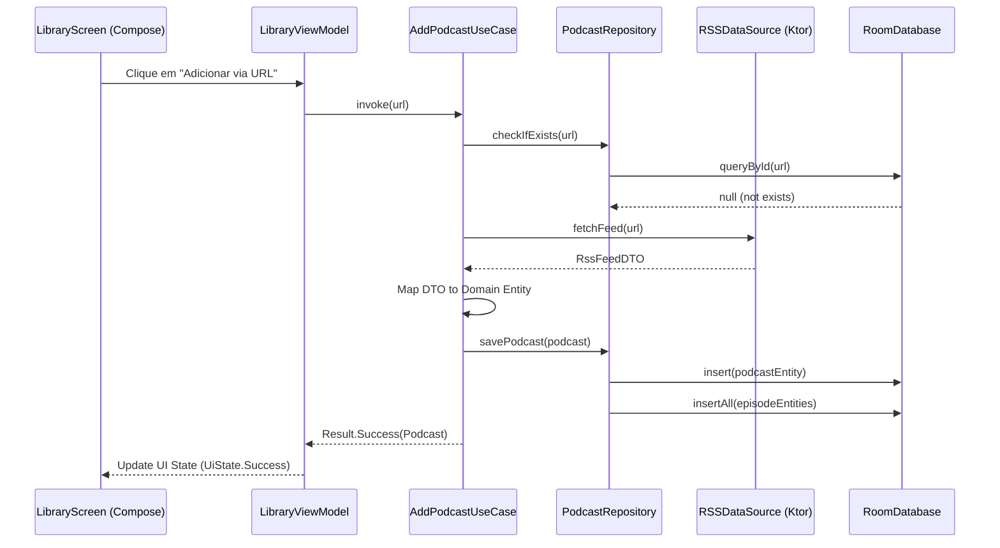

# Arquitetura do Sistema — Podcast KMP

Este documento descreve as decisões de engenharia, a estrutura modular e os padrões de design adotados no projeto de Podcast.

## 1. Estrutura de Componentes

O projeto adota uma arquitetura **Clean Architecture** dentro de um módulo compartilhado Kotlin Multiplatform (`:shared`), permitindo que 95% da lógica seja reutilizada entre as plataformas.

*   **`:shared:core`**: Contém utilitários globais, logs (Kermit), despacho de corrotinas e configurações de rede (Ktor).
*   **`:shared:data`**: Implementação de repositórios, DAOs (Room), fontes de dados remotas e mappers. Lida com a transformação de DTOs para Entidades.
*   **`:shared:domain`**: O "coração" da aplicação. Contém as entidades puras, interfaces de repositório e os **Use Cases** (interactors) que ditam as regras de negócio.
*   **`:shared:feature`**: Módulos organizados por funcionalidade (Player, Library, Search) contendo seus próprios ViewModels e lógica de apresentação compartilhada.
*   **`androidApp`, `iosApp`, `desktopApp`, `webApp`**: Camadas de UI nativas que consomem o `:shared`. Utilizam Compose Multiplatform ou SwiftUI (opcionalmente) para renderização.

## 2. Diagrama de Fluxo (Ciclo de Vida de um Comando)

O diagrama abaixo ilustra o fluxo de dados desde a interação do usuário na UI até a persistência e resposta do sistema.

## 3. Gerenciamento de Estado e Efeitos Colaterais

*   **UI State:** Exposto via `StateFlow` nos ViewModels. A UI observa esses fluxos e reage a mudanças de estado de forma reativa.
*   **Persistência:**
    *   **Local:** Room 3 com suporte a drivers nativos (SQLite Bundled). No Wasm, utiliza OPFS via WebWorker.
    *   **Sessão:** O estado do Player (fila, episódio atual) é mantido em memória e espelhado no banco de dados para recuperação pós-fechamento.
*   **Efeitos Colaterais:** Gerenciados via `LaunchedEffect` na UI ou disparados diretamente pelos ViewModels em escopos de corrotinas controlados (`viewModelScope`).

## 4. Padrões de Design Adotados

1.  **Dependency Injection (Koin):** Utilizado para desacoplar as camadas e facilitar o fornecimento de Fakes durante os testes multiplataforma.
2.  **Repository Pattern:** Centraliza o acesso aos dados e decide entre dados locais ou remotos de forma transparente para o Use Case.
3.  **Command / Use Case Pattern:** Cada ação do usuário (Add, Refresh, Delete) é encapsulada em uma classe de Use Case única, facilitando a testabilidade e reuso.
4.  **Mapper Pattern:** Isola as camadas de dados das camadas de domínio, garantindo que mudanças em APIs externas não quebrem a lógica interna.
5.  **Expect/Actual Pattern:** Utilizado para fornecer implementações nativas de componentes que exigem APIs de plataforma, como o `AudioPlayer` e a criação do banco de dados `Room`.

### 5. Abstração do Player de Áudio

O `AudioPlayer` é definido como uma `interface` no módulo `commonMain`. Cada plataforma (`androidMain`, `iosMain`, etc.) implementa esta interface utilizando suas APIs nativas, permitindo que a lógica de controle da fila e estado de reprodução permaneça no ViewModel compartilhado.

## 6. Estratégia de Testes

O projeto prioriza a confiabilidade através de uma pirâmide de testes multiplataforma:

*   **Testes Unitários (`commonTest`):** 100% da lógica de Use Cases, Mappers e ViewModels é testada no código compartilhado.
*   **Fakes Manuais:** Em vez de frameworks de mocking dinâmico (como MockK), o projeto utiliza implementações `Fake` (ex: `FakePodcastRepository`) para garantir compatibilidade com todos os compiladores (Kotlin/Native, Wasm, JVM).
*   **Testes de Integração de DAO:** Validação do comportamento do Room utilizando `createInMemoryDatabase` rodando em simuladores/emuladores reais.

> ⚠️ **Nota:** O uso de Mocks foi desencorajado em favor de **Fakes manuais** para garantir que os testes rodem em todos os targets do KMP (especialmente iOS e Wasm), onde bibliotecas de mocking dinâmico costumam falhar.
